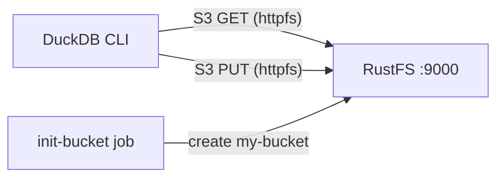

このガイドでは、S3 互換ストレージとして **RustFS** を組み合わせて **DuckDB** を実行します。Docker Compose で両サービスを起動し、DuckDB の `httpfs` 拡張機能を RustFS エンドポイント向けに設定し、クエリ結果を Parquet としてバケットに書き込み、読み戻して、RustFS 内のオブジェクトを確認します。この流れは `duckdb/duckdb:latest` イメージ（v1.5.5）と `rustfs/rustfs-x86-musl:v2.3.1` で検証済みです。

Docker と Compose プラグインが必要です。このデプロイはローカルでの統合テストを目的としており、本番環境向けではありません。

## アーキテクチャ



DuckDB は S3 API を実装する [`httpfs` 拡張機能](https://duckdb.org/docs/stable/extensions/httpfs/overview)を通じてオブジェクトの読み書きを行います。S3 シークレットに RustFS エンドポイント、認証情報、パススタイルのアドレス指定、平文 HTTP の設定を保持させると、Parquet ファイルを `s3://my-bucket/...` のパスでローカルファイルと同じようにロード・書き込みできます。

## 1. プロジェクトファイルを作成する

作業ディレクトリを作成します。

```bash
mkdir rustfs-duckdb
cd rustfs-duckdb
```

環境変数ファイルを作成し、2 つの認証情報プレースホルダーを置き換えます。

```ini title=".env"
RUSTFS_ACCESS_KEY=<your-access-key>
RUSTFS_SECRET_KEY=<your-secret-key>
```

バケットには専用の認証情報を使用してください。`.env` をバージョン管理にコミットしないでください。

Compose ファイルを作成します。

```yaml title="compose.yaml"
services:
  rustfs:
    image: rustfs/rustfs-x86-musl:v2.3.1
    environment:
      RUSTFS_ACCESS_KEY: ${RUSTFS_ACCESS_KEY}
      RUSTFS_SECRET_KEY: ${RUSTFS_SECRET_KEY}
      RUSTFS_VOLUMES: /data
      RUSTFS_ADDRESS: ":9000"
      RUSTFS_CONSOLE_ADDRESS: ":9001"
      RUSTFS_CONSOLE_ENABLE: "true"
    volumes:
      - rustfs-data:/data
    ports:
      - "9000:9000"
      - "9001:9001"
    healthcheck:
      test: ["CMD", "curl", "-sf", "http://127.0.0.1:9000/health"]
      interval: 10s
      timeout: 5s
      retries: 6
      start_period: 10s
    networks:
      - warehouse

  create-bucket:
    image: rustfs/rc:latest
    depends_on:
      rustfs:
        condition: service_healthy
    environment:
      RUSTFS_ACCESS_KEY: ${RUSTFS_ACCESS_KEY}
      RUSTFS_SECRET_KEY: ${RUSTFS_SECRET_KEY}
    entrypoint:
      - /bin/sh
      - -c
      - |
        until /usr/bin/rc alias set rustfs http://rustfs:9000 "$${RUSTFS_ACCESS_KEY}" "$${RUSTFS_SECRET_KEY}"; do
          echo "Waiting for RustFS..."
          sleep 2
        done
        /usr/bin/rc ls rustfs/my-bucket >/dev/null 2>&1 || /usr/bin/rc mb rustfs/my-bucket
    networks:
      - warehouse

  duckdb:
    image: duckdb/duckdb:latest
    entrypoint: ["/duckdb"]
    depends_on:
      create-bucket:
        condition: service_completed_successfully
    networks:
      - warehouse

networks:
  warehouse:

volumes:
  rustfs-data:
```

[`rc` イメージ](https://github.com/rustfs/cli)は RustFS の公式コマンドラインクライアントを提供します。初期化ジョブは作成前に `my-bucket` の存在を確認するため、繰り返し起動しても既存のデータは削除されません。`duckdb/duckdb` イメージには `/duckdb` バイナリのみが含まれシェルはないため、サービスには `entrypoint: ["/duckdb"]` を設定しています。

## 2. デプロイを起動する

コンテナを起動する前に Compose ファイルを検証します。

```bash
docker compose config
```

サービスを起動し、バケット初期化の完了を待ちます。

```bash
docker compose up -d
docker compose ps -a
```

`create-bucket` サービスは終了コード `0` で終了するはずです。RustFS コンソールは `http://localhost:9001/rustfs/console/` からいつでもバケットを確認できます。

## 3. DuckDB で S3 シークレットを設定する

対話的な DuckDB セッションを開始します。

```bash
docker compose run --rm duckdb
```

拡張機能をインストールし、RustFS エンドポイントを登録します。

```sql
INSTALL httpfs;
LOAD httpfs;

CREATE SECRET rustfs (
    TYPE S3,
    KEY_ID '<your-access-key>',
    SECRET '<your-secret-key>',
    ENDPOINT 'rustfs:9000',
    USE_SSL FALSE,
    URL_STYLE 'path'
);
```

エンドポイントはスキーマなしの `host:port` 形式で指定します。`USE_SSL FALSE` は Compose ネットワーク内での平文 HTTP を選択し、`URL_STYLE 'path'` は RustFS が期待するパススタイルのアドレス指定を選択します。シークレットは現在のセッションでのみ有効です。新しいセッションを開始するたびに再作成してください。

## 4. クエリ結果を RustFS に書き込む

小さなテーブルを Parquet としてバケットに書き込みます。

```sql
COPY
    (SELECT i AS id, 'rustfs-duckdb-demo' AS source FROM range(1000) t(i))
    TO 's3://my-bucket/duckdb-demo/events.parquet'
    (FORMAT PARQUET);
```

```text
┌─────────┐
│ Success │
│ boolean │
├─────────┤
│   true  │
└─────────┘
```

## 5. RustFS から Parquet を読み戻す

書き込んだばかりのオブジェクトをローカルファイルと同じように照会します。

```sql
SELECT count(*) AS rows, min(id) AS min_id, max(id) AS max_id
FROM read_parquet('s3://my-bucket/duckdb-demo/events.parquet');
```

```text
┌───────┬────────┬────────┐
│ rows  │ min_id │ max_id │
│ int64 │ int64  │ int64  │
├───────┼────────┼────────┤
│  1000 │      0 │    999 │
└───────┴────────┴────────┘
```

バケット配下の任意の Parquet オブジェクトをこの方法で照会できます。OpenObserve、Spark、Iceberg など他のシステムが書き込んだファイルも対象です。

## 6. RustFS 内のオブジェクトを確認する

バケット初期化イメージを使ってプレフィックスを一覧表示します。

```bash
docker compose run --rm --entrypoint /bin/sh create-bucket -c \
  '/usr/bin/rc alias set rustfs http://rustfs:9000 "$RUSTFS_ACCESS_KEY" "$RUSTFS_SECRET_KEY" >/dev/null && /usr/bin/rc ls rustfs/my-bucket/duckdb-demo --recursive'
```

```text
[2026-09-20 06:52:45]   5.32 KiB duckdb-demo/events.parquet
```

RustFS コンソールで `duckdb-demo` プレフィックスを確認することもできます。


## 7. スタックを停止・リセットする

RustFS データボリュームを保持したままコンテナを停止します。

```bash
docker compose down
```

ローカルのオブジェクトを削除して空の RustFS ボリュームからやり直す場合は、明示的に `--volumes` を付けます。

```bash
docker compose down --volumes
```

## トラブルシューティング

### DuckDB から RustFS に接続できない

Compose ネットワーク内のエンドポイントは `rustfs:9000` です。ホスト上で実行する DuckDB プロセスからは `localhost:9000` を使用し、Compose ファイルのとおりにポート `9000` を公開してください。

### 平文 HTTP エンドポイントでの SSL エラーや接続エラー

`ENDPOINT` にスキーマは指定しません。RustFS が TLS なしで動作している場合は、シークレットに `USE_SSL FALSE` を設定する必要があります。設定しないと `httpfs` が HTTPS を試みて接続エラーや証明書エラーになります。

### AccessDenied レスポンス

シークレットの認証情報が RustFS の認証情報と一致しているか、バケット初期化が正常に完了しているかを確認してください。

```bash
docker compose logs create-bucket
```

### バーチャルホストスタイルのリクエスト

コンテナネットワークのエンドポイントには `URL_STYLE 'path'` が必要です。バーチャルホストスタイルのリクエストには RustFS のドメイン設定（`RUSTFS_SERVER_DOMAINS`）と対応する DNS レコードが必要で、この構成では不要です。

## 次のステップ

- 追加の S3 オペレーションを採用する前に、[S3 互換性ノート](/administration/protocols/s3)を確認してください。
- [アクセスキー管理](/security-compliance/iam/access-token)で本番用の専用認証情報を作成してください。
- [DuckDB httpfs ドキュメント](https://duckdb.org/docs/stable/extensions/httpfs/overview)で、リージョン上書きや接続数制限などの高度なオプションを確認してください。
