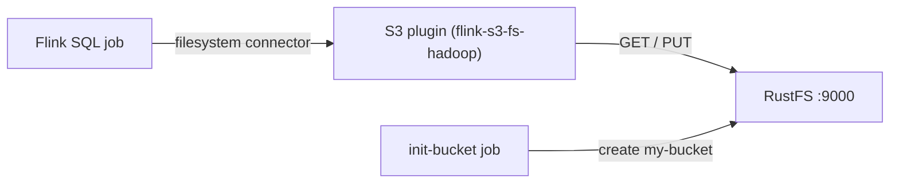

このガイドでは、Flink の S3 ファイルシステムプラグイン（`flink-s3-fs-hadoop`）を通じて [Apache Flink](https://github.com/apache/flink) を **RustFS** に接続します。Docker Compose でセッションクラスタを起動し、バッチモードで有界结果セットをバケットに書き込み、Flink SQL で読み戻します。この流れは `flink:1.20` と `rustfs/rustfs-x86-musl:v2.3.1` で検証済みです。

Docker と Compose プラグインが必要です。このデプロイはローカルでの統合テストを目的としており、本番環境向けではありません。

## アーキテクチャ



`flink-s3-fs-hadoop` プラグインは、Flink の filesystem コネクタ向けに `s3://` スキームを登録します。エンドポイント、パススタイルアドレス指定、平文 HTTP、認証情報は、`FLINK_PROPERTIES` 経由で渡す `flink-conf.yaml` の `s3.*` プロパティで設定します。

## 1. プロジェクトファイルを作成する

作業ディレクトリを作成します。

```bash
mkdir rustfs-flink
cd rustfs-flink
```

環境変数ファイルを作成し、2 つの認証情報プレースホルダーを置き換えます。

```ini title=".env"
RUSTFS_ACCESS_KEY=<your-access-key>
RUSTFS_SECRET_KEY=<your-secret-key>
```

バケットには専用の認証情報を使用してください。`.env` をバージョン管理にコミットしないでください。

S3 プラグインはイメージ内の `/opt/flink/opt/` に同梱されており、ロードするには `/opt/flink/plugins/s3fs/` へコピーする必要があります。ローカルディレクトリを準備します。

```bash
mkdir -p s3fs
docker create --name flink-tmp flink:1.20
docker cp flink-tmp:/opt/flink/opt/flink-s3-fs-hadoop-1.20.5.jar s3fs/
docker rm flink-tmp
```

Compose ファイルを作成します。

```yaml title="compose.yaml"
services:
  rustfs:
    image: rustfs/rustfs-x86-musl:v2.3.1
    environment:
      RUSTFS_ACCESS_KEY: ${RUSTFS_ACCESS_KEY}
      RUSTFS_SECRET_KEY: ${RUSTFS_SECRET_KEY}
      RUSTFS_VOLUMES: /data
      RUSTFS_ADDRESS: ":9000"
      RUSTFS_CONSOLE_ADDRESS: ":9001"
      RUSTFS_CONSOLE_ENABLE: "true"
    volumes:
      - rustfs-data:/data
    ports:
      - "9000:9000"
      - "9001:9001"
    healthcheck:
      test: ["CMD", "curl", "-sf", "http://127.0.0.1:9000/health"]
      interval: 10s
      timeout: 5s
      retries: 6
      start_period: 10s
    networks:
      - flink

  create-bucket:
    image: rustfs/rc:latest
    depends_on:
      rustfs:
        condition: service_healthy
    environment:
      RUSTFS_ACCESS_KEY: ${RUSTFS_ACCESS_KEY}
      RUSTFS_SECRET_KEY: ${RUSTFS_SECRET_KEY}
    entrypoint:
      - /bin/sh
      - -c
      - |
        until /usr/bin/rc alias set rustfs http://rustfs:9000 "$${RUSTFS_ACCESS_KEY}" "$${RUSTFS_SECRET_KEY}"; do
          echo "Waiting for RustFS..."
          sleep 2
        done
        /usr/bin/rc ls rustfs/my-bucket >/dev/null 2>&1 || /usr/bin/rc mb rustfs/my-bucket
    networks:
      - flink

  jobmanager:
    image: flink:1.20
    command: jobmanager
    environment:
      FLINK_PROPERTIES: |
        jobmanager.rpc.address: jobmanager
        rest.address: jobmanager
        rest.bind-address: 0.0.0.0
        s3.access-key: ${RUSTFS_ACCESS_KEY}
        s3.secret-key: ${RUSTFS_SECRET_KEY}
        s3.endpoint: http://rustfs:9000
        s3.path-style-access: true
    volumes:
      - ./s3fs:/opt/flink/plugins/s3fs:ro
    ports:
      - "8081:8081"
    depends_on:
      create-bucket:
        condition: service_completed_successfully
    networks:
      - flink

  taskmanager:
    image: flink:1.20
    command: taskmanager
    environment:
      FLINK_PROPERTIES: |
        jobmanager.rpc.address: jobmanager
        taskmanager.host: taskmanager
        s3.access-key: ${RUSTFS_ACCESS_KEY}
        s3.secret-key: ${RUSTFS_SECRET_KEY}
        s3.endpoint: http://rustfs:9000
        s3.path-style-access: true
    volumes:
      - ./s3fs:/opt/flink/plugins/s3fs:ro
    depends_on:
      jobmanager:
        condition: service_started
    networks:
      - flink

networks:
  flink:

volumes:
  rustfs-data:
```

`s3.access-key`、`s3.secret-key`、`s3.endpoint`、`s3.path-style-access` プロパティが、JobManager と TaskManager の両方の S3 プラグインを設定します。

## 2. デプロイを起動する

コンテナを起動する前に Compose ファイルを検証します。

```bash
docker compose config
```

サービスを起動し、バケット初期化の完了を待ちます。

```bash
docker compose up -d
docker compose ps -a
```

## 3. 结果セットを RustFS に書き込む

SQL ジョブを作成します。バッチモードと filesystem シンクを使います。

```yaml title="batch.sql"
SET 'execution.runtime-mode' = 'batch';

CREATE TABLE sink (
  id INT,
  payload STRING
) WITH (
  'connector' = 'filesystem',
  'path' = 's3://my-bucket/flink-out/',
  'format' = 'csv'
);

INSERT INTO sink
  VALUES (1, 'alpha'), (2, 'bravo'), (3, 'charlie'), (4, 'delta'), (5, 'echo');
```

JobManager 内の SQL クライアントから送信します。

```bash
docker compose exec jobmanager bash -c "/opt/flink/bin/sql-client.sh embedded -f /dev/stdin" < batch.sql
```

すべての行が書き込まれるとジョブは終了します。

## 4. データを読み戻す

読み取りクエリを作成します。filesystem コネクタがプレフィックスを走査します。

```yaml title="read.sql"
CREATE TABLE readings (
  id INT,
  payload STRING
) WITH (
  'connector' = 'filesystem',
  'path' = 's3://my-bucket/flink-out/',
  'format' = 'csv'
);

SET 'sql-client.execution.result-mode' = 'TABLEAU';

SELECT * FROM readings;
```

```bash
docker compose exec jobmanager bash -c "/opt/flink/bin/sql-client.sh embedded -f /dev/stdin" < read.sql
```

```text
+----+-------------+--------------------------------+
| op |          id |                         payload |
+----+-------------+--------------------------------+
| +I |           1 |                           alpha |
| +I |           2 |                           bravo |
| +I |           3 |                         charlie |
| +I |           4 |                           delta |
| +I |           5 |                            echo |
+----+-------------+--------------------------------+
```

## 5. RustFS 内のオブジェクトを確認する

バケット初期化イメージを使ってプレフィックスを一覧表示します。

```bash
docker compose run --rm --entrypoint /bin/sh create-bucket -c \
  '/usr/bin/rc alias set rustfs http://rustfs:9000 "$RUSTFS_ACCESS_KEY" "$RUSTFS_SECRET_KEY" >/dev/null && /usr/bin/rc ls rustfs/my-bucket/flink-out --recursive'
```

```text
[2026-09-21 01:34:52]       41 B flink-out/part-f759f9e8-3d1b-46a1-a92e-53e9b727e831-task-0-file-0
```

RustFS コンソールでこのプレフィックスを参照することもできます。


## 6. RustFS S3 Tables を使用する

RustFS S3 Tables は組み込みの Apache Iceberg REST カタログを提供します。Flink はテーブルバケットを管理された Iceberg ウェアハウスとして扱え、データは RustFS 内に保持されます。[S3 Tables](/administration/data/s3-tables) の説明に従ってテーブルバケットを有効化し、Flink Iceberg コネクタの REST カタログを RustFS に向けてください。REST カタログ URI は `http://<rustfs-host>:9000/iceberg`、ウェアハウスはバケット名で、カタログリクエスト（AWS Signature Version 4、署名名 `s3`）と S3 ファイルアクセスの両方がパススタイルのアドレス指定を使います。

S3 Tables のサポートマトリクスに従い、本番でこの経路を採用する前に、実際にデプロイする Flink と Iceberg のバージョンでカタログを検証してください。

## 7. スタックを停止・リセットする

RustFS データボリュームを保持したままコンテナを停止します。

```bash
docker compose down
```

保存したファイルを削除して空の RustFS ボリュームからやり直す場合は、明示的に `--volumes` を付けます。

```bash
docker compose down --volumes
```

## トラブルシューティング

### 書き込みで No AWS Credentials provided / AccessDenied が出る

S3 プラグインは `flink-conf.yaml` の `s3.*` プロパティから認証情報を読み込みます。JobManager と TaskManager **両方**の `FLINK_PROPERTIES` に `s3.access-key`、`s3.secret-key`、`s3.endpoint`、`s3.path-style-access` があること、そして各コンテナの `/opt/flink/plugins/s3fs/` にプラグイン jar があることを確認してください。

### TaskManager が `rustfs` ホストを解決できない

すべての Flink コンテナと RustFS は同じ Compose ネットワークを共有する必要があります。RustFS を外部ネットワークに接続している場合は、ジョブを投入する前に Flink コンテナもそのネットワークに接続してください。

### 失敗したストリーミング書き込みが "Stream closed" で復帰しない

失敗後の進行中 S3 アップロードのリカバリでライターが復帰不能な状態になることがあります。バケット内のジョブ出力プレフィックスを削除してジョブを再投入するか、本ガイドのように一回限りの書き込みにはバッチモードを使用してください。

## 次のステップ

- 追加の S3 オペレーションを採用する前に、[S3 互換性ノート](/administration/protocols/s3)を確認してください。
- [アクセスキー管理](/security-compliance/iam/access-token)で本番用の専用認証情報を作成してください。
- [Apache Flink ドキュメント](https://nightlies.apache.org/flink/flink-docs-stable/)で、パーティショニングやコンパクションなど filesystem コネクタのオプションを確認してください。
