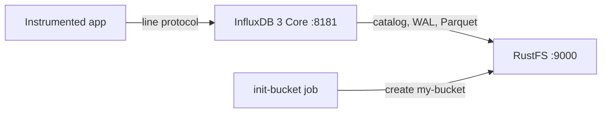

このガイドでは、[InfluxDB](https://github.com/influxdata/influxdb) — 具体的には Rust 製で Parquet ストレージエンジンを採用する時系列データベース **InfluxDB 3 Core** — を、**RustFS** をオブジェクトストアとして実行します。Docker Compose で InfluxDB を起動し、HTTP API 経由でラインプロトコルを書き込み、SQL で読み戻し、RustFS 内の永続化オブジェクトを確認して、データが InfluxDB の再起動後も保持されることを確認します。この流れは `influxdb:3-core`（v3.11.5）と `rustfs/rustfs-x86-musl:v2.3.1` で検証済みです。

Docker と Compose プラグインが必要です。このデプロイはローカルでの統合テストを目的としており、本番環境向けではありません。

## アーキテクチャ



InfluxDB 3 Core は、カタログ・先行書き込みログ（WAL）・Parquet データファイルを設定されたオブジェクトストアに保持します。書き込みはまず WAL に記録されて RustFS へ永続化されるため、コンパクションが Parquet ファイルを生成する前でも、すべての書き込みが再起動後も保持されます。サーバーは設定されたエンドポイントに対してデフォルトでパススタイルのアドレス指定を使用します。

## 1. プロジェクトファイルを作成する

作業ディレクトリを作成します。

```bash
mkdir rustfs-influxdb
cd rustfs-influxdb
```

環境変数ファイルを作成し、2 つの認証情報プレースホルダーを置き換えます。

```ini title=".env"
RUSTFS_ACCESS_KEY=<your-access-key>
RUSTFS_SECRET_KEY=<your-secret-key>
```

バケットには専用の認証情報を使用してください。`.env` をバージョン管理にコミットしないでください。

Compose ファイルを作成します。

```yaml title="compose.yaml"
services:
  rustfs:
    image: rustfs/rustfs-x86-musl:v2.3.1
    environment:
      RUSTFS_ACCESS_KEY: ${RUSTFS_ACCESS_KEY}
      RUSTFS_SECRET_KEY: ${RUSTFS_SECRET_KEY}
      RUSTFS_VOLUMES: /data
      RUSTFS_ADDRESS: ":9000"
      RUSTFS_CONSOLE_ADDRESS: ":9001"
      RUSTFS_CONSOLE_ENABLE: "true"
    volumes:
      - rustfs-data:/data
    ports:
      - "9000:9000"
      - "9001:9001"
    healthcheck:
      test: ["CMD", "curl", "-sf", "http://127.0.0.1:9000/health"]
      interval: 10s
      timeout: 5s
      retries: 6
      start_period: 10s
    networks:
      - influxdb

  create-bucket:
    image: rustfs/rc:latest
    depends_on:
      rustfs:
        condition: service_healthy
    environment:
      RUSTFS_ACCESS_KEY: ${RUSTFS_ACCESS_KEY}
      RUSTFS_SECRET_KEY: ${RUSTFS_SECRET_KEY}
    entrypoint:
      - /bin/sh
      - -c
      - |
        until /usr/bin/rc alias set rustfs http://rustfs:9000 "$${RUSTFS_ACCESS_KEY}" "$${RUSTFS_SECRET_KEY}"; do
          echo "Waiting for RustFS..."
          sleep 2
        done
        /usr/bin/rc ls rustfs/my-bucket >/dev/null 2>&1 || /usr/bin/rc mb rustfs/my-bucket
    networks:
      - influxdb

  influxdb:
    image: influxdb:3-core
    command:
      - serve
      - --node-id
      - influxdb-demo
      - --object-store
      - s3
      - --bucket
      - my-bucket
      - --aws-endpoint
      - http://rustfs:9000
      - --aws-access-key-id
      - ${RUSTFS_ACCESS_KEY}
      - --aws-secret-access-key
      - ${RUSTFS_SECRET_KEY}
      - --aws-allow-http
    ports:
      - "8181:8181"
    depends_on:
      create-bucket:
        condition: service_completed_successfully
    networks:
      - influxdb

networks:
  influxdb:

volumes:
  rustfs-data:
```

`--object-store s3` と `--aws-endpoint` により、カタログ・WAL・Parquet のすべての書き込みが RustFS にルーティングされます。InfluxDB はエンドポイントに対してデフォルトでパススタイルのアドレス指定を使用し、`--aws-allow-http` は Compose ネットワーク内での平文 HTTP を許可します。

## 2. デプロイを起動する

コンテナを起動する前に Compose ファイルを検証します。

```bash
docker compose config
```

サービスを起動し、バケット初期化の完了を待ちます。

```bash
docker compose up -d
docker compose ps -a
```

## 3. 管理者トークンを作成する

InfluxDB 3 Core はすべての API リクエストにベアラートークンを要求します。初回起動後に管理者トークンを一度作成し、表示された値を保存してください。

```bash
docker compose exec influxdb3 influxdb3 create token --admin
```

```text
Token: <your-admin-token>
```

:::note[トークンの作成]

トークンの値は一度しか表示されず、後から復元できません。トークン名が既に存在する場合（HTTP 409）は、ノードにメタデータが残っています。新しいバケットプレフィックスでやり直すか、再試行前にバケット内のノードプレフィックスを削除してください。

:::

## 4. ラインプロトコルを書き込む

`rustfs_demo` データベースへ、ラインプロトコル形式の CPU 測定値のバッチを送信します。

```bash
python3 - <<'PY'
import time, urllib.request

token = "<your-admin-token>"
now_ns = int(time.time() * 1e9)
lines = []
for i in range(30):
    ts = now_ns - i * 1_000_000_000
    lines.append(f"cpu_usage,host=az-server,region=us-east-1 usage={60 + i % 30}.{i % 10} {ts}")

req = urllib.request.Request(
    "http://localhost:8181/api/v3/write_lp?db=rustfs_demo",
    data="\n".join(lines).encode(),
    headers={"Content-Type": "text/plain", "Authorization": f"Bearer {token}"},
    method="POST",
)
with urllib.request.urlopen(req, timeout=30) as r:
    print("write:", r.status)
PY
```

```text
write: 204
```

## 5. SQL で照会する

SQL API で計測データを読み戻します。

```bash
curl -sG "http://localhost:8181/api/v3/query_sql" \
  --data-urlencode "db=rustfs_demo" \
  --data-urlencode "format=json" \
  --data-urlencode "q=SELECT count(*) AS cnt FROM cpu_usage" \
  -H "Authorization: Bearer <your-admin-token>"
```

```text
[{"cnt":30}]
```

## 6. RustFS 内のオブジェクトを確認する

バケット初期化イメージを使ってノードのプレフィックスを一覧表示します。

```bash
docker compose run --rm --entrypoint /bin/sh create-bucket -c \
  '/usr/bin/rc alias set rustfs http://rustfs:9000 "$RUSTFS_ACCESS_KEY" "$RUSTFS_SECRET_KEY" >/dev/null && /usr/bin/rc ls rustfs/my-bucket/influxdb-demo --recursive'
```

カタログ・WAL・後から生成される Parquet データファイルは、ノード識別子のプレフィックスの下に保存されます。

```text
[2026-09-20 23:18:28]      105 B influxdb-demo/catalog/v3/snapshot
[2026-09-20 23:20:54]     1.45 KiB influxdb-demo/wal/00000000001.wal
[2026-09-20 23:20:19]       31 B influxdb-demo/table-index-conversion-completed
```

RustFS コンソールでこのプレフィックスを参照することもできます。


## 7. 再起動後の永続性を確認する

InfluxDB を再起動して、SQL クエリを繰り返します。

```bash
docker compose restart influxdb
curl -sG "http://localhost:8181/api/v3/query_sql" \
  --data-urlencode "db=rustfs_demo" \
  --data-urlencode "format=json" \
  --data-urlencode "q=SELECT count(*) AS cnt FROM cpu_usage" \
  -H "Authorization: Bearer <your-admin-token>"
```

```text
[{"cnt":30}]
```

カタログと WAL が RustFS からリプレイされるため、カウントは変わりません。オブジェクトストアがまさに永続層であり、本番トポロジと同じ仕組みです。

## 8. スタックを停止・リセットする

RustFS データボリュームを保持したままコンテナを停止します。

```bash
docker compose down
```

保存したデータを削除して空の RustFS ボリュームからやり直す場合は、明示的に `--volumes` を付けます。

```bash
docker compose down --volumes
```

## トラブルシューティング

### すべてのリクエストで "the request was not authenticated" が出る

InfluxDB 3 Core は API リクエストに管理者ベアラートークンを要求します。`influxdb3 create token --admin` で一度作成し、`Authorization: Bearer <token>` として送信してください。

### 管理者トークンの作成で "token name already exists" が出る

ノードには既に管理者トークンがあり、値は復元できません。コンテナを停止した状態でバケット内のノードプレフィックス（例 `influxdb-demo/`）を削除し、再起動後に新しいトークンを作成してください。

### AccessDenied や 403 レスポンス

Compose ファイルの認証情報が RustFS の認証情報と一致しているか、`create-bucket` ジョブが正常に完了しているかを確認してください。

```bash
docker compose logs create-bucket
```

### 接続エラーや証明書エラー

`--aws-endpoint` には完全な URL を指定します。`--aws-allow-http` はコンテナネットワークエンドポイントでの平文 HTTP を許可します。Compose ネットワーク内では `http://rustfs:9000` を、ホストからは `http://localhost:9000` を使用してください。

## 次のステップ

- 追加の S3 オペレーションを採用する前に、[S3 互換性ノート](/administration/protocols/s3)を確認してください。
- [アクセスキー管理](/security-compliance/iam/access-token)で本番用の専用認証情報を作成してください。
- [InfluxDB 3 Core ドキュメント](https://docs.influxdata.com/influxdb3/core/)に従って、telegraf や書き込み API をデータプロデューサーとして接続してください。
