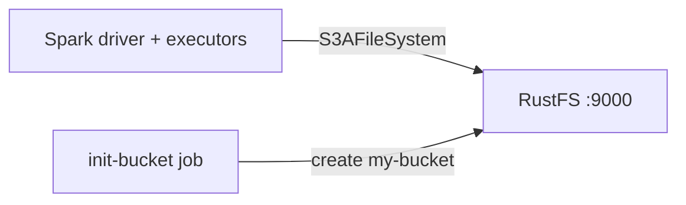

このガイドでは、`s3a` コネクタを通じて [Apache Spark](https://github.com/apache/spark) を **RustFS** に接続します。Docker Compose で RustFS を起動し、Parquet データセットをバケットに書き込んで読み戻す Spark ジョブを実行し、RustFS 内のオブジェクトを確認します。この流れは `apache/spark:3.5.6`（`hadoop-aws` 3.3.4 を同梱）と `rustfs/rustfs-x86-musl:v2.3.1` で検証済みです。

Docker と Compose プラグインが必要です。このデプロイはローカルでの統合テストを目的としており、本番環境向けではありません。

## アーキテクチャ



Spark は `hadoop-aws` の S3A ファイルシステムを通じて RustFS と通信します。エンドポイント、パススタイルアドレス指定、平文 HTTP、認証情報といったコネクタ設定は `spark.hadoop.fs.s3a.*` プロパティとして渡します。

## 1. プロジェクトファイルを作成する

作業ディレクトリを作成します。

```bash
mkdir rustfs-spark
cd rustfs-spark
```

環境変数ファイルを作成し、2 つの認証情報プレースホルダーを置き換えます。

```ini title=".env"
RUSTFS_ACCESS_KEY=<your-access-key>
RUSTFS_SECRET_KEY=<your-secret-key>
```

バケットには専用の認証情報を使用してください。`.env` をバージョン管理にコミットしないでください。

Spark ジョブを作成します。

```python title="job.py"
from pyspark.sql import SparkSession

spark = SparkSession.builder.appName("rustfs-spark-demo").getOrCreate()
spark.sparkContext.setLogLevel("WARN")

spark.range(1000).withColumnRenamed("id", "num") \
    .write.mode("overwrite").parquet("s3a://my-bucket/spark-demo/events")

back = spark.read.parquet("s3a://my-bucket/spark-demo/events")
print("ROWS_READ_BACK:", back.count())
spark.stop()
```

Compose ファイルを作成します。

```yaml title="compose.yaml"
services:
  rustfs:
    image: rustfs/rustfs-x86-musl:v2.3.1
    environment:
      RUSTFS_ACCESS_KEY: ${RUSTFS_ACCESS_KEY}
      RUSTFS_SECRET_KEY: ${RUSTFS_SECRET_KEY}
      RUSTFS_VOLUMES: /data
      RUSTFS_ADDRESS: ":9000"
      RUSTFS_CONSOLE_ADDRESS: ":9001"
      RUSTFS_CONSOLE_ENABLE: "true"
    volumes:
      - rustfs-data:/data
    ports:
      - "9000:9000"
      - "9001:9001"
    healthcheck:
      test: ["CMD", "curl", "-sf", "http://127.0.0.1:9000/health"]
      interval: 10s
      timeout: 5s
      retries: 6
      start_period: 10s
    networks:
      - warehouse

  create-bucket:
    image: rustfs/rc:latest
    depends_on:
      rustfs:
        condition: service_healthy
    environment:
      RUSTFS_ACCESS_KEY: ${RUSTFS_ACCESS_KEY}
      RUSTFS_SECRET_KEY: ${RUSTFS_SECRET_KEY}
    entrypoint:
      - /bin/sh
      - -c
      - |
        until /usr/bin/rc alias set rustfs http://rustfs:9000 "$${RUSTFS_ACCESS_KEY}" "$${RUSTFS_SECRET_KEY}"; do
          echo "Waiting for RustFS..."
          sleep 2
        done
        /usr/bin/rc ls rustfs/my-bucket >/dev/null 2>&1 || /usr/bin/rc mb rustfs/my-bucket
    networks:
      - warehouse

  spark:
    image: apache/spark:3.5.6
    entrypoint: ["/opt/spark/bin/spark-submit"]
    volumes:
      - ./job.py:/job.py:ro
    command:
      - --conf
      - spark.jars.ivy=/tmp/.ivy2
      - --packages
      - org.apache.hadoop:hadoop-aws:3.3.4
      - --conf
      - spark.hadoop.fs.s3a.endpoint=http://rustfs:9000
      - --conf
      - spark.hadoop.fs.s3a.access.key=${RUSTFS_ACCESS_KEY}
      - --conf
      - spark.hadoop.fs.s3a.secret.key=${RUSTFS_SECRET_KEY}
      - --conf
      - spark.hadoop.fs.s3a.path.style.access=true
      - --conf
      - spark.hadoop.fs.s3a.connection.ssl.enabled=false
      - --conf
      - spark.hadoop.fs.s3a.impl=org.apache.hadoop.fs.s3a.S3AFileSystem
      - /job.py
    depends_on:
      create-bucket:
        condition: service_completed_successfully
    networks:
      - warehouse

networks:
  warehouse:

volumes:
  rustfs-data:
```

`--packages org.apache.hadoop:hadoop-aws:3.3.4` は起動時に S3 コネクタをダウンロードします。Spark イメージに同梱の Hadoop バージョンと一致させる必要があります。`spark.jars.ivy=/tmp/.ivy2` はダウンロードキャッシュを書き込み可能なディレクトリへ移動します。

## 2. ストレージを起動してジョブを実行する

ストレージサービスを起動します。

```bash
docker compose up -d
docker compose ps -a
```

Spark ジョブを実行します。

```bash
docker compose run --rm spark
```

```text
ROWS_READ_BACK: 1000
```

## 3. RustFS 内のオブジェクトを確認する

バケット初期化イメージを使ってデータセットを一覧表示します。

```bash
docker compose run --rm --entrypoint /bin/sh create-bucket -c \
  '/usr/bin/rc alias set rustfs http://rustfs:9000 "$RUSTFS_ACCESS_KEY" "$RUSTFS_SECRET_KEY" >/dev/null && /usr/bin/rc ls rustfs/my-bucket/spark-demo --recursive'
```

```text
[2026-09-21 00:58:22]        0 B spark-demo/events/_SUCCESS
[2026-09-21 00:58:21]   1.46 KiB spark-demo/events/part-00000-...-c000.snappy.parquet
[2026-09-21 00:58:21]   1.46 KiB spark-demo/events/part-00001-...-c000.snappy.parquet
[2026-09-21 00:58:21]   1.46 KiB spark-demo/events/part-00002-...-c000.snappy.parquet
```

RustFS コンソールでこのプレフィックスを参照することもできます。


## 4. RustFS S3 Tables を使用する

RustFS S3 Tables は組み込みの Apache Iceberg REST カタログを提供します。Flink と同様に、Spark はテーブルバケットを管理された Iceberg ウェアハウスとして扱え、データは RustFS 内に保持されます。[S3 Tables](/administration/data/s3-tables) の説明に従ってテーブルバケットを有効化し、Spark の Iceberg REST カタログを接続してください。REST カタログ URI は `http://<rustfs-host>:9000/iceberg`、ウェアハウスはバケット名で、カタログリクエスト（AWS Signature Version 4、署名名 `s3`）と S3 ファイルアクセスの両方がパススタイルのアドレス指定を使います。

S3 Tables のサポートマトリクスに従い、本番でこの経路を採用する前に、実際にデプロイする Spark と Iceberg のバージョンでカタログを検証してください。

## 5. スタックを停止・リセットする

RustFS データボリュームを保持したままコンテナを停止します。

```bash
docker compose down
```

データセットを削除して空の RustFS ボリュームからやり直す場合は、明示的に `--volumes` を付けます。

```bash
docker compose down --volumes
```

## トラブルシューティング

### NumberFormatException: For input string: "60s"

`hadoop-aws` のバージョンが Spark イメージ同梱の Hadoop バージョンと一致していません。Spark 4.x イメージには `hadoop-aws` 3.4.x が必要です。このガイドは `apache/spark:3.5.6` と `hadoop-aws:3.3.4` の組み合わせに固定しています。

### `rustfs:9000` への接続エラー

`fs.s3a.endpoint` は Compose ネットワーク内で解決されます。ホスト上で実行する Spark プロセスからは `http://localhost:9000` を使用してください。

### AccessDenied や 403 レスポンス

コネクタ設定が RustFS の認証情報と一致しているか、`create-bucket` ジョブが正常に完了しているかを確認してください。

```bash
docker compose logs create-bucket
```

## 次のステップ

- 追加の S3 オペレーションを採用する前に、[S3 互換性ノート](/administration/protocols/s3)を確認してください。
- [アクセスキー管理](/security-compliance/iam/access-token)で本番用の専用認証情報を作成してください。
- [Spark ドキュメント](https://spark.apache.org/docs/latest/)で構造化ストリーミングやデータソースのオプションを確認してください。
