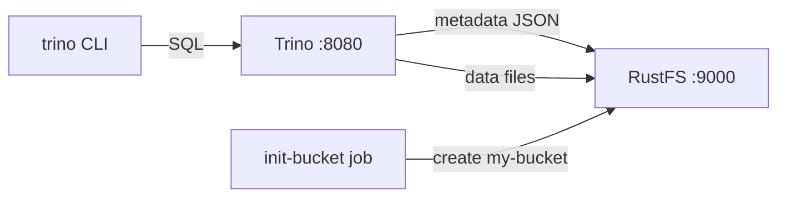

このガイドでは、分散 SQL クエリエンジンである [Trino](https://github.com/trinodb/trino) を、hive コネクタのファイルメタストアとネイティブ S3 ファイルシステムを通じて **RustFS** に接続します。スキーマとテーブルを作成し、行を插入して読み戻し、RustFS 内のオブジェクトを確認します。テーブルのメタデータもデータファイルも RustFS 内に保存されます。この流れは `trinodb/trino:435` と `rustfs/rustfs-x86-musl:v2.3.1` で検証済みです。

Docker と Compose プラグインが必要です。このデプロイはローカルでの統合テストを目的としており、本番環境向けではありません。

## アーキテクチャ



`hive.metastore=file` の hive コネクタは、スキーマとテーブルのメタデータをカタログディレクトリ配下の JSON オブジェクトとして保持し、ネイティブ S3 ファイルシステム（`fs.s3.enabled`）がメタデータとデータファイルの両方を、平文 HTTP 上のパススタイルアドレス指定で RustFS に保存します。

## 1. プロジェクトファイルを作成する

作業ディレクトリを作成します。

```bash
mkdir rustfs-trino
cd rustfs-trino
```

環境変数ファイルを作成し、2 つの認証情報プレースホルダーを置き換えます。

```ini title=".env"
RUSTFS_ACCESS_KEY=<your-access-key>
RUSTFS_SECRET_KEY=<your-secret-key>
```

バケットには専用の認証情報を使用してください。`.env` をバージョン管理にコミットしないでください。

Trino の catalog 設定を作成します。

```ini title="hive.properties"
connector.name=hive
hive.metastore=file
hive.metastore.catalog.dir=s3://my-bucket/trino-metastore
fs.s3.enabled=true
s3.endpoint=http://rustfs:9000
s3.region=us-east-1
s3.path-style-access=true
s3.aws-access-key=<your-access-key>
s3.aws-secret-key=<your-secret-key>
```

`hive.metastore.catalog.dir` がファイルメタストアをバケット内に向けます。そのためメタデータもデータも RustFS 内に保存されます。`fs.s3.enabled` がネイティブ S3 ファイルシステムを有効化し、コンテナネットワークのエンドポイントには `s3.path-style-access` が必要です。

Compose ファイルを作成します。

```yaml title="compose.yaml"
services:
  rustfs:
    image: rustfs/rustfs-x86-musl:v2.3.1
    environment:
      RUSTFS_ACCESS_KEY: ${RUSTFS_ACCESS_KEY}
      RUSTFS_SECRET_KEY: ${RUSTFS_SECRET_KEY}
      RUSTFS_VOLUMES: /data
      RUSTFS_ADDRESS: ":9000"
      RUSTFS_CONSOLE_ADDRESS: ":9001"
      RUSTFS_CONSOLE_ENABLE: "true"
    volumes:
      - rustfs-data:/data
    ports:
      - "9000:9000"
      - "9001:9001"
    healthcheck:
      test: ["CMD", "curl", "-sf", "http://127.0.0.1:9000/health"]
      interval: 10s
      timeout: 5s
      retries: 6
      start_period: 10s
    networks:
      - warehouse

  create-bucket:
    image: rustfs/rc:latest
    depends_on:
      rustfs:
        condition: service_healthy
    environment:
      RUSTFS_ACCESS_KEY: ${RUSTFS_ACCESS_KEY}
      RUSTFS_SECRET_KEY: ${RUSTFS_SECRET_KEY}
    entrypoint:
      - /bin/sh
      - -c
      - |
        until /usr/bin/rc alias set rustfs http://rustfs:9000 "$${RUSTFS_ACCESS_KEY}" "$${RUSTFS_SECRET_KEY}"; do
          echo "Waiting for RustFS..."
          sleep 2
        done
        /usr/bin/rc ls rustfs/my-bucket >/dev/null 2>&1 || /usr/bin/rc mb rustfs/my-bucket
    networks:
      - warehouse

  trino:
    image: trinodb/trino:435
    volumes:
      - ./hive.properties:/etc/trino/catalog/hive.properties:ro
      - metastore-data:/data/metastore
    depends_on:
      create-bucket:
        condition: service_completed_successfully
    networks:
      - warehouse

networks:
  warehouse:

volumes:
  rustfs-data:
  metastore-data:
```

## 2. デプロイを起動する

コンテナを起動する前に Compose ファイルを検証します。

```bash
docker compose config
```

サービスを起動し、バケット初期化の完了を待ちます。

```bash
docker compose up -d
docker compose ps -a
```

Trino はサーバーログに `SERVER STARTED` と出力されると起動完了です。コンテナは `trino` ユーザー（uid 1000）で実行されるため、メタストアボリュームが書き込み可能であることを確認してください。

```bash
docker compose exec trino id
docker compose exec trino ls -la /data/metastore
```

## 3. スキーマとテーブルを作成する

明示的なロケーションを指定せずにスキーマを作成します。Trino が RustFS 内のカタログディレクトリ配下に配置します。

```bash
docker compose exec trino trino --execute \
  "CREATE SCHEMA hive.demo"
```

テーブルを作成して 5 行を插入します。

```bash
docker compose exec trino trino --execute \
  "CREATE TABLE hive.demo.events (id bigint, label varchar) WITH (format = 'parquet')"

docker compose exec trino trino --execute \
  "INSERT INTO hive.demo.events VALUES (1,'alpha'),(2,'bravo'),(3,'charlie'),(4,'delta'),(5,'echo')"
```

```text
INSERT: 5 rows
```

## 4. データを照会する

行を読み戻します。

```bash
docker compose exec trino trino --execute \
  "SELECT * FROM hive.demo.events ORDER BY id"
```

```text
"1","alpha"
"2","bravo"
"3","charlie"
"4","delta"
"5","echo"
```

## 5. RustFS 内のオブジェクトを確認する

バケット初期化イメージを使ってメタストアのプレフィックスを一覧表示します。

```bash
docker compose run --rm --entrypoint /bin/sh create-bucket -c \
  '/usr/bin/rc alias set rustfs http://rustfs:9000 "$RUSTFS_ACCESS_KEY" "$RUSTFS_SECRET_KEY" >/dev/null && /usr/bin/rc ls rustfs/my-bucket/trino-metastore --recursive'
```

```text
[2026-09-21 01:55:16]      155 B trino-metastore/.demo.trinoSchema
[2026-09-21 01:55:19]      474 B trino-metastore/demo/events/.trinoPermissions/user_trino
[2026-09-21 01:55:25]     1007 B trino-metastore/demo/events/.trinoSchema
[2026-09-21 01:55:25]      432 B trino-metastore/demo/events/20260921_..._cb761cec-...parquet
```

RustFS コンソールでこのプレフィックスを参照することもできます。


## 6. RustFS S3 Tables を使用する

RustFS S3 Tables は組み込みの Apache Iceberg REST カタログを提供します。Trino はテーブルバケットを管理された Iceberg ウェアハウスとして扱え、データは RustFS 内に保持されます。[S3 Tables](/administration/data/s3-tables) の説明に従ってテーブルバケットを有効化し、Trino の Iceberg コネクタを REST カタログに接続してください。REST カタログ URI は `http://<rustfs-host>:9000/iceberg`、ウェアハウスはバケット名で、カタログリクエスト（AWS Signature Version 4、署名名 `s3`）と S3 ファイルアクセスの両方がパススタイルのアドレス指定を使います。

S3 Tables のサポートマトリクスでは、Trino はカタログに対する読み取り専用プローブが行われた段階です。本番でこの経路を採用する前に、書き込み互換性と実際にデプロイする Trino バージョンを検証してください。

## 7. スタックを停止・リセットする

RustFS データボリュームを保持したままコンテナを停止します。

```bash
docker compose down
```

保存したメタデータとデータを削除して空の RustFS ボリュームからやり直す場合は、明示的に `--volumes` を付けます。

```bash
docker compose down --volumes
```

## トラブルシューティング

### `fs.native-s3.enabled` や `fs.s3.enabled` の設定エラー

ネイティブ S3 ファイルシステムのプロパティ名は Trino のバージョン間で変わりました。Trino 435 は `fs.native-s3.enabled` を、それ以降のリリースは `fs.s3.enabled` を使用します。このガイドは `trinodb/trino:435` に固定しているため、`fs.native-s3.enabled` を使用してください。

### テーブル作成時に "Table directory must be ..." が出る

ファイルメタストアでは、テーブルのロケーションは `hive.metastore.catalog.dir` の配下にある必要があります。スキーマの作成時に明示的なロケーションを指定せず、同じバケットプレフィックス内のディレクトリを指すようにしてください。

### Hive CSV ストレージ形式は VARCHAR のみ対応

CSV 形式は文字列以外の列を拒否します。型付きテーブルでは、このガイドのように `format = 'parquet'` を使用してください。

### AccessDenied や 403 レスポンス

`hive.properties` の認証情報が RustFS の認証情報と一致しているか、`create-bucket` ジョブが正常に完了しているかを確認してください。

```bash
docker compose logs create-bucket
```

## 次のステップ

- 追加の S3 オペレーションを採用する前に、[S3 互換性ノート](/administration/protocols/s3)を確認してください。
- [アクセスキー管理](/security-compliance/iam/access-token)で本番用の専用認証情報を作成してください。
- [Trino ドキュメント](https://trino.io/docs/current/)に従って、BI ツールを接続したりオブジェクトストレージカタログを追加したりしてください。
