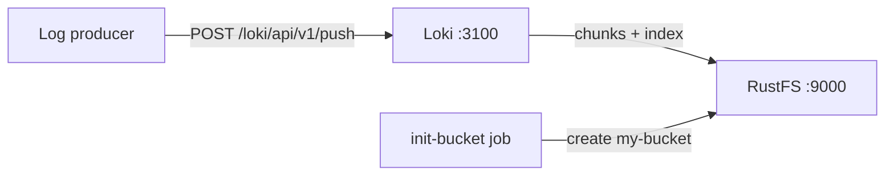
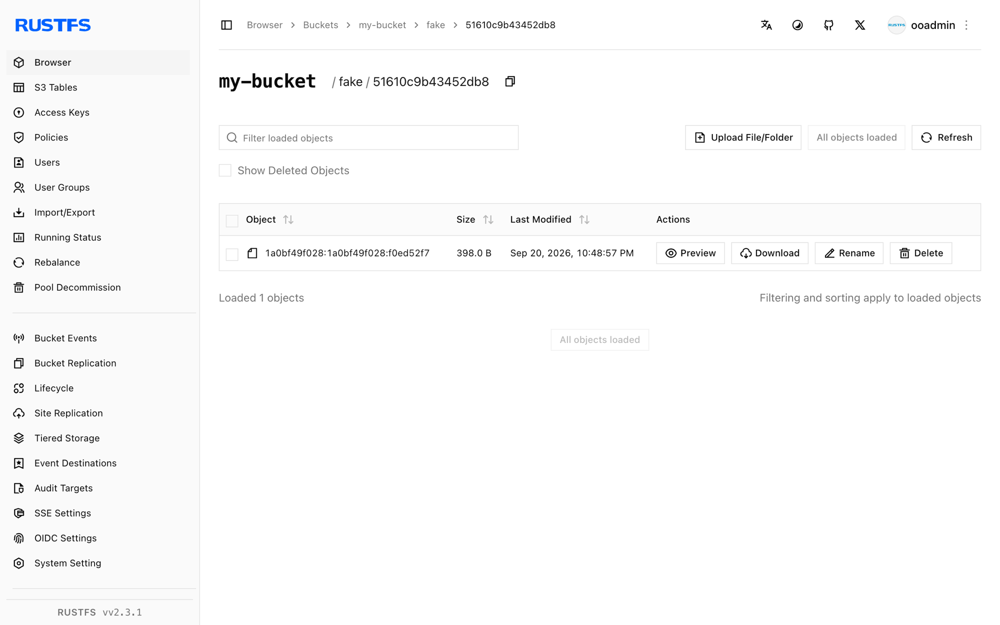

このガイドでは、Grafana Labs のログ集約システムである [Grafana Loki](https://github.com/grafana/loki) を、**RustFS** をオブジェクトストレージバックエンドとして実行します。Docker Compose でシングルバイナリの Loki を起動し、HTTP API 経由でログストリームを push し、クエリで読み戻し、ログチャンクがオブジェクトとして RustFS 内に保存されることを確認します。この流れは `grafana/loki:latest`（v3.7.8）と `rustfs/rustfs-x86-musl:v2.3.1` で検証済みです。

Docker と Compose プラグインが必要です。このデプロイはローカルでの統合テストを目的としており、本番環境向けではありません。

## アーキテクチャ



Loki はログストリームをメモリ内チャンクと先行書き込みログ（WAL）に取り込み、ストリームがアイドルになると圧縮済みチャンクをオブジェクトストレージへフラッシュし、TSDB インデックスファイルを同じバケットへ送出します。クエリ時にはインデックスでチャンクを解決し、オブジェクトストレージから読み込みます。

## 1. プロジェクトファイルを作成する

作業ディレクトリを作成します。

```bash
mkdir rustfs-loki
cd rustfs-loki
```

環境変数ファイルを作成し、2 つの認証情報プレースホルダーを置き換えます。

```ini title=".env"
RUSTFS_ACCESS_KEY=<your-access-key>
RUSTFS_SECRET_KEY=<your-secret-key>
```

バケットには専用の認証情報を使用してください。`.env` をバージョン管理にコミットしないでください。

Loki 設定を作成します。TSDB スキーマと、RustFS に向いた S3 バックエンドを使うシングルバイナリ構成です。

```yaml title="loki.yml"
auth_enabled: false

server:
  http_listen_port: 3100

common:
  instance_addr: 127.0.0.1
  path_prefix: /loki
  storage:
    s3:
      endpoint: rustfs:9000
      insecure: true
      bucketnames: my-bucket
      access_key_id: ${RUSTFS_ACCESS_KEY}
      secret_access_key: ${RUSTFS_SECRET_KEY}
      s3forcepathstyle: true
  replication_factor: 1
  ring:
    kvstore:
      store: inmemory

schema_config:
  configs:
    - from: 2020-10-24
      store: tsdb
      object_store: s3
      schema: v13
      index:
        prefix: index_
        period: 24h

ingester:
  chunk_idle_period: 30s
  max_chunk_age: 1m

ruler:
  alertmanager_url: http://localhost:9093
```

`s3forcepathstyle: true` と `insecure: true` は、コンテナネットワークのエンドポイントに対して RustFS が期待する、平文 HTTP 上のパススタイルアドレス指定を選択します。`chunk_idle_period` と `max_chunk_age` は短縮しており、検証時にデフォルトの 30 分間チャンクのフラッシュを待つ必要がありません。

Compose ファイルを作成します。

```yaml title="compose.yaml"
services:
  rustfs:
    image: rustfs/rustfs-x86-musl:v2.3.1
    environment:
      RUSTFS_ACCESS_KEY: ${RUSTFS_ACCESS_KEY}
      RUSTFS_SECRET_KEY: ${RUSTFS_SECRET_KEY}
      RUSTFS_VOLUMES: /data
      RUSTFS_ADDRESS: ":9000"
      RUSTFS_CONSOLE_ADDRESS: ":9001"
      RUSTFS_CONSOLE_ENABLE: "true"
    volumes:
      - rustfs-data:/data
    ports:
      - "9000:9000"
      - "9001:9001"
    healthcheck:
      test: ["CMD", "curl", "-sf", "http://127.0.0.1:9000/health"]
      interval: 10s
      timeout: 5s
      retries: 6
      start_period: 10s
    networks:
      - loki

  create-bucket:
    image: rustfs/rc:latest
    depends_on:
      rustfs:
        condition: service_healthy
    environment:
      RUSTFS_ACCESS_KEY: ${RUSTFS_ACCESS_KEY}
      RUSTFS_SECRET_KEY: ${RUSTFS_SECRET_KEY}
    entrypoint:
      - /bin/sh
      - -c
      - |
        until /usr/bin/rc alias set rustfs http://rustfs:9000 "$${RUSTFS_ACCESS_KEY}" "$${RUSTFS_SECRET_KEY}"; do
          echo "Waiting for RustFS..."
          sleep 2
        done
        /usr/bin/rc ls rustfs/my-bucket >/dev/null 2>&1 || /usr/bin/rc mb rustfs/my-bucket
    networks:
      - loki

  loki:
    image: grafana/loki:latest
    command: -config.file=/etc/loki/loki-config.yml
    volumes:
      - ./loki.yml:/etc/loki/loki-config.yml:ro
    ports:
      - "3100:3100"
    depends_on:
      create-bucket:
        condition: service_completed_successfully
    networks:
      - loki

networks:
  loki:

volumes:
  rustfs-data:
```

## 2. デプロイを起動する

コンテナを起動する前に Compose ファイルを検証します。

```bash
docker compose config
```

サービスを起動し、バケット初期化の完了を待ちます。

```bash
docker compose up -d
docker compose ps -a
```

readiness エンドポイントが成功を返せば Loki の準備ができています。

```bash
curl -s http://localhost:3100/ready
```

```text
ready
```

## 3. ログストリームを push する

push API にログエントリのバッチを送信します。

```bash
python3 - <<'PY'
import json, time, urllib.request

values = []
base_ns = int(time.time() * 1e9)
for i in range(20):
    values.append([
        str(base_ns - i * 1_000_000_000),
        f"[rustfs-loki-integration] log line {i} stored in RustFS object storage",
    ])

payload = {
    "streams": [{
        "stream": {"job": "rustfs-demo", "service": "loki-integration"},
        "values": values,
    }]
}

req = urllib.request.Request(
    "http://localhost:3100/loki/api/v1/push",
    data=json.dumps(payload).encode(),
    headers={"Content-Type": "application/json"},
    method="POST",
)
with urllib.request.urlopen(req, timeout=30) as r:
    print("push:", r.status)
PY
```

```text
push: 204
```

## 4. ログを照会する

レンジクエリ API でストリームを照会します。

```bash
curl -sG "http://localhost:3100/loki/api/v1/query_range" \
  --data-urlencode 'query={job="rustfs-demo"}' \
  --data-urlencode "start=$(($(date +%s) - 3600))000000000" \
  --data-urlencode "end=$(($(date +%s) + 60))000000000" \
  | python3 -m json.tool | head -20
```

レスポンスには push した行が含まれます。

```text
"values": [
    [
      "1789916564000000000",
      "[rustfs-loki-integration] log line 0 stored in RustFS object storage"
    ],
```

## 5. RustFS 内のチャンクを確認する

`chunk_idle_period: 30s` の設定では、ingester は最終行から約 1 分後にストリームをオブジェクトストレージへフラッシュします。バケット初期化イメージを使ってテナントのプレフィックスを一覧表示します。

```bash
docker compose run --rm --entrypoint /bin/sh create-bucket -c \
  '/usr/bin/rc alias set rustfs http://rustfs:9000 "$RUSTFS_ACCESS_KEY" "$RUSTFS_SECRET_KEY" >/dev/null && /usr/bin/rc ls rustfs/my-bucket/fake --recursive'
```

`fake` は `auth_enabled` が `false` の場合に Loki が使うテナントで、各オブジェクトが 1 つの圧縮ログチャンクです。

```text
[2026-09-20 14:48:57]      398 B fake/51610c9b43452db8/1a0bf49f028:1a0bf49f028:f0ed52f7
[2026-09-20 14:49:33]      670 B fake/cd916b27d004a688/1a0bf4a03ca:1a0bf4a4e03:1376b308
```

RustFS コンソールでこのプレフィックスを参照することもできます。



## 6. スタックを停止・リセットする

RustFS データボリュームを保持したままコンテナを停止します。

```bash
docker compose down
```

保存したログを削除して空の RustFS ボリュームからやり直す場合は、明示的に `--volumes` を付けます。

```bash
docker compose down --volumes
```

## トラブルシューティング

### Loki が書き込みをスロットリングし "disk usage exceeded threshold" を報告する

Loki は WAL を保持するディスクを監視し、使用率が 90% を超えると ingester をスロットリングします。`path_prefix` の背後にあるボリュームに十分な空きがあることを確認してください。マシン自体が健全であれば、このガイドの Compose ファイルのように WAL 用に tmpfs を使う方法もあります。

### ring がポート 8500 への接続エラーを報告する

ring のデフォルト KV ストアは Consul です。シングルバイナリでは、上記の設定どおり `common.ring.kvstore.store: inmemory` を設定してください。

### push リクエストが "Ingester is shutting down" で失敗する

ingester が実行状態に到達していません。多くの場合、以前の失敗した起動で残ったコンテナが原因です。`docker compose down` でコンテナを取り除いて再起動するか、ログで根本のストレージエラーを確認してください。

### AccessDenied や 403 レスポンス

`loki.yml` の認証情報が RustFS の認証情報と一致しているか、`create-bucket` ジョブが正常に完了しているかを確認してください。

```bash
docker compose logs create-bucket
```

## 次のステップ

- 追加の S3 オペレーションを採用する前に、[S3 互換性ノート](/administration/protocols/s3)を確認してください。
- [アクセスキー管理](/security-compliance/iam/access-token)で本番用の専用認証情報を作成してください。
- [Grafana Loki ドキュメント](https://grafana.com/docs/loki/latest/)に従って、Promtail、Alloy、OpenTelemetry Collector をログプロデューサーとして接続してください。
