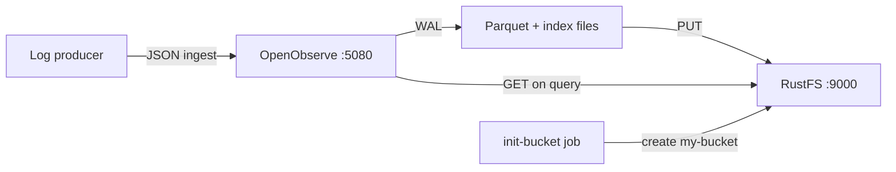
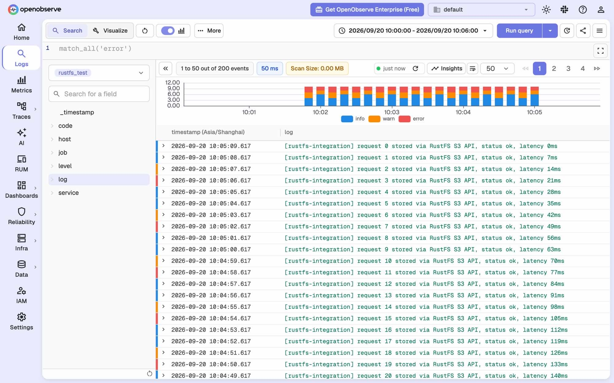

このガイドでは、**RustFS** をオブジェクトストレージバックエンドとして **OpenObserve** を実行します。Docker Compose で両サービスを起動し、OpenObserve にログレコードを取り込み、オブジェクトストレージへフラッシュし、生成された Parquet ファイルを RustFS 内で確認して、OpenObserve の UI と検索 API からデータを再度照会します。

Docker と Compose プラグイン、および 3 つのコンテナを実行できるマシンが必要です。このデプロイはローカルでの統合テストを目的としており、本番環境向けではありません。

## 製品紹介

### OpenObserve

[OpenObserve](https://openobserve.ai/) は、ログ、メトリクス、トレース、リアルユーザーモニタリングを扱うオープンソースのオブザーバビリティプラットフォームです。ストレージとコンピュートを分離しており、取り込まれたデータはまずローカルの先行書き込みログ（WAL）に書き込まれ、全文索引付きの Parquet ファイルに変換された後、オブジェクトストレージへアップロードされます。オブジェクトストレージは唯一の永続データ層として機能します。クエリ時にはファイルリストのメタデータでリモートの Parquet ファイルを特定し、必要に応じてローカルキャッシュへダウンロードします。

OpenObserve は Rust 製の `object_store` クライアントを通じてオブジェクトストレージと通信します。デフォルトでは SigV4 署名付きの **パススタイル** リクエストを使用するため、エンドポイント URL、リージョン、認証情報、バケット名を指定すれば、RustFS を含む任意の S3 互換エンドポイントを利用できます。

### RustFS

RustFS は Rust で構築された分散オブジェクトストレージシステムです。SigV4 署名、パススタイルおよびバーチャルホストスタイルのアドレス指定、マルチパートアップロードを含む Amazon S3 API を実装し、Web コンソールとマルチテナント IAM を備えています。単一ノードからマルチノードクラスタまで実行でき、OpenObserve がテレメトリデータの保存に必要とする S3 オペレーションをカバーします。

### 統合の仕組み



- **書き込みパス**: データがサイズしきい値または `ZO_MAX_FILE_RETENTION_TIME`（デフォルト 600 秒）に達すると、OpenObserve は WAL レコードを Parquet ファイルにマージし、バケットの `files/` プレフィックスの下にアップロードして、ファイルリストに登録します。
- **クエリパス**: 検索 API は指定された時間範囲のファイルを解決し、RustFS からローカルキャッシュへダウンロードしてからクエリを実行します。

## 統合手順

### 1. プロジェクトファイルを作成する

作業ディレクトリを作成します。

```bash
mkdir rustfs-openobserve
cd rustfs-openobserve
```

環境変数ファイルを作成し、認証情報のプレースホルダーを置き換えます。

```ini title=".env"
RUSTFS_ACCESS_KEY=<your-access-key>
RUSTFS_SECRET_KEY=<your-secret-key>
RUSTFS_BUCKET_NAME=my-bucket
ZO_ROOT_USER_EMAIL=root@example.com
ZO_ROOT_USER_PASSWORD=Complexpass#123
```

:::note[OpenObserve のサンプル認証情報]

`root@example.com` と `Complexpass#123` は OpenObserve ドキュメントのサンプル値です。OpenObserve v1.0.x では、大文字・小文字・数字・特殊文字を含む 8〜128 文字のパスワードポリシーが強制されます。実際のデプロイでは必ず両方の値を変更し、`.env` をバージョン管理にコミットしないでください。

:::

Compose ファイルを作成します。

```yaml title="compose.yaml"
services:
  rustfs:
    image: rustfs/rustfs-x86-musl:v2.3.1
    environment:
      RUSTFS_ACCESS_KEY: ${RUSTFS_ACCESS_KEY}
      RUSTFS_SECRET_KEY: ${RUSTFS_SECRET_KEY}
      RUSTFS_VOLUMES: /data
      RUSTFS_ADDRESS: ":9000"
      RUSTFS_CONSOLE_ADDRESS: ":9001"
      RUSTFS_CONSOLE_ENABLE: "true"
    volumes:
      - rustfs-data:/data
    ports:
      - "9000:9000"
      - "9001:9001"
    healthcheck:
      test: ["CMD", "curl", "-sf", "http://127.0.0.1:9000/health"]
      interval: 10s
      timeout: 5s
      retries: 6
      start_period: 10s
    networks:
      - observability

  init-bucket:
    image: rustfs/rc:latest
    depends_on:
      rustfs:
        condition: service_healthy
    environment:
      RUSTFS_ACCESS_KEY: ${RUSTFS_ACCESS_KEY}
      RUSTFS_SECRET_KEY: ${RUSTFS_SECRET_KEY}
    entrypoint:
      - /bin/sh
      - -c
      - |
        until /usr/bin/rc alias set rustfs http://rustfs:9000 "$${RUSTFS_ACCESS_KEY}" "$${RUSTFS_SECRET_KEY}"; do
          echo "Waiting for RustFS..."
          sleep 2
        done
        /usr/bin/rc ls rustfs/my-bucket >/dev/null 2>&1 || /usr/bin/rc mb rustfs/my-bucket
    networks:
      - observability

  openobserve:
    image: openobserve/openobserve:v1.0.3
    depends_on:
      rustfs:
        condition: service_healthy
      init-bucket:
        condition: service_completed_successfully
    environment:
      ZO_ROOT_USER_EMAIL: ${ZO_ROOT_USER_EMAIL}
      ZO_ROOT_USER_PASSWORD: ${ZO_ROOT_USER_PASSWORD}
      ZO_LOCAL_MODE: "true"
      ZO_LOCAL_MODE_STORAGE: "s3"
      ZO_DATA_DIR: /data
      ZO_HTTP_PORT: "5080"
      RUST_LOG: INFO
      ZO_S3_PROVIDER: s3
      ZO_S3_SERVER_URL: http://rustfs:9000
      ZO_S3_REGION_NAME: us-east-1
      ZO_S3_ACCESS_KEY: ${RUSTFS_ACCESS_KEY}
      ZO_S3_SECRET_KEY: ${RUSTFS_SECRET_KEY}
      ZO_S3_BUCKET_NAME: ${RUSTFS_BUCKET_NAME}
      # Upload Parquet files after 60 seconds instead of the default 600.
      # Keep the default for production-like setups.
      ZO_MAX_FILE_RETENTION_TIME: "60"
    volumes:
      - oo-data:/data
    ports:
      - "5080:5080"
    networks:
      - observability

networks:
  observability:

volumes:
  rustfs-data:
  oo-data:
```

`ZO_LOCAL_MODE_STORAGE=s3` は必須です。シングルノードモードでは、これを設定しないと OpenObserve は Parquet ファイルをローカルディスクに書き込み、`ZO_S3_*` 変数を無視します。`init-bucket` ジョブは [`rc` イメージ](https://github.com/rustfs/cli)を使用して、RustFS がヘルスチェックを通過した後に `my-bucket` を作成します。バケットが既に存在する場合は作成をスキップします。

### 2. デプロイを起動する

Compose スタックを検証して起動します。

```bash
docker compose config
docker compose up -d
docker compose ps
```

`init-bucket` サービスは、バケット作成後に終了コード `0` で終了するはずです。

```text
✓ Bucket 'rustfs/my-bucket' created successfully.
```

`http://localhost:5080` で OpenObserve の UI を開き、`.env` の `ZO_ROOT_USER_EMAIL` と `ZO_ROOT_USER_PASSWORD` でサインインします。RustFS コンソールは `http://localhost:9001/rustfs/console/` から利用できます。

### 3. OpenObserve と RustFS の接続を確認する

OpenObserve の起動ログにストレージ設定が出力されていることを確認します。

```bash
docker compose logs openobserve | grep "s3 init config"
```

```text
INFO infra::storage::remote: s3 init config: StorageConfig { name: "default", provider: "s3", server_url: "http://rustfs:9000", region_name: "us-east-1", access_key: "<your-access-key>", secret_key: "<your-secret-key>", bucket_name: "my-bucket", bucket_prefix: "" }
```

OpenObserve は起動時にストレージのプローブも実行し、`o2_test/check.txt` をバケットに書き込んで読み戻します。RustFS 内でこのファイルが見えれば、書き込みパスが機能しています。

### 4. ログレコードを取り込む

組織 `default` のストリーム `rustfs_test` の JSON 取り込み API にレコードを送信します。

```bash
curl -u "root@example.com:Complexpass#123" \
  -X POST "http://localhost:5080/api/default/rustfs_test/_json" \
  -H "Content-Type: application/json" \
  -d '[
    {"level":"info","service":"rustfs-openobserve-demo","host":"host-1",
     "job":"integration-test","log":"[rustfs-integration] request 1 stored via RustFS S3 API","code":200},
    {"level":"error","service":"rustfs-openobserve-demo","host":"host-1",
     "job":"integration-test","log":"[rustfs-integration] request 2 stored via RustFS S3 API","code":200}
  ]'
```

```text
{"code":200,"status":[{"name":"rustfs_test","successful":2,"failed":0}]}
```

### 5. データをオブジェクトストレージへフラッシュする

ノードレベルのフラッシュエンドポイントを呼び出して、レコードを WAL から出します。

```bash
curl -s -u "root@example.com:Complexpass#123" -X PUT "http://localhost:5080/node/flush"
```

ingester は WAL レコードを Parquet ファイルに変換し、ファイルが `ZO_MAX_FILE_RETENTION_TIME`（この Compose ファイルでは 60 秒、デフォルトは 600 秒）より古くなるとバックグラウンドで RustFS へアップロードします。

## 検証

### RustFS 内のオブジェクトを確認する

バケット初期化イメージを使ってバケットの内容を一覧表示します。

```bash
docker compose run --rm --entrypoint /bin/sh init-bucket -c \
  '/usr/bin/rc alias set rustfs http://rustfs:9000 "$RUSTFS_ACCESS_KEY" "$RUSTFS_SECRET_KEY" >/dev/null && /usr/bin/rc ls rustfs/my-bucket --recursive'
```

出力には、プローブファイルと `files/` 配下の ingester の成果物が含まれるはずです。

```text
      19 B o2_test/check.txt
   3.7 KiB files/default/logs/rustfs_test/2026/09/20/02/75072592621841940484907.parquet
   6.5 KiB files/default/index/rustfs_test_logs/2026/09/20/02/75072592621841940484907.ttv
```

RustFS コンソール `http://localhost:9001/rustfs/console/` からバケットを確認することもできます。


OpenObserve は Parquet データファイルを `files/<organization>/<stream type>/<stream>/<date partitions>` の下に、全文索引ファイルを `files/<organization>/index/` の下に保存します。


### OpenObserve でログを照会する

OpenObserve の UI で **Logs** を開き、ストリーム `rustfs_test` を選択してクエリを実行します。取り込んだレコードが結果テーブルに表示されます。



検索 API による同じクエリです。`start_time` と `end_time` は**マイクロ秒**単位である点に注意してください。

```bash
curl -s -u "root@example.com:Complexpass#123" \
  -X POST "http://localhost:5080/api/default/_search?type=logs" \
  -H "Content-Type: application/json" \
  -d '{"query":{"sql":"SELECT count(*) AS cnt FROM \"rustfs_test\"","start_time":1789869600000000,"end_time":1789869960000000}}'
```

```text
"hits": [{"cnt": 200}]
```

### ストリーム統計を確認する

**Data → Streams** ページには、`rustfs_test` のイベント数、取り込みサイズと圧縮後サイズ、インデックスサイズが表示されます。


### ローカルキャッシュなしでデータが保持されることを確認する

永続層がローカルディスクではなく RustFS であることを確認するには、OpenObserve のキャッシュディレクトリを削除し、コンテナを再起動してから再度クエリを実行します。OpenObserve イメージにはシェルが含まれていないため、`busybox` でファイルを削除します。

```bash
docker compose stop openobserve
docker run --rm -v rustfs-openobserve_oo-data:/data busybox rm -rf /data/cache
docker compose start openobserve
```

UI が戻るのを待ち、上記の検索クエリを再度実行します。OpenObserve が Parquet ファイルを RustFS から再ダウンロードするため、同じレコードが返ります。プロジェクトのディレクトリ名（`rustfs-openobserve`）がボリューム名の接頭辞になります。別のディレクトリ名を使った場合は `docker volume ls` で確認してください。

## トラブルシューティング

### データが RustFS ではなくローカルディスクに書き込まれる

シングルノードモード（`ZO_LOCAL_MODE=true`）のストレージバックエンドはデフォルトで `disk` です。`ZO_LOCAL_MODE_STORAGE=s3` を設定しないと、OpenObserve は `ZO_S3_*` 変数を無視し、Parquet ファイルを `/data/wal/files/` の下に保持します。

### フラッシュ後もバケットに Parquet ファイルが現れない

アップローダーはバックグラウンドで実行され、ファイルが `ZO_MAX_FILE_RETENTION_TIME` より古くなった場合にのみ Parquet ファイルをアップロードします。デフォルトは 600 秒です。このガイドでは 60 秒に設定しています。ファイルがまだ見つからない場合は ingester のログを確認してください。

```bash
docker compose logs openobserve | grep "INGESTER:JOB"
```

### 検索 API が結果を返さない

検索 API の `start_time` と `end_time` はマイクロ秒単位です。`1789869600000` のようなミリ秒のタイムスタンプは 1970 年の範囲を選択するため、1000 を掛ける必要があります。

### OpenObserve が弱いパスワードのエラーで再起動を繰り返す

OpenObserve v1.0.x は、大文字・小文字・数字・特殊文字をそれぞれ 1 文字以上含まない `ZO_ROOT_USER_PASSWORD` の値を拒否します。

### RustFS コンソールが開かない

RustFS v2.x では、コンソールは `/rustfs/console/` のパスプレフィックスで提供されます。ポート `9001` のルートパスにアクセスすると、S3 スタイルの XML アクセス拒否レスポンスが返りますが、これは想定された動作です。

### RustFS が権限エラーで起動しない

RustFS イメージはユーザーとグループ `10001` で実行されます。このガイドの名前付きボリュームの代わりにホストディレクトリをマウントする場合は、事前に `chown -R 10001:10001 <host-directory>` を実行してください。

## 次のステップ

- 追加の S3 オペレーションを採用する前に、[S3 互換性ノート](/administration/protocols/s3)を確認してください。
- [アクセスキー管理](/security-compliance/iam/access-token)で本番用の専用認証情報を作成してください。
- [OpenObserve ドキュメント](https://openobserve.ai/docs/)に従って、Fluent Bit や OpenTelemetry Collector などの実際のログプロデューサーを接続してください。
