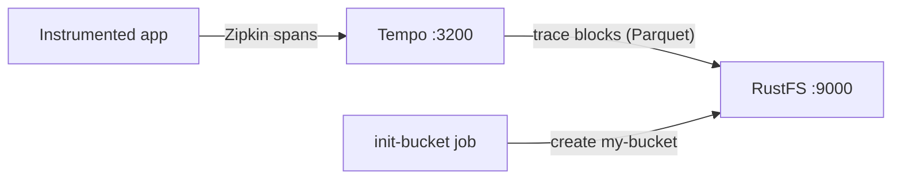

このガイドでは、Grafana Labs の分散トレーシングバックエンドである [Grafana Tempo](https://github.com/grafana/tempo) を、**RustFS** をトレースストレージとして実行します。Docker Compose でシングルバイナリの Tempo を起動し、Zipkin 互換レシーバー経由でトレースを push し、検索 API で照会して、トレースブロックが Parquet オブジェクトとして RustFS 内に保存されることを確認します。この流れは `grafana/tempo:2.9.5` と `rustfs/rustfs-x86-musl:v2.3.1` で検証済みです。

Docker と Compose プラグインが必要です。このデプロイはローカルでの統合テストを目的としており、本番環境向けではありません。

## アーキテクチャ



Tempo は Zipkin 互換エンドポイントからスパンを受け付け、メモリ内ブロックにバッファリングし、完了したブロックを Parquet ファイルとしてオブジェクトストレージへフラッシュします。検索はブロックインデックスを走査し、ブロックデータをオブジェクトストレージから読み込むため、すべてのトレースは Tempo の再起動後も保持されます。

## 1. プロジェクトファイルを作成する

作業ディレクトリを作成します。

```bash
mkdir rustfs-tempo
cd rustfs-tempo
```

環境変数ファイルを作成し、2 つの認証情報プレースホルダーを置き換えます。

```ini title=".env"
RUSTFS_ACCESS_KEY=<your-access-key>
RUSTFS_SECRET_KEY=<your-secret-key>
```

バケットには専用の認証情報を使用してください。`.env` をバージョン管理にコミットしないでください。

Tempo 設定を作成します。S3 バックエンドが RustFS に向いたシングルバイナリ構成で、検証時にデフォルトの 30 分を待たなくていいようブロック期間を短くしています。

```yaml title="tempo.yml"
server:
  http_listen_port: 3200

distributor:
  receivers:
    zipkin:
      endpoint: 0.0.0.0:9411

ingester:
  max_block_duration: 1m

compactor:
  compaction:
    block_retention: 24h

storage:
  trace:
    backend: s3
    s3:
      endpoint: rustfs:9000
      bucket: my-bucket
      access_key: <your-access-key>
      secret_key: <your-secret-key>
      insecure: true
      forcepathstyle: true
    wal:
      path: /var/tempo/wal
    blocklist_poll: 30s
```

`forcepathstyle: true` と `insecure: true` は、コンテナネットワークのエンドポイントに対して RustFS が期待する、平文 HTTP 上のパススタイルアドレス指定を選択します。`max_block_duration: 1m` と `blocklist_poll: 30s` は、テスト向けにフラッシュと発見のサイクルを高速化します。

Compose ファイルを作成します。

```yaml title="compose.yaml"
services:
  rustfs:
    image: rustfs/rustfs-x86-musl:v2.3.1
    environment:
      RUSTFS_ACCESS_KEY: ${RUSTFS_ACCESS_KEY}
      RUSTFS_SECRET_KEY: ${RUSTFS_SECRET_KEY}
      RUSTFS_VOLUMES: /data
      RUSTFS_ADDRESS: ":9000"
      RUSTFS_CONSOLE_ADDRESS: ":9001"
      RUSTFS_CONSOLE_ENABLE: "true"
    volumes:
      - rustfs-data:/data
    ports:
      - "9000:9000"
      - "9001:9001"
    healthcheck:
      test: ["CMD", "curl", "-sf", "http://127.0.0.1:9000/health"]
      interval: 10s
      timeout: 5s
      retries: 6
      start_period: 10s
    networks:
      - tempo

  create-bucket:
    image: rustfs/rc:latest
    depends_on:
      rustfs:
        condition: service_healthy
    environment:
      RUSTFS_ACCESS_KEY: ${RUSTFS_ACCESS_KEY}
      RUSTFS_SECRET_KEY: ${RUSTFS_SECRET_KEY}
    entrypoint:
      - /bin/sh
      - -c
      - |
        until /usr/bin/rc alias set rustfs http://rustfs:9000 "$${RUSTFS_ACCESS_KEY}" "$${RUSTFS_SECRET_KEY}"; do
          echo "Waiting for RustFS..."
          sleep 2
        done
        /usr/bin/rc ls rustfs/my-bucket >/dev/null 2>&1 || /usr/bin/rc mb rustfs/my-bucket
    networks:
      - tempo

  tempo:
    image: grafana/tempo:2.9.5
    command: -config.file=/tempo-local.yaml
    volumes:
      - ./tempo.yml:/tempo-local.yaml:ro
    ports:
      - "3200:3200"
      - "9411:9411"
    depends_on:
      create-bucket:
        condition: service_completed_successfully
    networks:
      - tempo

networks:
  tempo:

volumes:
  rustfs-data:
```

## 2. デプロイを起動する

コンテナを起動する前に Compose ファイルを検証します。

```bash
docker compose config
```

サービスを起動し、バケット初期化の完了を待ちます。

```bash
docker compose up -d
docker compose ps -a
```

ステータスエンドポイントが応答すれば Tempo が起動しています。

```bash
curl -s http://localhost:3200/status | head -c 120
```

## 3. トレースを push する

5 つのスパンを持つ小さな Zipkin トレースを、Zipkin 互換レシーバーに送信します。

```bash
python3 - <<'PY'
import json, time, urllib.request, random

now_us = int(time.time() * 1e6)
trace_id = "".join(random.choice("0123456789abcdef") for _ in range(32))
span_id = "".join(random.choice("0123456789abcdef") for _ in range(16))

spans = []
for i in range(5):
    spans.append({
        "traceId": trace_id,
        "id": "".join(random.choice("0123456789abcdef") for _ in range(16)),
        "name": f"rustfs-tempo-span-{i}",
        "timestamp": now_us - i * 1000,
        "duration": 1000 + i * 500,
        "localEndpoint": {"serviceName": "rustfs-tempo-demo"},
        "tags": {"job": "rustfs-integration"},
    })
spans[0]["parent_id"] = ""
for s in spans[1:]:
    s["parent_id"] = span_id

req = urllib.request.Request(
    "http://localhost:9411/api/v2/spans",
    data=json.dumps(spans).encode(),
    headers={"Content-Type": "application/json"},
    method="POST",
)
with urllib.request.urlopen(req, timeout=30) as r:
    print("push:", r.status)
print("trace_id:", trace_id)
PY
```

```text
push: 202
```

## 4. トレースを検索して読み込む

約 1 分後、ingester は完了したブロックを RustFS へフラッシュし、compactor がそれを発見します。タグで検索します。

```bash
curl -s "http://localhost:3200/api/search?tags=job=rustfs-integration"
```

```text
{"traces":[{"traceID":"5354809288c0d1a3de0e09ce74d06987","rootServiceName":"rustfs-tempo-demo","rootTraceName":"rustfs-tempo-span-0",...}]}
```

push スクリプトが表示したトレース ID を使って、ID 指定でトレースを取得します。

```bash
curl -s "http://localhost:3200/api/traces/<your-trace-id>" -o /dev/null -w "%{http_code}\n"
```

```text
200
```

## 5. RustFS 内のトレースブロックを確認する

バケット初期化イメージを使ってテナントのプレフィックスを一覧表示します。

```bash
docker compose run --rm --entrypoint /bin/sh create-bucket -c \
  '/usr/bin/rc alias set rustfs http://rustfs:9000 "$RUSTFS_ACCESS_KEY" "$RUSTFS_SECRET_KEY" >/dev/null && /usr/bin/rc ls rustfs/my-bucket/single-tenant --recursive'
```

`single-tenant` は `multitenancy_enabled` が `false` の場合に Tempo が使うテナントで、完了した各トレースブロックは 1 つの Parquet オブジェクトです。

```text
[2026-09-20 15:03:54]  25.16 KiB single-tenant/619118dc-a512-4ca6-90f5-e8b15bc9013f/data.parquet
```

RustFS コンソールでこのプレフィックスを参照することもできます。


ブロックは RustFS 内にあるため、Tempo を再起動してもトレースは照会可能です。コンテナを再起動して同じ検索を繰り返せば確認できます。

## 6. スタックを停止・リセットする

RustFS データボリュームを保持したままコンテナを停止します。

```bash
docker compose down
```

保存したトレースを削除して空の RustFS ボリュームからやり直す場合は、明示的に `--volumes` を付けます。

```bash
docker compose down --volumes
```

## トラブルシューティング

### 設定ファイルが "field ingester not found" で拒否される

Tempo 3.x では設定レイアウトが変更されました。このガイドは `grafana/tempo:2.9.5` に固定しており、上記の古典的な `ingester`/`compactor` ブロックと一致する設定になっています。

### push 直後の検索でトレースが見つからない

ingester は `max_block_duration`（このガイドでは 1 分）経過後に完了したブロックをフラッシュし、querier は毎回 `blocklist_poll`（30 秒）で新しいブロックを発見します。フラッシュを待ってから再度検索し、それでも見つからない場合は Tempo のログを確認してください。

```bash
docker compose logs tempo
```

### AccessDenied や 403 レスポンス

`tempo.yml` の認証情報が RustFS の認証情報と一致しているか、`create-bucket` ジョブが正常に完了しているかを確認してください。

```bash
docker compose logs create-bucket
```

### 接続エラーや証明書エラー

`endpoint` にスキーマは指定しません。`insecure: true` が平文 HTTP を、`forcepathstyle: true` がコンテナネットワークエンドポイント向けのパススタイルアドレス指定を選択します。Compose ネットワーク内では `rustfs:9000` を、ホストからは `localhost:9000` を使用してください。

## 次のステップ

- 追加の S3 オペレーションを採用する前に、[S3 互換性ノート](/administration/protocols/s3)を確認してください。
- [アクセスキー管理](/security-compliance/iam/access-token)で本番用の専用認証情報を作成してください。
- [Grafana Tempo ドキュメント](https://grafana.com/docs/tempo/latest/)に従って、OpenTelemetry Collector や計装済みアプリケーションをトレースプロデューサーとして接続してください。
