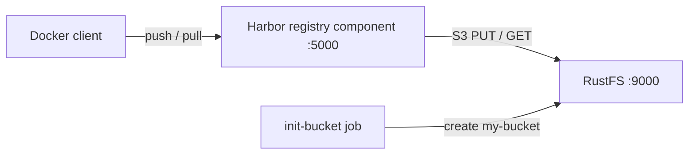

このガイドでは、CNCF を卒業したクラウドネイティブレジストリである [Harbor](https://github.com/goharbor/harbor) を **RustFS** に接続します。Harbor は、[distribution](https://distribution.github.io/distribution/) プロジェクトの S3 ストレージドライバーを実装する組み込み registry コンポーネントを通じて、イメージレイヤー・マニフェスト・その他の OCI アーティファクトを永続化します。Docker Compose でその registry コンポーネントを RustFS に対して実行し、イメージを push して pull で戻し、RustFS 内のオブジェクトを確認します。同じストレージ設定は完全な Harbor デプロイにも適用できます。この流れは `goharbor/registry-photon:v2.12.2` と `rustfs/rustfs-x86-musl:v2.3.1` で検証済みです。

Docker と Compose プラグインが必要です。このデプロイはローカルでの統合テストを目的としており、本番環境向けではありません。

## アーキテクチャ



registry は、S3 ストレージドライバーを通じて、すべての blob・マニフェスト・リポジトリリンクをバケット内の `docker/registry/v2/` の下に保存します。ドライバー設定の `regionendpoint`、`secure: false`、`skipverify: true` により、ドライバーが使用する AWS S3 クライアントが、平文 HTTP 上のパススタイルアドレス指定で RustFS エンドポイントに向くようになります。

## 1. プロジェクトファイルを作成する

作業ディレクトリを作成します。

```bash
mkdir rustfs-harbor
cd rustfs-harbor
```

環境変数ファイルを作成し、2 つの認証情報プレースホルダーを置き換えます。

```ini title=".env"
RUSTFS_ACCESS_KEY=<your-access-key>
RUSTFS_SECRET_KEY=<your-secret-key>
```

バケットには専用の認証情報を使用してください。`.env` をバージョン管理にコミットしないでください。

Harbor が registry コンポーネントに使う registry 設定を作成します。

```yaml title="config.yml"
version: 0.1
log:
  level: info
storage:
  s3:
    accesskey: <your-access-key>
    secretkey: <your-secret-key>
    region: us-east-1
    regionendpoint: http://rustfs:9000
    bucket: my-bucket
    secure: false
    skipverify: true
  delete:
    enabled: true
  redirect:
    disable: true
http:
  addr: 0.0.0.0:5000
health:
  storagedriver:
    enabled: true
    interval: 10s
    threshold: 3
```

`regionendpoint` はドライバーを AWS ではなく RustFS へ向けます。`secure: false` は Compose ネットワーク内での平文 HTTP を選択し、`redirect.disable: true` は registry 自身が blob を提供するようにします。Harbor はリダイレクト非対応のバックエンドに対して同じオプションを設定します。

Compose ファイルを作成します。

```yaml title="compose.yaml"
services:
  rustfs:
    image: rustfs/rustfs-x86-musl:v2.3.1
    environment:
      RUSTFS_ACCESS_KEY: ${RUSTFS_ACCESS_KEY}
      RUSTFS_SECRET_KEY: ${RUSTFS_SECRET_KEY}
      RUSTFS_VOLUMES: /data
      RUSTFS_ADDRESS: ":9000"
      RUSTFS_CONSOLE_ADDRESS: ":9001"
      RUSTFS_CONSOLE_ENABLE: "true"
    volumes:
      - rustfs-data:/data
    ports:
      - "9000:9000"
      - "9001:9001"
    healthcheck:
      test: ["CMD", "curl", "-sf", "http://127.0.0.1:9000/health"]
      interval: 10s
      timeout: 5s
      retries: 6
      start_period: 10s
    networks:
      - registry

  create-bucket:
    image: rustfs/rc:latest
    depends_on:
      rustfs:
        condition: service_healthy
    environment:
      RUSTFS_ACCESS_KEY: ${RUSTFS_ACCESS_KEY}
      RUSTFS_SECRET_KEY: ${RUSTFS_SECRET_KEY}
    entrypoint:
      - /bin/sh
      - -c
      - |
        until /usr/bin/rc alias set rustfs http://rustfs:9000 "$${RUSTFS_ACCESS_KEY}" "$${RUSTFS_SECRET_KEY}"; do
          echo "Waiting for RustFS..."
          sleep 2
        done
        /usr/bin/rc ls rustfs/my-bucket >/dev/null 2>&1 || /usr/bin/rc mb rustfs/my-bucket
    networks:
      - registry

  registry:
    image: goharbor/registry-photon:v2.12.2
    volumes:
      - ./config.yml:/etc/registry/config.yml:ro
    ports:
      - "5000:5000"
    depends_on:
      create-bucket:
        condition: service_completed_successfully
    networks:
      - registry

networks:
  registry:

volumes:
  rustfs-data:
```

[`rc` イメージ](https://github.com/rustfs/cli)は RustFS の公式コマンドラインクライアントを提供します。初期化ジョブは作成前に `my-bucket` の存在を確認するため、繰り返し起動しても既存のアーティファクトは削除されません。

## 2. デプロイを起動する

コンテナを起動する前に Compose ファイルを検証します。

```bash
docker compose config
```

サービスを起動し、バケット初期化の完了を待ちます。

```bash
docker compose up -d
docker compose ps -a
```

registry API は空のカタログで応答するはずです。

```bash
curl -s http://localhost:5000/v2/_catalog
```

```text
{"repositories":[]}
```

## 3. イメージを push する

小さなイメージを pull し、ローカルのレジストリ向けにタグを付け直して push します。

```bash
docker pull busybox:latest
docker tag busybox:latest localhost:5000/demo/app:v1
docker push localhost:5000/demo/app:v1
```

```text
v1: digest: sha256:1cfa4e2b09e127b9c4ed43578d3f3c18e7d44ea47b9ea98475c0cbe9086525f8 size: 527
```

## 4. イメージを pull で戻す

ローカルのタグを削除してから、registry からイメージを pull します。レイヤーは今や RustFS から提供されます。

```bash
docker rmi localhost:5000/demo/app:v1
docker pull localhost:5000/demo/app:v1
```

```text
localhost:5000/demo/app:v1
```

## 5. RustFS 内のオブジェクトを確認する

バケット初期化イメージを使ってリポジトリのプレフィックスを一覧表示します。

```bash
docker compose run --rm --entrypoint /bin/sh create-bucket -c \
  '/usr/bin/rc alias set rustfs http://rustfs:9000 "$RUSTFS_ACCESS_KEY" "$RUSTFS_SECRET_KEY" >/dev/null && /usr/bin/rc ls rustfs/my-bucket/docker/registry/v2/repositories/demo --recursive'
```

```text
[2026-09-20 12:11:25]       71 B docker/registry/v2/repositories/demo/app/_layers/sha256/b05093807bb0294152bb9cf86d64da722732dddaf7f8882fa1f120477dbc4db3/link
[2026-09-20 12:11:25]       71 B docker/registry/v2/repositories/demo/app/_layers/sha256/c6348fa86ba0fb2108c9334f5fe913ddc6d853313e655891f133a0127c30099f/link
[2026-09-20 12:11:25]       71 B docker/registry/v2/repositories/demo/app/_manifests/revisions/sha256/1cfa4e2b09e127b9c4ed43578d3f3c18e7d44ea47b9ea98475c0cbe9086525f8/link
[2026-09-20 12:11:25]       71 B docker/registry/v2/repositories/demo/app/_manifests/tags/v1/current/link
[2026-09-20 12:11:25]       71 B docker/registry/v2/repositories/demo/app/_manifests/tags/v1/index/sha256/1cfa4e2b09e127b9c4ed43578d3f3c18e7d44ea47b9ea98475c0cbe9086525f8/link
```

blob の実体は `docker/registry/v2/blobs/` の下に保存されます。RustFS コンソール (`http://localhost:9001/rustfs/console/`) でこのプレフィックスを参照することもできます。


## 6. 完全な Harbor デプロイで RustFS を使用する

上で検証した registry コンポーネントは、完全な Harbor デプロイが実行するものと同じコンポーネントです。そのためストレージ設定はそのまま引き継げます。

Helm チャートでは `persistence.imageChartStorage` の下に S3 オプションを設定します。

```yaml title="values.yaml"
persistence:
  imageChartStorage:
    type: s3
    disableredirect: true
    s3:
      region: us-east-1
      bucket: my-bucket
      accesskey: <your-access-key>
      secretkey: <your-secret-key>
      regionendpoint: http://rustfs:9000
      secure: false
      skipverify: true
```

`harbor.yml` ファイルを使う Harbor インストーラーでは、同じドライバーキーを `storage_service.s3` の下に置きます。どちらのファイルも、[distribution プロジェクト](https://distribution.github.io/distribution/about/configuration/)でドキュメント化されているストレージドライバーのオプションを受け付けます。このガイドで検証したのはまさにその設定面です。

## 7. スタックを停止・リセットする

RustFS データボリュームを保持したままコンテナを停止します。

```bash
docker compose down
```

保存したアーティファクトを削除して空の RustFS ボリュームからやり直す場合は、明示的に `--volumes` を付けます。

```bash
docker compose down --volumes
```

## トラブルシューティング

### registry が起動しない、またはストレージエラーが出る

S3 ドライバーのメッセージを確認するために registry のログを確認します。

```bash
docker compose logs registry
```

`regionendpoint` は registry コンテナから到達可能である必要があります。Compose ネットワーク内では `http://rustfs:9000` を、ホスト上のプロセスからは `http://localhost:9000` を使用してください。

### 平文 HTTP エンドポイントでの SSL エラーや証明書エラー

`secure: false` は RustFS エンドポイントで平文 HTTP を選択します。設定しないとドライバーは HTTPS を試みて接続エラーや証明書エラーになります。自己署名証明書の TLS エンドポイントでは、`secure: true` を維持し、`skipverify: true` を設定した上で、Harbor が `harbor.yml` で公開している `ca_bundle` オプションで CA バンドルを提供してください。

### AccessDenied や 403 レスポンス

`config.yml` の認証情報が RustFS の認証情報と一致しているか、`create-bucket` ジョブが正常に完了しているかを確認してください。

```bash
docker compose logs create-bucket
```

### push は成功するがオブジェクトが期待のプレフィックスに現れない

ドライバーはバケット内の `docker/registry/v2/` の下に書き込みます。設定問題と判断する前に、バケット全体を再帰的に一覧表示してリポジトリツリーの場所を確認してください。

## 次のステップ

- 追加の S3 オペレーションを採用する前に、[S3 互換性ノート](/administration/protocols/s3)を確認してください。
- [アクセスキー管理](/security-compliance/iam/access-token)で本番用の専用認証情報を作成してください。
- [Harbor ドキュメント](https://goharbor.io/docs/)に従って、レプリケーション・脆弱性スキャン・RBAC を備えた完全な Harbor デプロイを構成してください。
