> Note: This document is based on the latest RustFS version. Please perform full data backup before scaling operations. For production environments, it's recommended to contact RustFS technical support engineers for solution review.

## Scaling Solution Overview

RustFS supports horizontal scaling by adding new storage pools (Server Pool). Each new storage pool must meet:

1. Nodes within the storage pool must use **consecutive hostnames** (e.g., node5-node8)
2. Single storage pool must use **same specifications** of disks (type/capacity/quantity)
3. New storage pools must maintain **time synchronization** and **network connectivity** with existing clusters

```mermaid
flowchart LR
    APP[Applications] --> S3API(["S3 API"])

    subgraph DIST["Distributed RustFS"]
        direction TB
        subgraph N1["Node 1"]
            direction LR
            S3a[S3]
            subgraph OL1["Object Layer"]
                direction TB
                C1[Cache]
                K1[Compression]
                E1[Encryption]
                B1["Erasure Code · Bitrot"]
            end
            SL1["Storage Layer"]
            J1[("JBOD / FS disks")]
            S3a -->|Object API| OL1
            OL1 -->|Storage API| SL1
            SL1 <--> J1
        end
        subgraph N2["Node 2"]
            direction LR
            S3b[S3]
            subgraph OL2["Object Layer"]
                direction TB
                C2[Cache]
                K2[Compression]
                E2[Encryption]
                B2["Erasure Code · Bitrot"]
            end
            SL2["Storage Layer"]
            J2[("JBOD / FS disks")]
            S3b -->|Object API| OL2
            OL2 -->|Storage API| SL2
            SL2 <--> J2
        end
        NN["Node n ..."]
        N1 <-->|Internal RESTful API| N2
        N2 <-->|Internal RESTful API| NN
    end

    S3API --> N1
    S3API --> N2
    S3API --> NN

    classDef server fill:#dbeafe,stroke:#3b82f6,stroke-width:2px,color:#1e293b;
    classDef store fill:#dcfce7,stroke:#22c55e,stroke-width:2px,color:#1e293b;
    classDef svc fill:#eef2ff,stroke:#6366f1,stroke-width:2px,color:#1e293b;
    classDef muted fill:#f3f4f6,stroke:#9ca3af,stroke-width:2px,color:#1e293b;
    classDef accent fill:#fae8ff,stroke:#c026d3,stroke-width:2px,color:#1e293b;
    class APP,NN muted
    class S3API accent
    class S3a,S3b,SL1,SL2 server
    class C1,K1,E1,B1,C2,K2,E2,B2 svc
    class J1,J2 store
```



---

## Pre-Scaling Preparation

### 1.1 Hardware Planning Requirements

| Item | Minimum Requirements | Recommended Production Configuration |
|---------------|---------------------------|---------------------------|
| Node Count | 4 nodes/storage pool | 4 - 8 nodes/storage pool |
| Single Node Memory | 128 GB | 128 GB |
| Disk Type | SSD | NVMe SSD |
| Single Disk Capacity | ≥1 TB | ≥4 TB |
| Network Bandwidth | 10 Gbps | 25 Gbps |

### 1.2 System Environment Check

```bash
# Check hostname continuity (new node example)
cat /etc/hosts
192.168.10.5 node5
192.168.10.6 node6
192.168.10.7 node7
192.168.10.8 node8

# Verify time synchronization status
timedatectl status | grep synchronized

# Check firewall rules (all nodes need to open ports 9000/9001)
firewall-cmd --list-ports | grep 9000
firewall-cmd --list-ports | grep 9001
```

---

## Scaling Implementation Steps

### 2.1 New Node Basic Configuration

```bash
# Create dedicated user (execute on all new nodes)
groupadd rustfs-user
useradd -M -r -g rustfs-user rustfs-user

# Create storage directories (example with 8 disks)
mkdir -p /data/rustfs{0..7}
chown -R rustfs-user:rustfs-user /data/rustfs*
```

### 2.2 Install RustFS Binary on all new nodes

```bash
# Check rustfs version on existing node
/usr/local/bin/rustfs --version

# Download and install binary package (version must match existing cluster), e.g. for version 1.0.0-alpha.67:
wget https://github.com/rustfs/rustfs/releases/download/1.0.0-alpha.67/rustfs-linux-x86_64-musl-latest.zip
unzip rustfs-linux-x86_64-musl-latest.zip
chmod +x rustfs
mv rustfs /usr/local/bin/
```

### 2.3 Create RustFS configuration file on all new nodes (/etc/default/rustfs)

```bash
# Create configuration file (/etc/default/rustfs)
# Please replace <Your RustFS admin username> and <Secure password of your RustFS admin> with yours values!
cat <<EOF > /etc/default/rustfs
RUSTFS_ACCESS_KEY=<Your RustFS admin username> # e.g. admin
RUSTFS_SECRET_KEY=<Secure password of your RustFS admin> # e.g. output of: openssl rand -base64 24
RUSTFS_VOLUMES="http://node-{1...4}:9000/data/rustfs{0...3} http://node-{5...8}:9000/data/rustfs{0...7}" # add new storage pool to the existing
RUSTFS_ADDRESS=":9000"
RUSTFS_CONSOLE_ADDRESS=":9001"
EOF
```

### 2.4 Configure System Service on all new nodes

```bash
# Create systemd service file

sudo tee /etc/systemd/system/rustfs.service <<EOF
[Unit]
Description=RustFS Object Storage Server
Documentation=https://rustfs.com/docs/
After=network-online.target
Wants=network-online.target

[Service]
Type=notify
NotifyAccess=main
User=root
Group=root

WorkingDirectory=/usr/local
EnvironmentFile=-/etc/default/rustfs
ExecStart=/usr/local/bin/rustfs \$RUSTFS_VOLUMES

LimitNOFILE=1048576
LimitNPROC=32768
TasksMax=infinity

Restart=always
RestartSec=10s

OOMScoreAdjust=-1000
SendSIGKILL=no

TimeoutStartSec=30s
TimeoutStopSec=30s

NoNewPrivileges=true
ProtectHome=true
PrivateTmp=true
PrivateDevices=true
ProtectClock=true
ProtectKernelTunables=true
ProtectKernelModules=true
ProtectControlGroups=true
RestrictSUIDSGID=true
RestrictRealtime=true

# service log configuration
StandardOutput=append:/var/logs/rustfs/rustfs.log
StandardError=append:/var/logs/rustfs/rustfs-err.log

[Install]
WantedBy=multi-user.target
EOF
```

### 2.5 Reload service configuration on all new nodes

```bash
#Reload service configuration
sudo systemctl daemon-reload

#Start service and set auto-start
sudo systemctl enable --now rustfs
```

### 2.6 Cluster Scaling Operation on all existing nodes

```bash
# Update configuration on all existing nodes (following command will add new storage pool to the existing $RUSTFS_VOLUMES list)
sed -i '/RUSTFS_VOLUMES/s|"$| http://node{5...8}:9000/data/rustfs{0...7}"|' /etc/default/rustfs
```

### 2.7 Cluster Scaling Operation on all nodes (existing and added)

```bash
# Global service restart (execute simultaneously on all nodes)
systemctl restart rustfs.service
```

---

## Post-Scaling Verification

### 3.1 Check Server List in RustFS Console
Open in the RustFS Console Performance menu, e.g. http://node1:9001/rustfs/console/performance and check node join status in the Server List

### 3.2 Data Balance Verification

```bash
# View data distribution ratio (should be close to each storage pool capacity ratio)
watch -n 5 "rustfs-admin metrics | grep 'PoolUsagePercent'"
```

---

## Important Notes

1. **Rolling Restart Prohibited**: Must restart all nodes simultaneously to avoid data inconsistency
2. **Capacity Planning Recommendation**: Should plan next scaling when storage usage reaches 70%
3. **Performance Tuning Recommendations**:

 ```bash
 # Adjust kernel parameters (all nodes)
 echo "vm.swappiness=10" >> /etc/sysctl.conf
 echo "net.core.somaxconn=32768" >> /etc/sysctl.conf
 sysctl -p
 ```

---

## Troubleshooting Guide

| Symptom | Check Point | Fix Command |
|---------------------------|---------------------------------|-------------------------------|
| New nodes cannot join cluster | Check port 9000 connectivity | `telnet node5 9000` |
| Uneven data distribution | Check storage pool capacity configuration | `rustfs-admin rebalance start`|
| Console shows abnormal node status | Verify time synchronization status | `chronyc sources` |
