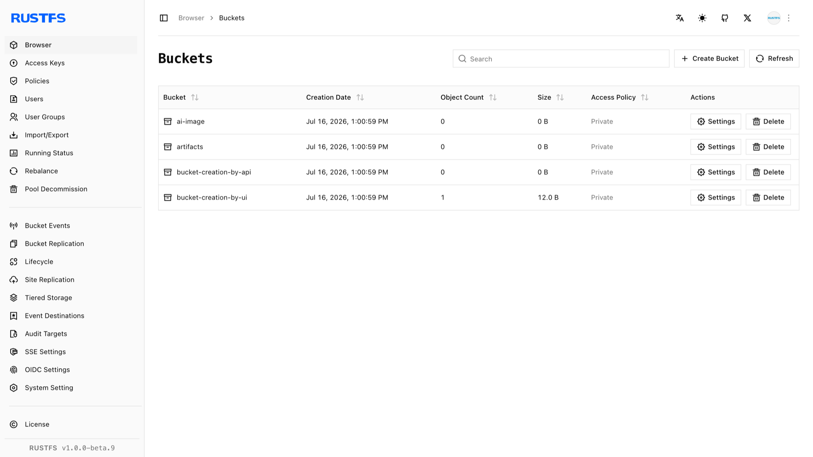

本指南介绍如何使用 RustFS UI、`rc` 或 S3 API 创建存储桶。

## 要求

- 正在运行的 RustFS 实例（参阅[安装指南](../../../installation/index.md)）。
- 已安装 [`rc`](/operations/rc)，并为命令行工作流配置了别名。

## 使用 RustFS UI

1. 登录 RustFS 控制台。
2. 在存储桶页面右上角，选择 **Create Bucket**。
3. 输入存储桶名称，然后单击 **Create** 完成创建。



## 使用 `rc`

有关安装和别名配置，请参阅 [`rc` 指南](/operations/rc)。

创建存储桶：

```bash
rc bucket create rustfs/my-bucket
rc bucket list rustfs/
```

```text
✓ Bucket 'rustfs/my-bucket' created successfully.
```

## 使用 API

通过 API 创建存储桶：

```http
PUT /{bucketName} HTTP/1.1
```

S3 请求必须使用 AWS Signature V4 签名，因此请使用 S3 客户端，不要手动构造请求头。为访问密钥配置 [AWS CLI](https://docs.aws.amazon.com/cli/latest/userguide/getting-started-install.html) 后，运行：

```bash
aws s3api create-bucket \
  --bucket bucket-creation-by-api \
  --endpoint-url http://localhost:9000
```

在 RustFS 控制台中确认存储桶已创建。