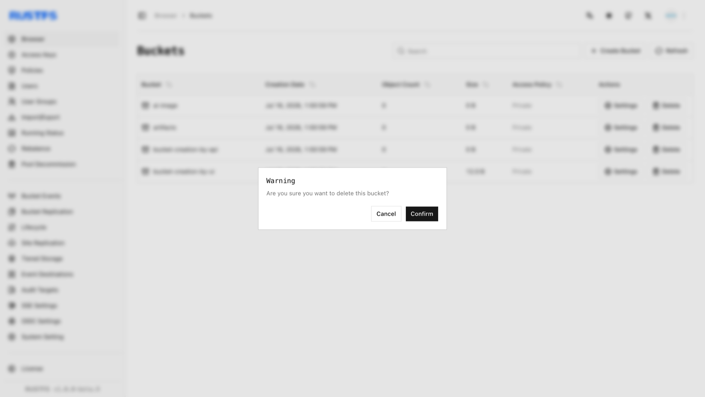

本指南介绍如何使用 RustFS UI、`rc` 或 S3 API 删除存储桶。

## 要求

- 使用命令行工作流前，请安装并配置 [`rc`](/operations/rc)。
- 删除目标存储桶前先将其清空；仅在检查将被删除的对象后使用 `--force`。

**警告**：删除存储桶无法撤销，并可能导致依赖该存储桶的应用中断。继续操作前，请确保已备份所有必要数据。

## 使用 RustFS UI

1. 登录 RustFS 控制台。
2. 在首页选择要删除的存储桶。
3. 在最右侧选择 **Delete** 按钮。
4. 在弹出对话框中单击 **Confirm**，完成存储桶删除。



## 使用 `rc`

有关安装和别名配置，请参阅 [`rc` 指南](/operations/rc)。

删除存储桶：

```bash
rc bucket remove rustfs/my-bucket
```

```text
✓ Bucket 'rustfs/my-bucket' removed successfully.
```

## 使用 API

通过 API 删除存储桶：

```http
DELETE /{bucketName} HTTP/1.1
```

S3 请求必须使用 AWS Signature V4 签名，因此请使用 S3 客户端，不要手动构造请求头。为访问密钥配置 [AWS CLI](https://docs.aws.amazon.com/cli/latest/userguide/getting-started-install.html) 后，运行：

```bash
aws s3api delete-bucket \
  --bucket bucket-creation-by-api \
  --endpoint-url http://localhost:9000
```

在 RustFS 控制台中确认存储桶已删除。