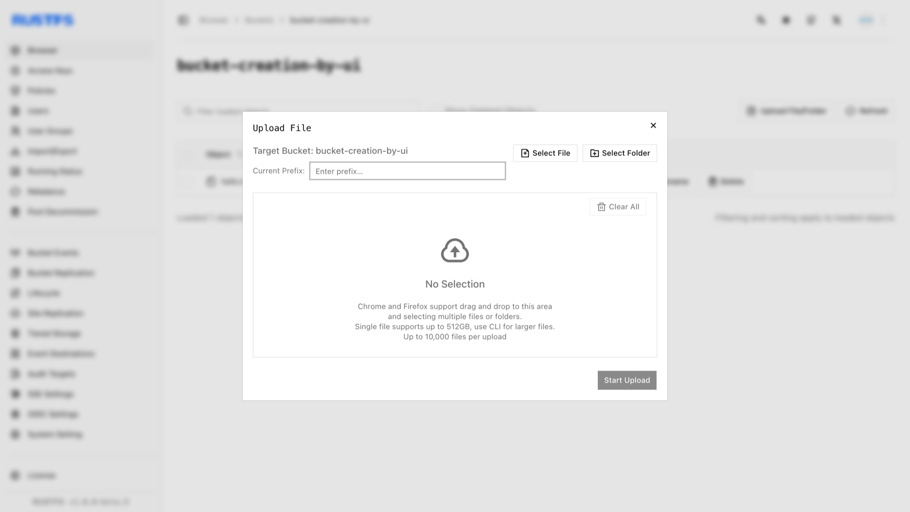
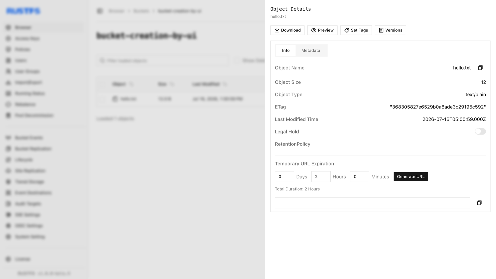

对象是 RustFS 中的基本存储单元，包含数据、元数据和唯一键。本指南介绍如何创建（上传）对象。

## 要求

- 正在运行的 RustFS 实例（参阅[安装指南](../../../installation/index.md)）。
- 已安装 [`rc`](/operations/rc)，并为命令行工作流配置了别名。
- 目标存储桶。按照[创建存储桶](../bucket/creation.md)中的步骤创建一个存储桶。

## 创建对象

### 使用 RustFS UI

1. 登录 RustFS 控制台。
2. 选择目标存储桶。
3. 在存储桶页面右上角，选择 **New Directory**、**New File** 或 **Upload File/Folder**。
4. 如需从本地计算机上传，请单击 **Upload File/Folder**，选择文件，然后单击 **Start Upload**。



单击对象可查看其详细信息。



### 使用 `rc`

有关安装和别名配置，请参阅 [`rc` 指南](/operations/rc)。

上传文件：

```bash
rc object copy /path/to/hello.txt rustfs/my-bucket/hello.txt
rc object list rustfs/my-bucket
```

在 RustFS 控制台中确认上传结果。

### 使用 API

通过 API 上传文件：

```http
PUT /{bucketName}/{objectName} HTTP/1.1
```

S3 请求必须使用 AWS Signature V4 签名，因此请使用 S3 客户端，不要手动构造请求头。为访问密钥配置 [AWS CLI](https://docs.aws.amazon.com/cli/latest/userguide/getting-started-install.html) 后，运行：

```bash
aws s3api put-object \
  --bucket bucket-creation-by-api \
  --key hello.txt \
  --body /path/to/hello.txt \
  --endpoint-url http://localhost:9000
```

在 RustFS 控制台中确认上传结果。

## 删除对象

请参阅[删除对象](./deletion.md)。

使用以下 API 删除文件：

```http
DELETE /{bucketName}/{objectName} HTTP/1.1
```

请求示例：

```bash
aws s3api delete-object \
  --bucket bucket-creation-by-api \
  --key hello.txt \
  --endpoint-url http://localhost:9000
```

可以在 RustFS UI 中确认文件已删除。