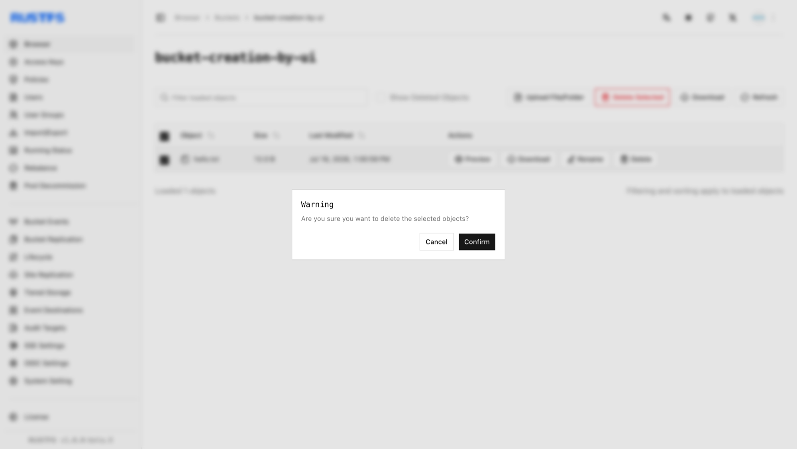

本指南介绍如何删除对象。

## 要求

- 使用命令行工作流前，请安装并配置 [`rc`](/operations/rc)。
- 删除对象前，请确认别名、存储桶和对象键。

## 使用 RustFS UI

1. 登录 RustFS 控制台。
2. 选择包含待删除文件的存储桶。
3. 在存储桶页面选择待删除文件。
4. 单击右上角的 **Delete Selected Items**，然后在弹出对话框中单击 **Confirm**。



## 使用 `rc`

删除文件：

```bash
rc object remove rustfs/my-bucket/hello.txt
rc object list rustfs/my-bucket
```

```text
Removed: rustfs/my-bucket/hello.txt
✓ Removed 1 object(s).
```

在 RustFS 控制台中确认删除结果。

## 使用 API

通过 API 删除文件：

```http
DELETE /{bucketName}/{objectName} HTTP/1.1
```

S3 请求必须使用 AWS Signature V4 签名，因此请使用 S3 客户端，不要手动构造请求头。为访问密钥配置 [AWS CLI](https://docs.aws.amazon.com/cli/latest/userguide/getting-started-install.html) 后，运行：

```bash
aws s3api delete-object \
  --bucket bucket-creation-by-api \
  --key hello.txt \
  --endpoint-url http://localhost:9000
```

在 RustFS 控制台中确认删除结果。