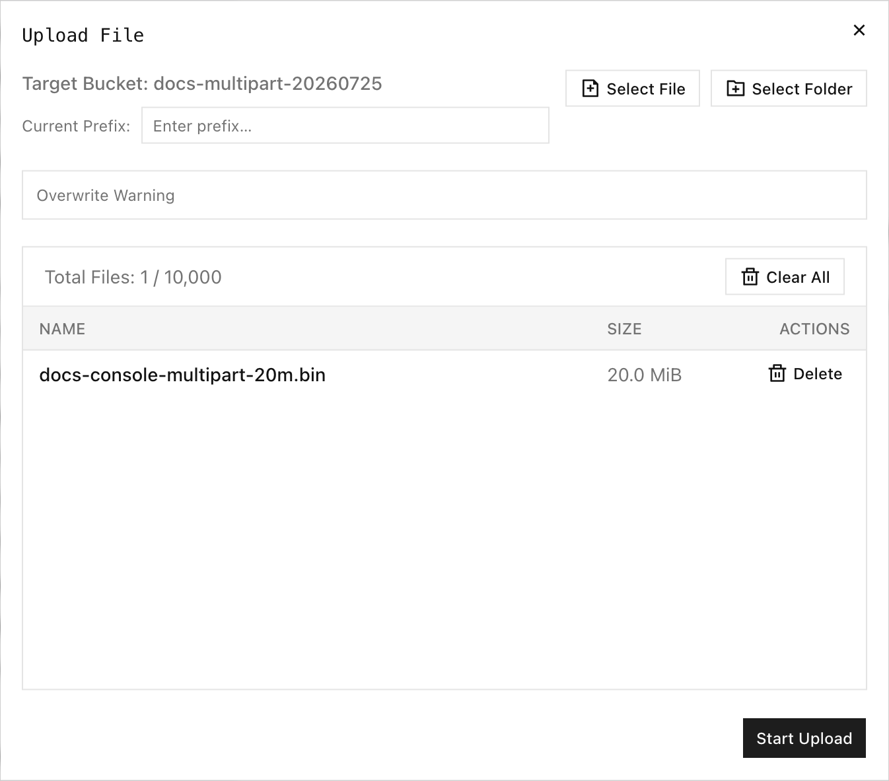

分段上传将一个对象拆分为独立上传的分段，并在服务器上进行组装。它适用于大型对象、可重试传输，以及需要进度和取消控制的浏览器上传。

## 概述

S3 分段上传工作流包含三个必要阶段：

1. **CreateMultipartUpload** 返回上传 ID。
2. **UploadPart** 上传带编号的分段，并为每个分段返回 ETag。
3. **CompleteMultipartUpload** 提交按顺序排列的分段编号和 ETag，以创建最终对象。

使用 **AbortMultipartUpload** 中止未完成的上传，避免临时分段继续占用存储空间。

RustFS 接受从 `1` 到 `10000` 的分段编号。`ListParts` 和 `ListMultipartUploads` 每次响应最多返回 1,000 个条目，并使用标记分页。只有完成请求成功后，完整对象才会出现。

## 在控制台中上传

1. 登录 RustFS 控制台并打开目标存储桶。
2. 选择 **Upload File/Folder**。
3. 可选择输入 **Current Prefix**。
4. 选择 **Select File** 或 **Select Folder**，然后选择要上传的内容。
5. 检查所选名称和大小，然后选择 **Start Upload**。



观察到的控制台上传对话框支持最多选择 10,000 个文件，并报告单个文件最大为 512 GB。这些是控制台上传限制；S3 客户端可能有不同的本地限制。

上传开始后，**Task Management** 会将任务分组为 Pending、Processing、Completed、Failed 和 Canceled 状态。每个处理中的任务都会显示进度和 **Cancel** 操作。取消活动的分段任务会中止当前分段请求，并将任务标记为已取消。

完成后刷新存储桶，确认对象大小和修改时间。

## 使用 rc

使用 `rc` 上传并验证对象：

```bash
rc object copy /path/to/hello.txt rustfs/my-bucket/hello.txt
rc object stat rustfs/my-bucket/hello.txt --json
```

:::note[rc 0.1.29 分段上传限制]

`rc 0.1.29` 不提供创建、上传分段、完成、列出分段或中止分段上传的命令。经过验证，20 MiB 的 `rc object copy` 使用单个 `PutObject` 请求，而不是分段上传。需要显式分段上传行为时，请使用控制台或 S3 SDK；使用 `rc object stat` 验证已完成的对象。

:::

对于启用版本控制的存储桶，列出已完成分段上传所创建的版本：

```bash
rc bucket version list rustfs/my-bucket/hello.txt --json
```

在启用版本控制的存储桶中成功完成分段上传后，RustFS 会返回版本 ID。

## S3 分段上传操作

使用支持以下标准操作的 S3 SDK：

| 阶段 | S3 操作 | 必需值 |
| --- | --- | --- |
| 发起 | `CreateMultipartUpload` | 存储桶、键、元数据、加密和可选的对象锁定设置。 |
| 上传 | `UploadPart` | 存储桶、键、上传 ID、分段编号和正文。保存返回的 ETag。 |
| 检查 | `ListParts` | 存储桶、键和上传 ID。需要时进行分页。 |
| 完成 | `CompleteMultipartUpload` | 按顺序排列的分段编号及其准确 ETag。 |
| 取消 | `AbortMultipartUpload` | 存储桶、键和上传 ID。 |
| 查找 | `ListMultipartUploads` | 存储桶和可选前缀。需要时进行分页。 |

不要将上传 ID 用于其他键。按分段编号升序提交已完成的分段，并完全保留每个 ETag 的返回值。

## 验证

完成后：

```bash
rc object stat rustfs/my-bucket/hello.txt --json
rc object show rustfs/my-bucket/hello.txt > /tmp/hello-downloaded.txt
cmp /path/to/hello.txt /tmp/hello-downloaded.txt
```

确认 `size_bytes` 与本地文件一致，且 `cmp` 成功退出。对于启用版本控制的存储桶，还要确认 `rc bucket version list` 返回版本 ID。

## 故障排除

| 现象 | 检查项 |
| --- | --- |
| 上传一直处于 Processing | 检查浏览器连接并保持控制台标签页打开；连接中断时取消并重试。 |
| 分段请求失败 | 使用同一上传 ID 和分段编号重试该分段，然后使用最新返回的 ETag。 |
| 完成操作报告分段无效 | 根据 `ListParts` 验证提交的分段编号、顺序和 ETag。 |
| 上传分段后对象不存在 | 发送 `CompleteMultipartUpload`；仅上传分段不会创建对象。 |
| 临时存储持续增长 | 列出未完成的上传并中止不再需要的上传。 |
| 对锁定键执行完成操作失败 | 检查当前目标版本的对象锁定保留期或依法保留。 |

## 后续步骤

- [创建和检查对象](./creation.md)
- [管理对象版本](./versioning.md)
- [使用对象锁定保护对象](./object-lock.md)