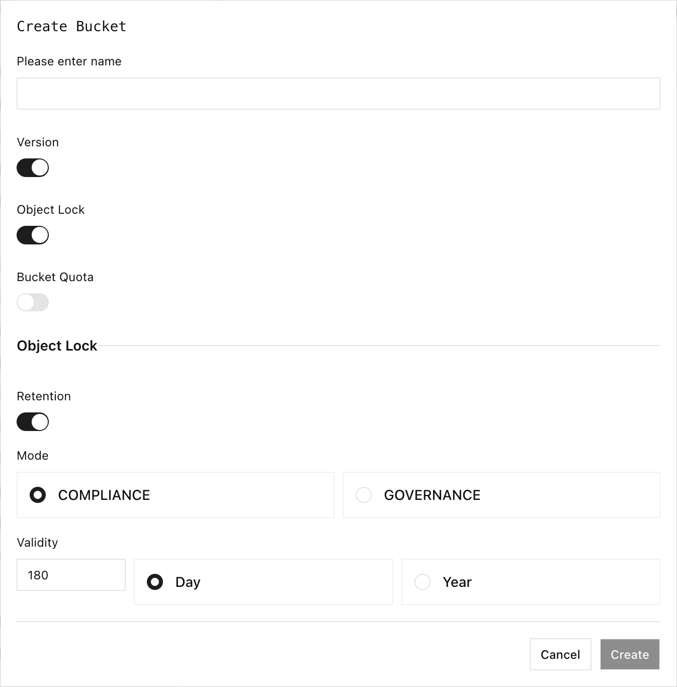

RustFS 对象锁定为单个对象版本提供一次写入、多次读取保护。使用保留期提供有期限的保护，使用依法保留提供没有预定义到期日期的保护。

## 概述

对象锁定要求启用存储桶版本控制，并且必须在创建存储桶时启用。每次覆盖都会创建新版本；保留期和依法保留保护的是特定版本，而不是整个对象键。

| 保护方式 | 行为 |
| --- | --- |
| `GOVERNANCE` 保留 | 阻止删除和缩短保留期，除非调用者具有绕过权限并显式请求绕过。无需绕过即可延长保留期。 |
| `COMPLIANCE` 保留 | 即使具有治理绕过权限也会阻止删除。日期可以延长，但不能缩短。 |
| 依法保留 | 阻止删除，直到保留状态设置为 `OFF`。它没有到期日期，治理绕过也无法将其覆盖。 |

删除不带版本 ID 的键会创建删除标记。受保护的版本仍会保留，并可按版本 ID 获取。

:::danger[启用前规划保留策略]

在保留截止日期之前，无法绕过或缩短 COMPLIANCE 保留期。保护生产数据前，请在非生产存储桶中测试策略，并验证时间同步、权限、生命周期规则、复制和备份流程。

:::

## 在控制台中配置

1. 登录 RustFS 控制台并打开 **Buckets**。
2. 选择 **Create Bucket** 并输入存储桶名称。
3. 启用 **Object Lock**。控制台还会启用 **Version**，因为对象锁定要求版本控制。
4. 如需自动对新对象版本应用保留期，请启用 **Retention**。
5. 选择 **COMPLIANCE** 或 **GOVERNANCE**，输入有效期，然后选择 **Day** 或 **Year**。
6. 选择 **Create**。



启用默认保留期时，控制台最初显示 `180` 天。请将其替换为保留策略要求的期限；这是 UI 初始值，不是通用建议。

要检查受保护对象，请打开存储桶，选择对象名称，然后使用 **Versions** 和 **Info** 标签页。Info 标签页会显示 **Legal Hold** 和 **RetentionPolicy** 字段。

## 使用 rc

运行这些示例前先配置别名：

```bash
rc alias set rustfs http://localhost:9000 \
	<your-access-key> <your-secret-key> \
	--region us-east-1 --bucket-lookup path
```

:::note[rc 0.1.29 存储桶创建限制]

`rc bucket create --with-lock` 和 `--with-versioning` 会出现在 `rc 0.1.29` 帮助输出中，但执行时会返回 `not implemented`。请在控制台中创建对象锁定存储桶。下面显示的上传请求头受支持，并已针对 RustFS 验证。

:::

上传带 GOVERNANCE 保留期的对象版本。请同时提供两个保留请求头，并使用未来的 RFC 3339 UTC 时间戳：

```bash
rc object copy /path/to/hello.txt rustfs/my-bucket/hello.txt \
	-H "x-amz-object-lock-mode:GOVERNANCE" \
	-H "x-amz-object-lock-retain-until-date:2027-01-01T00:00:00Z"
```

上传启用了依法保留的对象版本：

```bash
rc object copy /path/to/hello.txt rustfs/my-bucket/legal-hold.txt \
	-H "x-amz-object-lock-legal-hold:ON"
```

列出受保护版本并检查特定版本：

```bash
rc bucket version list rustfs/my-bucket --json
rc object stat rustfs/my-bucket/hello.txt \
	--version-id <version-id> --json
```

`rc 0.1.29` 不提供更改保留期或在 `ON` 与 `OFF` 之间切换现有依法保留状态的命令。请使用控制台或 S3 SDK 执行这些操作。

## 验证保护

1. 上传带 GOVERNANCE 保留期或依法保留的测试对象。
2. 使用 `rc bucket version list` 记录其版本 ID。
3. 通过 S3 客户端尝试在不绕过保护的情况下删除该确切版本。保护生效期间，RustFS 必须返回 `AccessDenied`。
4. 确认该版本在控制台中仍然可见，并可通过 `rc object stat --version-id` 检查。

测试 GOVERNANCE 保留期的绕过功能时，仅使用具有 `s3:BypassGovernanceRetention` 权限的专用管理身份。COMPLIANCE 保留期和依法保留不受治理绕过影响。

## 运维注意事项

- 默认存储桶保留期在发起新对象版本或分段上传时计算。
- 复制对象会创建新的目标版本；目标保留策略独立应用。
- 不应暂停对象锁定存储桶的版本控制。
- 保留期或依法保留阻止删除时，生命周期过期规则无法删除该版本。
- 锁定对象的复制目标必须支持兼容的对象锁定行为。

## 后续步骤

- [管理对象版本](./versioning.md)
- [配置存储桶复制](../bucket/replication.md)
- [查看安全检查清单](/installation/requirement/checklists/security-checklists)