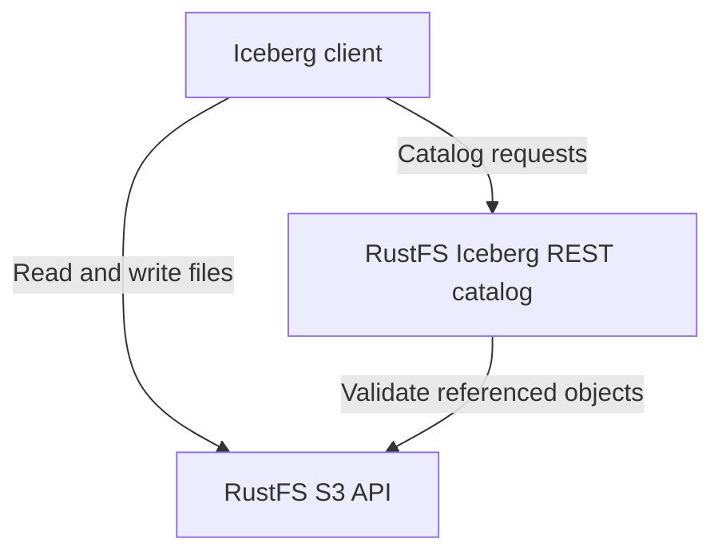

RustFS S3 Tables 通过内置 REST 目录管理 **Apache Iceberg** 表。表数据、清单和 Iceberg 元数据均以 S3 对象的形式存储在 RustFS 中。本指南介绍如何启用专用表存储桶，以及客户端连接、权限和维护方面的要求与限制。

:::note[预览状态与版本范围]

S3 Tables 目前为预览功能，客户端兼容性限于下文列出的工作流。本页依据 RustFS 提交 [`7e0c6711`](https://github.com/rustfs/rustfs/commit/7e0c67111b97703d47e23719b0264a739c8acea8) 编写，核对日期为 2026 年 9 月 8 日。使用其他目录操作或客户端前，请对照[支持矩阵](https://github.com/rustfs/rustfs/blob/7e0c67111b97703d47e23719b0264a739c8acea8/docs/architecture/s3-tables-support-matrix.md)确认当前部署版本的支持情况。

:::

## 工作原理

Iceberg 客户端通过 REST 目录发现表并提交元数据变更，通过 S3 API 读写表文件。这两个接口都由 RustFS 在 S3 API 端口上提供。



| 资源 | 用途 |
| --- | --- |
| 表存储桶 | 已启用目录功能的现有 S3 存储桶；桶名作为客户端的 `warehouse`。 |
| 命名空间 | 同一仓库内用于组织表的逻辑分组。 |
| 表 | 由目录维护的 Iceberg schema、快照和当前元数据位置。 |

启用表存储桶不会自动将现有 Parquet 文件注册为 Iceberg 表。请通过 Iceberg 客户端创建或注册表。未指定 `location` 时，RustFS 会分配存储位置；自定义位置必须位于同一存储桶内。客户端应使用返回的位置。

默认的 `object` 目录后端将目录状态持久化到 RustFS 对象存储。提交表变更时，会先校验其基准元数据和引用的对象，再有条件地更新当前元数据指针。发生写入冲突时，客户端必须重新加载表并处理冲突。事务范围限于单表。

## 开始之前

- 启动提供上述 S3 Tables 端点的 RustFS 部署。请参阅[安装](/installation)。
- 安装 [AWS CLI](/developer/examples/aws-cli)，以及支持 `--aws-sigv4` 和 `--fail-with-body` 的 `curl` 7.76 或更高版本。
- 为本教程新建一个专用存储桶，示例使用 `my-bucket`。
- 使用已有的管理账户，确保它同时具有目录操作和 S3 对象访问权限。内置的 `consoleAdmin` 策略覆盖本教程所需操作；应用程序应配置范围更小的策略。

示例使用 `http://localhost:9000` 作为端点。请替换为服务器端点，并在本地测试环境以外使用 [TLS](/integration/tls-configured)，保持证书校验开启。

:::warning[表存储桶的生命周期行为]

普通存储桶生命周期过期处理会跳过表存储桶。在现有存储桶上启用此模式，会改变其过期规则的执行方式。执行快照过期处理和清理表文件时，应使用能够识别 Iceberg 引用关系的目录维护操作。

:::

## 1. 创建存储桶

设置示例客户端的端点和访问凭证：

```bash
export RUSTFS_ENDPOINT="http://localhost:9000"
export AWS_ACCESS_KEY_ID="<your-access-key>"
export AWS_SECRET_ACCESS_KEY="<your-secret-key>"
export AWS_DEFAULT_REGION="us-east-1"
```

创建专用存储桶：

```bash
aws --endpoint-url "$RUSTFS_ENDPOINT" s3api create-bucket --bucket my-bucket
```

这些示例使用访问密钥和秘密密钥，不使用临时会话令牌。后续请求及 PyIceberg 指南均使用同一组 shell 环境变量。

## 2. 启用表存储桶

向表存储桶端点发送请求体为空的 SigV4 签名请求：

```bash
curl --fail-with-body --silent --show-error \
	--aws-sigv4 "aws:amz:us-east-1:s3" \
	--user "$AWS_ACCESS_KEY_ID:$AWS_SECRET_ACCESS_KEY" \
	--header "x-amz-content-sha256: e3b0c44298fc1c149afbf4c8996fb92427ae41e4649b934ca495991b7852b855" \
	--request PUT "$RUSTFS_ENDPOINT/iceberg/v1/buckets/my-bucket"
```

使用相同凭证读取状态：

```bash
curl --fail-with-body --silent --show-error \
	--aws-sigv4 "aws:amz:us-east-1:s3" \
	--user "$AWS_ACCESS_KEY_ID:$AWS_SECRET_ACCESS_KEY" \
	--header "x-amz-content-sha256: e3b0c44298fc1c149afbf4c8996fb92427ae41e4649b934ca495991b7852b855" \
	"$RUSTFS_ENDPOINT/iceberg/v1/buckets/my-bucket"
```

两个请求成功时均返回 HTTP `200`。确认响应包含以下值：

```json
{
	"table-bucket": "my-bucket",
	"enabled": true,
	"catalog-type": "iceberg-rest",
	"warehouse": "my-bucket",
	"catalog-entry-present": true
}
```

以上仅为响应节选。返回的 `catalog-uri` 是特定存储桶的路由；配置 Iceberg REST 客户端时，请使用下一节中的客户端基础 URI。

## 3. 连接 Iceberg 客户端

使用以下设置连接示例 RustFS 端点：

| 设置 | 值 |
| --- | --- |
| REST 目录 URI | `http://localhost:9000/iceberg` |
| 仓库与前缀 | `my-bucket` |
| REST 身份验证 | AWS Signature Version 4，签名服务名为 `s3` |
| 区域 | `us-east-1` |
| S3 文件端点 | `http://localhost:9000` 配合路径式寻址 |

客户端会在目录 URI 后添加 `/v1`。仓库值是存储桶名称，不是 S3 URI 或 AWS S3 Tables ARN。即使使用同一账户，也必须分别配置 REST 请求签名和 S3 文件访问。

如果已经运行独立的 Iceberg REST 目录，请参阅 [Apache Iceberg 集成](/developer/integration/big-data/iceberg)中的外部目录部署方式。

## 权限与凭证

启用表存储桶需要 `admin:SetTableBucket`，查询状态需要 `admin:GetTableBucket`。目录发现使用 `admin:GetTableCatalog`。命名空间和表操作分别对应 RustFS 管理操作权限，包括 `admin:SetTableNamespace`、`admin:CreateTable`、`admin:GetTableMetadata` 和 `admin:CommitTable`。

读写表文件还需要普通 S3 权限。RustFS 会对仓库对象路径检查表权限：读取需要相应的 `admin:GetTableMetadata` 授权，写入需要 `admin:SetTableMetadata`。仅授予目录提交权限，不会授权提交前的 S3 文件写入。请为两个接口配置 [IAM 策略](/security-compliance/iam/policies)。

目录凭证分发默认关闭。启用后，兼容客户端必须通过 `X-Iceberg-Access-Delegation: vended-credentials` 协商，调用方也必须具有请求表凭证的权限。初始目录连接仍然需要已获授权的身份。本文链接的 PyIceberg 教程使用显式配置的凭证。

## 维护与数据保护

元数据删除和后台维护默认关闭。RustFS 提供显式的维护规划、调度器运行和工作器运行操作，没有内置的定期维护调度器。启用删除前，请审查维护计划及其中保留的引用。

删除表会移除目录条目，但保留底层对象。请在注销表之前完成所需的表维护；注销后，维护操作将无法找到该表。清理遗留对象需要另行制定方案，并核实所有剩余引用。不要递归删除仍可能被快照或其他元数据引用的 S3 路径。

本教程保留默认目录后端。将现有部署切换到 `durable-strong` 时，必须遵循[目录切换流程](https://github.com/rustfs/rustfs/blob/7e0c67111b97703d47e23719b0264a739c8acea8/docs/operations/s3-tables-cutover-runbook.md)，包括迁移预检和协调隔离写入方。

## 客户端兼容性与限制

源码仓库维护的验证范围如下：

| 客户端 | 验证范围 |
| --- | --- |
| PyIceberg | 自动化验证创建、追加、重新加载、扫描及目录操作。 |
| DuckDB Iceberg 1.5.5 | 自动化验证通用 REST 目录下的单表读写和 schema 变更。 |
| Spark | 提供按需启用的在线测试框架；请验证实际部署的 Spark 和 Iceberg 版本组合。 |
| Trino | 仅提供手动只读探测，不声明写入兼容性。 |

支持 Iceberg 格式 v1 和 v2，默认使用 v2。不支持暂存式建表、删表时清除数据和 Iceberg 格式 v3。

RustFS S3 Tables 不提供 SQL 执行引擎、多表原子事务或跨区域独立双活写入，也不声明完整兼容 AWS S3 Tables 控制面。使用其他引擎或厂商专用配置前，请查阅[支持矩阵](https://github.com/rustfs/rustfs/blob/7e0c67111b97703d47e23719b0264a739c8acea8/docs/architecture/s3-tables-support-matrix.md)。

## 后续步骤

- 运行 [PyIceberg 教程](/developer/integration/big-data/pyiceberg)。
- 授予应用程序访问权限前，查阅 [IAM 策略](/security-compliance/iam/policies)。
- 使用仓库中的[客户端一致性检查](https://github.com/rustfs/rustfs/blob/7e0c67111b97703d47e23719b0264a739c8acea8/scripts/table-catalog/README.md)验证其他客户端版本。
