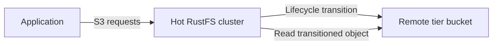

RustFS 分层存储会将对象从本地存储移至已配置的远程后端。本页说明支持的目标，并介绍如何在控制台中添加和维护 RustFS 存储层。

分层是异步的。RustFS 在本地保留对象元数据，将对象数据传输到远程层，并继续通过原始存储桶和对象键提供 S3 读取服务。



:::note[层级名称不是 AWS 存储类]

生命周期规则通过注册时使用的大写名称引用层级，例如 `COLDTIER`。除非已使用完全相同的有效名称注册 RustFS 层级并验证目标行为，否则不要替换为 `INTELLIGENT_TIERING`、`GLACIER` 或 `DEEP_ARCHIVE` 等 AWS 类标签。

:::

## 支持的后端

RustFS 源代码为以下目标类型定义了温存储后端实现：

| 类型 | 配置键 | 常见目标 |
| --- | --- | --- |
| RustFS | `rustfs` | 另一个 RustFS 部署 |
| S3 | `s3` | Amazon S3 或此后端支持的 S3 端点 |
| Wasabi | `wasabi` | Wasabi 对象存储 |
| MinIO | `minio` | MinIO 部署 |
| Aliyun | `aliyun` | 阿里云对象存储服务（OSS） |
| Tencent | `tencent` | 腾讯云对象存储（COS） |
| Huaweicloud | `huaweicloud` | 华为云对象存储服务（OBS） |
| Azure | `azure` | Azure Blob Storage |
| GCS | `gcs` | Google Cloud Storage |
| R2 | `r2` | Cloudflare R2 |

不同提供商的负载和凭证要求不同。下面的完整工作流使用 RustFS 后端，因为 RustFS 源代码包含此路径从热集群到冷集群的端到端测试。

## 开始前

请准备以下资源：

- 用于存储热数据的源 RustFS 部署。
- 独立的目标 RustFS 部署和已存在的目标存储桶。本示例在目标端使用 `my-bucket`。
- 有权在该存储桶中放置、获取、列出和删除对象的目标凭证。
- 源部署的 RustFS 控制台访问权限。

生产环境中的两个部署都应使用 TLS。将目标凭证限制到专用的分层存储桶和前缀。

## 1. 打开分层存储

登录源部署的 RustFS 控制台。在左侧导航中选择 **Tiered Storage**，然后选择右上角的 **Add Tier**。

## 2. 选择目标

选择目标提供商。本示例使用 **RustFS**，将源部署连接到另一个 RustFS 部署。

## 3. 输入目标详细信息

填写表单：

| 字段 | 值 |
| --- | --- |
| **Name (A-Z,0-9,_)** | 输入唯一的大写层级名称，例如 `COLDTIER`。 |
| **Endpoint** | 输入目标 RustFS S3 端点。 |
| **Access Key** | 输入目标部署的访问密钥。 |
| **Secret Key** | 输入目标部署的秘密密钥。 |
| **Bucket** | 输入已存在的目标存储桶名称，例如 `my-bucket`。 |
| **Prefix (Optional)** | 可选择输入分层对象专用的前缀。 |
| **Region** | 可选择输入目标区域，例如 `us-east-1`。 |

除非目标后端需要其他受支持的存储类，否则保留 **Storage Class** 的默认值。

:::warning[保护层级凭证]

表单包含秘密密钥。请使用仅限目标存储桶和前缀的凭证。不要在截图、工单或日志中暴露密钥。

:::

## 4. 保存层级

选择 **Save**。RustFS 会验证后端，并通过写入、读取和删除一个小对象进行探测。如果端点、凭证、存储桶权限或后端配置无法完成探测，保存将失败。

层级出现在 **Tiers** 列表后，请在[生命周期管理](/administration/data/lifecycle-management)中配置转换规则。只有生命周期规则引用已注册层级的名称后，层级才会移动对象。

## 使用 `rc` 管理层级

安装并配置 [`rc`](/operations/rc)，然后列出源部署上注册的层级：

```bash
rc bucket lifecycle tier list local
```

使用控制台工作流中所述的相同设置添加 RustFS 层级：

```bash
rc bucket lifecycle tier add rustfs COLDTIER local \
  --endpoint <target-rustfs-endpoint> \
  --access-key <your-access-key> \
  --secret-key <your-secret-key> \
  --bucket my-bucket \
  --region us-east-1
```

检查层级配置和可用统计信息：

```bash
rc bucket lifecycle tier info COLDTIER local
```

其余层级命令用于更新凭证或删除层级：

```bash
rc bucket lifecycle tier edit COLDTIER local \
  --access-key <your-access-key> \
  --secret-key <your-secret-key>
rc bucket lifecycle tier remove COLDTIER local
```

有关创建转换规则、确认转换和恢复本地副本，请参阅[生命周期管理](/administration/data/lifecycle-management)。更改层级前，运行 `rc bucket lifecycle tier <command> --help` 查看提供商特定选项。

## 监控层级活动

使用带 SigV4 签名且具有 `admin:ListTier` 权限的请求访问层级统计端点：

```http
GET /rustfs/admin/v3/tier-stats?tier=COLDTIER HTTP/1.1
Host: <hot-rustfs-endpoint>
```

监控转换失败，同时关注源集群容量和目标端可用性。对于没有已恢复本地副本的对象，配置层级会将目标服务和网络路径加入读取路径。

## 更改或删除层级

Admin API 提供以下变更路由，均需要 `admin:SetTier`：

| 操作 | 路由 |
| --- | --- |
| 编辑层级 | `POST /rustfs/admin/v3/tier/{tiername}` |
| 删除层级 | `DELETE /rustfs/admin/v3/tier/{tiername}` |
| 清除所有层级 | `POST /rustfs/admin/v3/tier/clear` |

编辑或删除层级前：

1. 禁用引用该层级的生命周期规则。
2. 确认没有转换任务仍在使用该层级。
3. 确认没有源对象依赖其目标存储桶或前缀中存储的数据。
4. 备份层级配置并记录目标位置。

常规层级变更会检查后端使用情况并保护非空目标。除非已独立证明每个已转换对象均可恢复，否则不要使用 `force` 选项绕过这些检查。删除活动层级的配置可能导致无法从源集群读取已转换对象。

:::warning[不要直接修改层级对象]

不要重命名、覆盖或删除目标存储桶中生成的对象。请通过热 RustFS 集群管理源对象，以便 RustFS 保持本地转换元数据与远程数据一致。

:::

## Admin API 参考

当前 RustFS 源代码注册了以下层级路由：

| 方法 | 路由 | 权限 |
| --- | --- | --- |
| `PUT` | `/rustfs/admin/v3/tier` | `admin:SetTier` |
| `POST` | `/rustfs/admin/v3/tier/{tiername}` | `admin:SetTier` |
| `DELETE` | `/rustfs/admin/v3/tier/{tiername}` | `admin:SetTier` |
| `POST` | `/rustfs/admin/v3/tier/clear` | `admin:SetTier` |
| `GET` | `/rustfs/admin/v3/tier`（列出配置） | `admin:ListTier` |
| `GET` | `/rustfs/admin/v3/tier/{tier}`（验证连接） | `admin:ListTier` |
| `GET` | `/rustfs/admin/v3/tier-stats`（读取统计信息） | `admin:ListTier` |

所有 Admin API 请求都需要 SigV4 身份验证。这些路由是管理接口，不是普通 S3 存储桶操作。

## 后续步骤

查看[生命周期管理](/administration/data/lifecycle-management)，并为分层存储所用的管理员和服务凭证配置[访问策略](/security-compliance/iam/policies)。