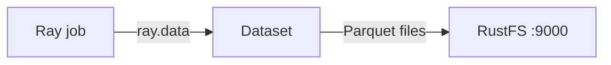
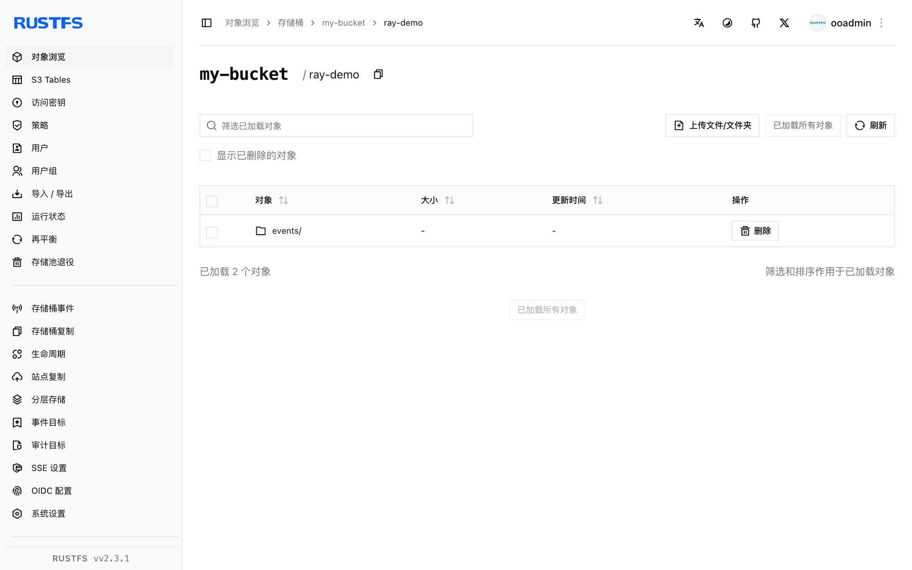

本指南通过 Ray Data 的 S3 文件系统支持，将分布式 AI 与 Python 计算框架 [Ray](https://github.com/ray-project/ray) 连接到 **RustFS**。你将在官方镜像内运行一个 Ray 作业，把数据集以 Parquet 写入 RustFS 存储桶，读回并验证对象。整个流程使用 `rayproject/ray:2.44.0-py311`（Ray 2.44，pyarrow 文件系统）和 `rustfs/rustfs-x86-musl:v2.3.1` 验证通过。

你需要安装 Docker。本部署用于本地集成测试，不适用于生产环境。

## 架构



Ray Data 通过 pyarrow 的 `S3FileSystem` 读写数据集。传入为 RustFS 配置的 `S3FileSystem` 后，所有数据集操作——Parquet、CSV、JSON——都会指向该存储桶。

## 1. 创建作业文件

创建脚本，并替换全部连接占位符：

```python title="ray_s3.py"
import ray
ray.init(ignore_reinit_error=True)

import pandas as pd
from pyarrow.fs import S3FileSystem

fs = S3FileSystem(
    endpoint_override="http://<your-rustfs-endpoint>:9000",
    access_key="<your-access-key>",
    secret_key="<your-secret-key>",
    region="us-east-1",
)

df = pd.DataFrame({"id": range(5), "value": [x * 1.5 for x in range(5)]})
ds = ray.data.from_pandas(df)
ds.write_parquet("my-bucket/ray-demo/events/", filesystem=fs)

back = ray.data.read_parquet("my-bucket/ray-demo/events/", filesystem=fs).take_all()
print("rows:", len(back))
print("sample:", back[0])
ray.shutdown()
```

`endpoint_override` 接收带协议的完整端点 URL。pyarrow 的 `S3FileSystem` 对自定义端点自动使用 path-style 请求，无需额外参数。同一个文件系统对象也可用于 `write_csv`、`read_json` 等其他 Ray Data 方法。

## 2. 运行作业

在与 RustFS 相同的 Docker 网络中的 Ray 镜像内运行脚本：

```bash
docker run --rm --network oo-rustfs_default \
  -v "$PWD/ray_s3.py":/tmp/ray_s3.py \
  rayproject/ray:2.44.0-py311 python /tmp/ray_s3.py
```

```text
rows: 5
sample: {'id': 0, 'value': 0.0}
```

## 3. 在 RustFS 中验证对象

列出数据集前缀：

```bash
rc ls rustfs/my-bucket/ray-demo/ -r
```

Ray Data 把数据集写成一个 Parquet 块：

```text
ray-demo/events/0_000000_000000.parquet
```



## 4. 停止或重置

Ray Data 自身不保存状态。删除演示数据集：

```bash
rc rm rustfs/my-bucket/ray-demo/ --recursive --force
```

## 故障排查

### `Unable to connect to endpoint` 或超时

确认 `endpoint_override` 带协议且 Ray 容器可达。Compose 网络内主机名为 `rustfs`；宿主机上使用 `http://localhost:9000`。

### 写入时报 `Access Denied`

确认访问密钥和秘密密钥直接传给了 `S3FileSystem`——这条代码路径不会读取容器的 AWS 环境变量。

## 后续步骤

- 在采用更多 Ray 操作之前，请查阅 [S3 兼容性说明](/administration/protocols/s3)。
- 通过[访问密钥管理](/security-compliance/iam/access-token)创建专用的生产凭证。
- 按照 [Ray Data 文档](https://docs.ray.io/en/latest/data/data.html)在同一存储桶上串联转换、训练摄取与检查点流程。
