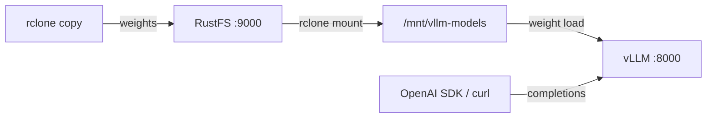
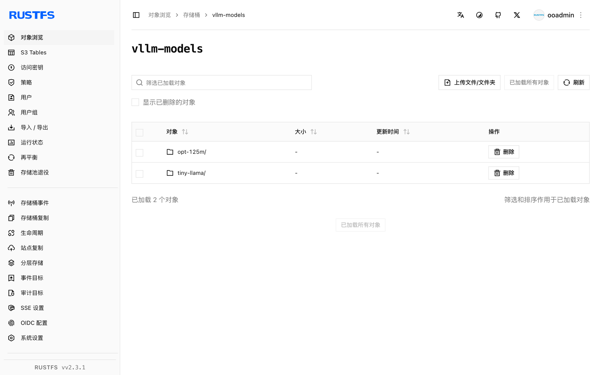

本指南将高吞吐 LLM 推理引擎 [vLLM](https://github.com/vllm-project/vllm) 连接到 **RustFS** 作为其模型权重存储。你将把模型上传到 RustFS 桶，通过 rclone 挂载把桶暴露给 vLLM 宿主机，并以 OpenAI 兼容 API 提供服务。整个流程使用 `vllm/vllm-openai-cpu`（vLLM 0.30.0）在纯 CPU 主机上对存放在 `rustfs/rustfs-x86-musl:v2.3.1` 桶中的 `facebook/opt-125m` 验证通过。

你需要 Docker 以及运行 vLLM 的宿主机上的 rclone 二进制。本部署用于本地集成测试，不适用于生产环境。

## 架构



桶内只有这一份模型。各服务节点以只读方式挂载桶，权重统一从 RustFS 拉取，本地不存在会漂移的模型副本。

:::note[为什么用 rclone 挂载]

vLLM 0.30 通过 RunAI model streamer 加载 `s3://` 模型路径，其对自定义 S3 端点的分段读取目前无法工作（任何非零偏移都会报 `File access error`）。把桶挂载为文件系统是经过验证的方式——权重保留在 RustFS，vLLM 按本地文件读取。

:::

## 1. 上传模型到 RustFS

创建桶并把模型权重拷入，替换全部连接占位符：

```ini title="rclone.conf"
[rustfs]
type = s3
provider = Other
access_key_id = <your-access-key>
secret_access_key = <your-secret-key>
endpoint = http://<your-rustfs-endpoint>:9000
region = us-east-1
```

```bash
rc mb rustfs/vllm-models
rclone copy ./opt-125m rustfs:vllm-models/opt-125m --transfers 4
```

任何 Hugging Face 目录结构都可以——`config.json`、tokenizer 文件与权重文件（`model.safetensors` 或 `pytorch_model.bin`）。每个模型使用一个独立前缀，多个模型即可共用同一个桶。

## 2. 在 vLLM 宿主机上挂载桶

在运行 vLLM 的机器上，以 `--allow-other` 只读挂载桶供其他用户访问：

```bash
mkdir -p /mnt/vllm-models
rclone mount rustfs:vllm-models /mnt/vllm-models \
  --allow-other --daemon
ls /mnt/vllm-models/opt-125m/
```

```text
config.json  merges.txt  model.safetensors  tokenizer.json  vocab.json
```

## 3. 运行 vLLM

用 CPU 镜像指向挂载的权重启动：

```bash
docker run -d --name vllm -p 8000:8000 --shm-size=2g \
  -v /mnt/vllm-models:/models:ro \
  vllm/vllm-openai-cpu:latest \
  --model /models/opt-125m --served-model-name opt-125m \
  --dtype float32 --max-model-len 256 --gpu-memory-utilization 0.15
```

vLLM 经由挂载读取权重——容器本身无状态，模型保存在 RustFS。等待服务就绪：

```bash
curl -s http://localhost:8000/v1/models | head -c 200
```

```text
{"object":"list","data":[{"id":"opt-125m","object":"model","created":...,"root":"/models/opt-125m",...}]}
```

在 CPU 后端上 `--gpu-memory-utilization` 控制预留给 KV cache 的内存比例；小内存主机请调低。`--dtype float32` 与该模型在 CPU attention 内核上支持的精度匹配。

## 4. 推理

发送 OpenAI 兼容的 completion 请求：

```bash
curl -s http://localhost:8000/v1/completions \
  -H "Content-Type: application/json" \
  -d '{"model": "opt-125m", "prompt": "RustFS is", "max_tokens": 12, "temperature": 0}'
```

```json
{"id":"cmpl-...","object":"text_completion","model":"opt-125m",
 "choices":[{"index":0,"text":" a great tool for building your own server. It's a",
 "finish_reason":"length",...}]}
```

请求是标准 OpenAI 结构，Python 客户端无需改动：

```python
from openai import OpenAI

client = OpenAI(base_url="http://localhost:8000/v1", api_key="EMPTY")
print(client.completions.create(
    model="opt-125m", prompt="RustFS is", max_tokens=12, temperature=0,
).choices[0].text)
```



## 5. 停止或重置

保留桶内对象、仅拆除演示环境：

```bash
docker rm -f vllm
fusermount -u /mnt/vllm-models
```

删除已存储的模型：

```bash
rclone purge rustfs:vllm-models
```

## 故障排查

### `Cannot find any model weights with /models/...`

挂载的目录缓存过期，或权重根本没传到桶里。重新执行 `rclone copy`，并在启动 vLLM 前先用 `ls` 通过挂载点确认文件存在。迭代调试时给挂载加较短的 `--dir-cache-time`（如 `10s`）。

### `Unsupported CPU attention configuration: head_dim=...`

vLLM 的 CPU 内核只支持有限的 head_dim 集合。`hf-internal-testing/tiny-random-*` 这类微型测试模型的奇异形状会在请求阶段失败——请使用真实的小模型，如 `facebook/opt-125m`。

### `Insufficient space in /dev/shm`

vLLM 的 CPU 引擎通过共享内存交换张量。运行容器时加 `--shm-size=2g`（或 `--ipc=host`）。

### 服务器退出并提示 `Available memory on node 0 ... is less than desired CPU memory utilization`

默认的 KV cache 预留是系统内存的 90%。用 `--gpu-memory-utilization 0.15` 调低（该 flag 在 CPU 后端同样生效，虽然名字里带 GPU）。

## 下一步

- 在启用更多服务方案前，先阅读 [S3 兼容性说明](/administration/protocols/s3)。
- 使用[访问密钥管理](/security-compliance/iam/access-token)创建专用的生产凭证。
- 按照 [vLLM 文档](https://docs.vllm.ai/en/latest/serving/openai_compatible_server.html)在同一个桶支撑的模型库之上使用 chat 模板、张量并行与量化权重。
