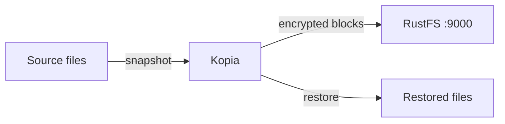
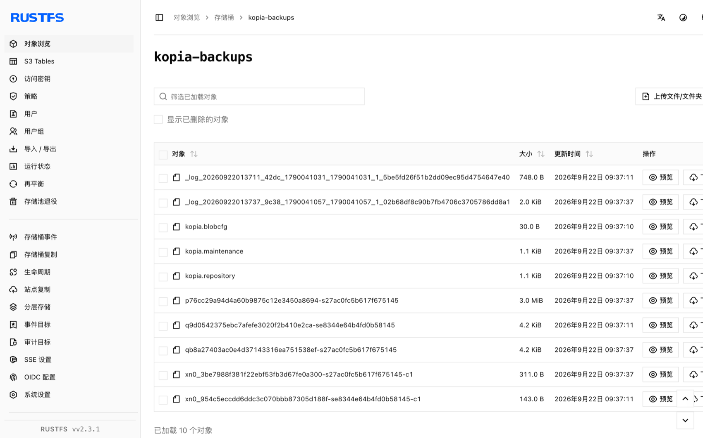

本指南将开源备份恢复工具 [Kopia](https://github.com/kopia/kopia) 的 S3 仓库连接到 **RustFS**。你将在 RustFS 存储桶中创建仓库，对一个目录做快照，恢复到空目录，并比对校验和。整个流程使用 `kopia/kopia:0.18.1` 和 `rustfs/rustfs-x86-musl:v2.3.1` 验证通过。

你需要安装 Docker。本部署用于本地集成测试，不适用于生产环境。

## 架构



Kopia 把仓库格式文件以及去重加密的内容块存进存储桶。恢复时读回内容块并重组原始文件，因此每个恢复文件的校验和必须与源文件一致。

## 1. 创建仓库

先创建存储桶，然后在其中初始化 Kopia 仓库。端点是纯 `host:port` 形式（不带协议）；`--disable-tls` 让客户端使用纯 HTTP：

```bash
rc alias set rustfs http://<your-rustfs-endpoint>:9000 <your-access-key> <your-secret-key>
rc mb rustfs/kopia-backups

docker run --rm --network oo-rustfs_default kopia/kopia:0.18.1 repository create s3 \
  --bucket kopia-backups \
  --access-key <your-access-key> \
  --secret-access-key <your-secret-key> \
  --endpoint <your-rustfs-endpoint>:9000 \
  --region us-east-1 \
  --disable-tls \
  --password <your-kopia-password> \
  --override-username demo --override-hostname workstation
```

Kopia 在报告成功之前会通过 S3 API 读写来校验存储提供方。

## 2. 连接、快照、恢复

在保存 `repository.config` 的目录（由上一步生成）中执行以下命令。Kopia 从该文件读取连接设置，S3 参数只需提供一次：

```bash
export KOPIA_PASSWORD=<your-kopia-password>
export KOPIA_CONFIG_PATH=/config/repository.config

alias kopia='docker run --rm --network oo-rustfs_default \
  -e KOPIA_PASSWORD -e KOPIA_CONFIG_PATH \
  -v "$PWD/config:/config" \
  -v "$PWD/source:/source:ro" \
  -v "$PWD/restore:/restore" kopia/kopia:0.18.1'

kopia repository connect s3 \
  --bucket kopia-backups \
  --access-key <your-access-key> \
  --secret-access-key <your-secret-key> \
  --endpoint <your-rustfs-endpoint>:9000 \
  --region us-east-1 --disable-tls \
  --override-username demo --override-hostname workstation

kopia snapshot create /source
kopia snapshot list
```

把快照恢复到空目录，并与源文件比对校验和。快照 ID 是 `snapshot list` 输出的 `ka...` 标识：

```bash
kopia restore <snapshot-id> /restore

sha256sum source/blob.bin restore/blob.bin
```

```text
bec4530e2798465b...  source/blob.bin
bec4530e2798465b...  restore/blob.bin
```

## 3. 在 RustFS 中验证对象

列出存储桶：

```bash
rc ls rustfs/kopia-backups/ -r
```

输出包含仓库格式文件以及快照写入的打包内容块：

```text
kopia.blobcfg
kopia.repository
p0000.../...
```



## 4. 停止或重置

Kopia 是客户端工具，自身不保存运行状态。删除仓库和全部快照：

```bash
rc rb rustfs/kopia-backups --force
```

## 故障排查

### `Endpoint url cannot have fully qualified paths`

端点必须是纯 `host:port` 值，不带协议和路径——Kopia 自己构造对象 URL。

### `server gave HTTP response to HTTPS client`

未加 `--disable-tls` 时 Kopia 使用 HTTPS。无 TLS 的 RustFS 需要在 `repository create s3` 和 `repository connect s3` 上都加 `--disable-tls`。

### `can't connect to storage` 并伴随 DNS 错误

S3 客户端正在使用 virtual-hosted 寻址。保持端点为纯 `host:port` 形式，Kopia 对这种端点使用 path-style 请求。

## 后续步骤

- 在采用更多 Kopia 操作之前，请查阅 [S3 兼容性说明](/administration/protocols/s3)。
- 通过[访问密钥管理](/security-compliance/iam/access-token)创建专用的生产凭证。
- 按照 [Kopia 仓库文档](https://kopia.io/docs/repositories/)添加策略、保留与计划快照。
