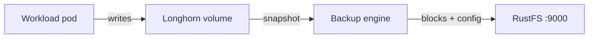
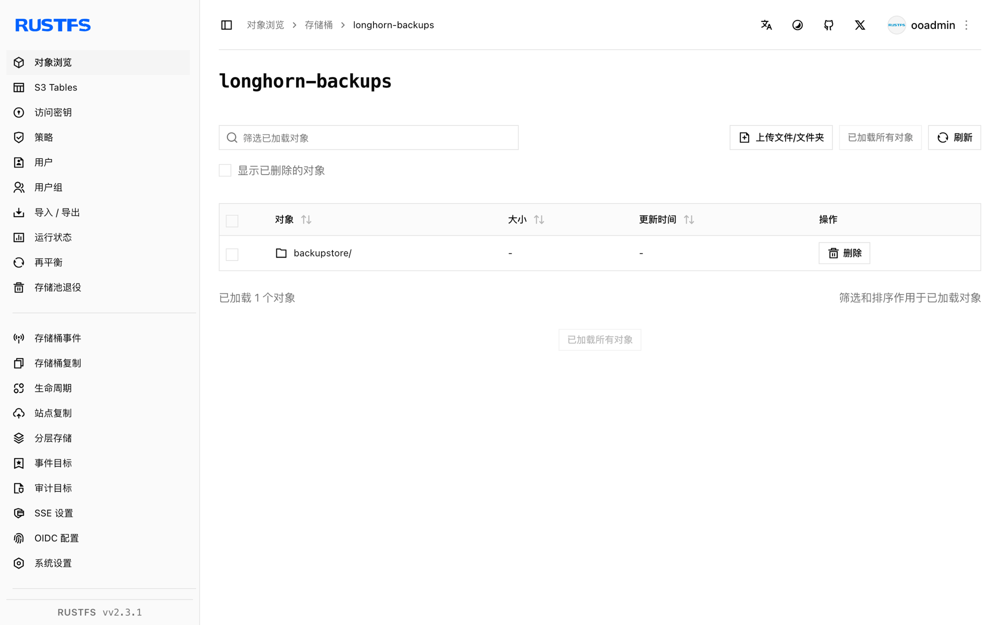

本指南将 Kubernetes 的分布式块存储系统 [Longhorn](https://github.com/longhorn/longhorn) 连接到 **RustFS** 作为其 S3 备份目标。你将配置备份目标，备份一个包含数据的卷，删除该卷后从 RustFS 恢复，并验证数据。整个流程使用 Longhorn 1.9.0（k3s，Kubernetes 1.30）和 `rustfs/rustfs-x86-musl:v2.3.1` 验证通过。

你需要一个已安装 Longhorn 的 Kubernetes 集群，并具备 `kubectl` 访问权限。本指南用于集成测试，不适用于生产环境。

## 架构



Longhorn 把备份以内容寻址块和一个小的卷配置文件的形式，存到目标存储桶的 `backupstore/volumes/` 前缀下。任何能访问 RustFS 的节点都可以把这些对象读回一个新卷来完成恢复。

## 1. 创建备份存储桶

使用 [`rc` 客户端](https://github.com/rustfs/cli)创建专用存储桶，替换为你自己的端点和凭证：

```bash
rc alias set rustfs http://<your-rustfs-endpoint>:9000 <your-access-key> <your-secret-key>
rc mb rustfs/longhorn-backups
```

Longhorn 不会创建存储桶，因此这一步必须在第一次备份之前完成。

## 2. 配置备份目标

把 RustFS 凭证保存为 `longhorn-system` 命名空间中的 Secret。`AWS_ENDPOINTS` 必须是每个节点都能访问的端点——请使用节点 IP 或内部负载均衡地址，而不是你工作站上的端口转发：

```bash
kubectl -n longhorn-system create secret generic rustfs-s3-secret \
  --from-literal=AWS_ACCESS_KEY_ID=<your-access-key> \
  --from-literal=AWS_SECRET_ACCESS_KEY=<your-secret-key> \
  --from-literal=AWS_ENDPOINTS=http://<your-rustfs-endpoint>:9000
```

Longhorn 1.9 通过 `BackupTarget` 资源管理备份目标。用 RustFS 存储桶修补 `default` 目标：

```bash
kubectl -n longhorn-system patch backupTarget default --type merge -p '
spec:
  backupTargetURL: s3://longhorn-backups@us-east-1/
  credentialSecret: rustfs-s3-secret
  pollInterval: 5m'
```

`@us-east-1` 段是 S3 URL 格式中的区域标注，不需要与实际部署区域一致。

等待目标变为可用——它确认 Longhorn 已通过该 Secret 访问到存储桶：

```bash
kubectl -n longhorn-system get backupTarget default
```

```text
NAME      URL                                CREDENTIAL         AVAILABLE   LASTSYNCEDAT
default   s3://longhorn-backups@us-east-1/   rustfs-s3-secret   true        2026-09-21T08:36:55Z
```

## 3. 写入数据并创建备份

创建一个包含数据的测试卷。以下清单创建一个 1 GiB 的 PVC 和一个写入标记文件的 Pod：

```yaml title="demo.yaml"
apiVersion: v1
kind: PersistentVolumeClaim
metadata:
  name: demo-vol
spec:
  accessModes: [ReadWriteOnce]
  storageClassName: longhorn
  resources:
    requests:
      storage: 1Gi
---
apiVersion: v1
kind: Pod
metadata:
  name: demo-app
spec:
  volumes:
  - name: data
    persistentVolumeClaim:
      claimName: demo-vol
  containers:
  - name: app
    image: busybox:1.36
    command: ["sh", "-c", "echo 'longhorn rustfs demo' > /data/hello.txt && sleep 3600"]
    volumeMounts:
    - name: data
      mountPath: /data
```

应用并等待 Pod 运行：

```bash
kubectl apply -f demo.yaml
kubectl get pod demo-app
```

创建快照并备份。你可以在 Longhorn UI 中操作（Volume → Snapshot → Backup），也可以用声明式方式：

```bash
VOLUME=$(kubectl get pvc demo-vol -o jsonpath='{.spec.volumeName}')
kubectl -n longhorn-system apply -f - <<EOF
apiVersion: longhorn.io/v1beta2
kind: Snapshot
metadata:
  name: demo-snap
  namespace: longhorn-system
spec:
  volume: $VOLUME
EOF
```

然后为该快照创建 `Backup` 资源：

```bash
kubectl -n longhorn-system apply -f - <<EOF
apiVersion: longhorn.io/v1beta2
kind: Backup
metadata:
  name: demo-backup
  namespace: longhorn-system
spec:
  snapshotName: demo-snap
EOF
```

等待备份完成：

```bash
kubectl -n longhorn-system wait --for=jsonpath='{.status.state}'=Completed backup/demo-backup --timeout=300s
kubectl -n longhorn-system get backup demo-backup -o jsonpath='{.status.backupURL}'
```

## 4. 在 RustFS 中验证备份

列出存储桶：

```bash
rc ls rustfs/longhorn-backups/ -r
```

输出应包含卷配置文件和内容寻址块：

```text
backupstore/volumes/08/62/pvc-b73aeb3a-1482-4146-a8c9-749954c5dd7d/backups/backup_backup-f52accbdf3984e3d.cfg
backupstore/volumes/08/62/pvc-b73aeb3a-1482-4146-a8c9-749954c5dd7d/blocks/15/22/15220b19...blk
```



## 5. 恢复并验证数据

使用第 3 步得到的 `backupURL` 创建一个从备份恢复的新卷：

```bash
kubectl -n longhorn-system apply -f - <<EOF
apiVersion: longhorn.io/v1beta2
kind: Volume
metadata:
  name: demo-restored
  namespace: longhorn-system
spec:
  size: "1073741824"
  numberOfReplicas: 1
  fromBackup: "<backupURL-from-step-3>"
EOF
```

恢复在卷首次 attach 时执行。通过静态 PV 创建绑定到恢复卷的 PVC，然后挂载它：

```bash
kubectl apply -f - <<EOF
apiVersion: v1
kind: PersistentVolume
metadata:
  name: demo-restored-pv
spec:
  capacity:
    storage: 1Gi
  accessModes: [ReadWriteOnce]
  claimRef:
    name: demo-restored
    namespace: default
  csi:
    driver: driver.longhorn.io
    volumeHandle: demo-restored
    fsType: ext4
  storageClassName: longhorn-static
---
apiVersion: v1
kind: PersistentVolumeClaim
metadata:
  name: demo-restored
spec:
  accessModes: [ReadWriteOnce]
  storageClassName: longhorn-static
  volumeName: demo-restored-pv
  resources:
    requests:
      storage: 1Gi
EOF
```

在验证 Pod 中挂载恢复出的卷：

```bash
kubectl apply -f - <<EOF
apiVersion: v1
kind: Pod
metadata:
  name: restore-verify
spec:
  volumes:
  - name: data
    persistentVolumeClaim:
      claimName: demo-restored
  containers:
  - name: verify
    image: busybox:1.36
    command: ["sh", "-c", "cat /data/hello.txt && sleep 300"]
    volumeMounts:
    - name: data
      mountPath: /data
EOF
sleep 40
kubectl logs restore-verify
```

输出会打印第 3 步写入的标记文件，证明数据经由 RustFS 完成了完整往返：

```text
longhorn rustfs demo
```

## 6. 清理

删除测试工作负载和恢复卷：

```bash
kubectl delete pod restore-verify demo-app
kubectl delete pvc demo-restored demo-vol
kubectl -n longhorn-system delete volume/demo-restored
```

RustFS 中的备份会一直保留，直到你在 Longhorn UI 或存储桶中删除它。

## 故障排查

### `No available disk candidates to create a new replica`

节点上没有可调度的磁盘。确认节点已注册默认磁盘：

```bash
kubectl -n longhorn-system get nodes.longhorn.io -o jsonpath='{.items[0].status.diskStatus}'
```

如果映射为空，在节点上创建 `/var/lib/longhorn` 并注册磁盘：

```bash
kubectl -n longhorn-system patch nodes.longhorn.io <node-name> --type merge -p '
spec:
  disks:
    default:
      path: /var/lib/longhorn
      allowScheduling: true'
```

### `failed to create backup ... missing input parameter`

备份在默认备份目标配置完成之前发起。先完成第 2 步，确认 `AVAILABLE` 为 `true`，再重新创建备份。

### 备份目标始终不可用

Secret 必须在目标同步之前存在，并且 `AWS_ENDPOINTS` 必须从节点本身可达。检查 `longhorn-manager` 日志中的 S3 错误：

```bash
kubectl -n longhorn-system logs -l app=longhorn-manager | grep -i s3 | tail
```

## 后续步骤

- 在采用更多备份目标之前，请查阅 [S3 兼容性说明](/administration/protocols/s3)。
- 通过[访问密钥管理](/security-compliance/iam/access-token)创建专用的生产凭证。
- 按照 [Longhorn 备份文档](https://longhorn.io/docs/1.9.0/backups-and-restore/)配置周期性备份作业和计划快照。
