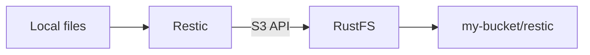

Restic 是一个命令行备份工具，会把快照存储到仓库中。本页演示如何将 Restic 指向 RustFS、备份本地目录、恢复快照，并验证 RustFS 中保存的对象。

你需要一个正在运行的 RustFS 实例、一个类似 `my-bucket` 的存储桶、已安装的 Restic、该存储桶的访问密钥，以及 Restic 仓库密码。

:::note[路径式寻址]

Restic 的 S3 backend 应在 RustFS 上使用路径式寻址。本页将设置 `-o s3.bucket-lookup=path`，并在仓库 URL 中使用存储桶名称。

:::

## 架构



Restic 通过 S3 API 将仓库元数据和备份快照写入 RustFS。本页中的仓库前缀是 `restic`，存储桶是 `my-bucket`。

## 1. 准备存储桶

打开 RustFS Console，地址为 `http://localhost:9001`，创建 `my-bucket`，或者选择一个专门用于备份的现有存储桶。


每个备份作业都应使用独立的存储桶。截图显示的是英文界面和浅色主题。

## 2. 初始化 Restic 仓库

设置凭据、区域、仓库密码和仓库位置：

```bash
export AWS_ACCESS_KEY_ID=<your-access-key>
export AWS_SECRET_ACCESS_KEY=<your-secret-key>
export AWS_DEFAULT_REGION=us-east-1
export RESTIC_PASSWORD=<your-restic-password>
export RESTIC_REPOSITORY=s3:http://localhost:9000/my-bucket/restic
```

使用路径式存储桶查找运行 `restic init`：

```bash
restic -o s3.bucket-lookup=path init
```

仓库密码用于保护快照数据。请将其与 RustFS 访问密钥分开保存。

## 3. 备份数据

创建一个小型测试目录并进行备份：

```bash
mkdir -p ~/Documents/restic-demo
printf 'hello from RustFS\n' > ~/Documents/restic-demo/hello.txt
restic -o s3.bucket-lookup=path backup ~/Documents/restic-demo
```

备份完成后，Restic 会输出一个快照 ID。修改文件后再次运行命令，可以创建第二个快照。

## 4. 恢复快照

将最新快照恢复到单独目录：

```bash
mkdir -p ~/Documents/restic-restore
restic -o s3.bucket-lookup=path restore latest --target ~/Documents/restic-restore
```

如果你需要恢复较早版本，也可以指定某个快照 ID。

## 5. 在 RustFS 中验证仓库

打开 RustFS Console 中的 `my-bucket`，确认 Restic 已在 `restic/` 前缀下创建仓库对象。

你也可以运行仓库检查：

```bash
restic -o s3.bucket-lookup=path check
```

## 下一步

- [CLI Client (rc)](/operations/rc) 用于从命令行创建存储桶并检查对象。
- 如果你要将 RustFS 暴露到不受信任的网络之外，请查看 [TLS Configuration](/integration/tls-configured)。