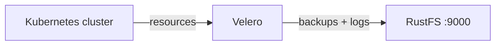
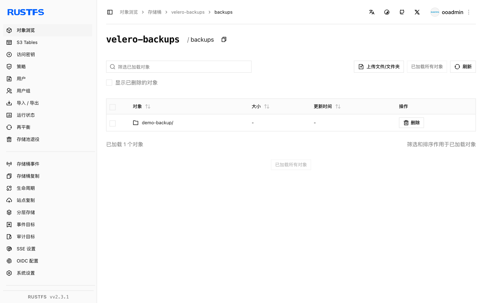

本指南将 Kubernetes 备份恢复工具 [Velero](https://github.com/vmware-tanzu/velero) 连接到 **RustFS** 作为其对象存储后端。你将在 Kubernetes 集群中安装指向 RustFS 备份位置的 Velero，备份集群资源，删除后从存储桶恢复，并验证恢复结果。整个流程使用 Velero CLI 1.16.2、`velero-plugin-for-aws:v1.12.2`（k3s，Kubernetes 1.30）和 `rustfs/rustfs-x86-musl:v2.3.1` 验证通过。

你需要一个可用 `kubectl` 访问的 Kubernetes 集群和 Velero CLI。本指南用于集成测试，不适用于生产环境。

## 架构



Velero 把 Kubernetes 资源（以及可选的 Pod 卷数据）序列化为 gzip 归档，存到桶内 `backups/<名称>/` 前缀下。恢复时下载这些归档并在集群中重建资源。

## 1. 创建备份存储桶

先创建专用存储桶——Velero 不会创建桶：

```bash
rc alias set rustfs http://<your-rustfs-endpoint>:9000 <your-access-key> <your-secret-key>
rc mb rustfs/velero-backups
```

## 2. 安装 Velero

把凭证写入文件并安装 Velero 服务端。`s3Url` 必须是集群 Pod 自己能访问的端点——请使用节点 IP 或内部地址，而不是工作站上的端口转发：

```bash
cat > velero-creds <<EOF
[default]
aws_access_key_id=<your-access-key>
aws_secret_access_key=<your-secret-key>
EOF

kubectl create namespace velero
kubectl create secret generic cloud-credentials \
  --namespace velero --from-file=cloud=velero-creds

velero install \
  --provider aws \
  --plugins velero/velero-plugin-for-aws:v1.12.2 \
  --bucket velero-backups \
  --backup-location-config region=us-east-1,s3ForcePathStyle="true",s3Url=http://<your-rustfs-endpoint>:9000 \
  --secret-file velero-creds \
  --use-volume-snapshots=false
```

等待部署就绪、备份位置变为 `Available`：

```bash
kubectl -n velero get pods
velero backup-location get
```

```text
NAME      PROVIDER   BUCKET/PREFIX    PHASE      LAST VALIDATED   ACCESS MODE   DEFAULT
default   aws        velero-backups   Available  2026-09-22 ...   ReadWrite     true
```

## 3. 备份集群资源

创建两个演示资源并备份整个默认作用域：

```bash
kubectl create configmap demo-cm --from-literal=key=rustfs-velero-demo
kubectl create deployment nginx --image=nginx:1.27

velero backup create demo-backup --wait
velero backup get
```

备份会把资源归档和日志上传到 RustFS。

## 4. 在 RustFS 中验证备份

列出存储桶：

```bash
rc ls rustfs/velero-backups/ -r
```

备份归档集存放在 `backups/` 前缀下：

```text
backups/demo-backup/demo-backup-resources.json.gz
backups/demo-backup/demo-backup-logs.gz
backups/demo-backup/demo-backup-itemoperations.json.gz
```



## 5. 恢复并验证

删除演示资源后从备份恢复。恢复过程从 RustFS 读取归档并重建资源：

```bash
kubectl delete configmap demo-cm
kubectl delete deployment nginx

velero restore create --from-backup demo-backup --wait
```

确认资源已按原内容恢复：

```bash
kubectl get configmap demo-cm -o jsonpath="{.data.key}"
kubectl get deployment nginx
```

```text
rustfs-velero-demo
NAME    READY   UP-TO-DATE   AVAILABLE   AGE
nginx   1/1     1            1           10s
```

## 6. 停止或重置

备份保留在 `velero-backups` 存储桶中，运行 Velero 并指向同一桶的任何集群都能恢复它们。从 RustFS 删除演示备份：

```bash
velero backup delete demo-backup --confirm
rc rm rustfs/velero-backups/backups/ --recursive --force
```

## 故障排查

### 备份位置始终 `Unavailable`

Velero Pod 无法访问 `s3Url`。Docker 自定义网桥网段对 Kubernetes Pod 不可路由——使用 Docker 宿主网桥 IP（单机集群为 `http://172.17.0.1:9000`）或节点地址。修补位置后 Velero 会重新校验：

```bash
kubectl -n velero patch backupstoragelocation default --type merge -p \
  '{"spec":{"config":{"s3Url":"http://172.17.0.1:9000"}}}'
```

### 备份 `PartiallyFailed` 并报 daemonset 错误

`daemonset pod not found in running state` 错误表示 node-agent Pod（用于 Pod 卷备份）未运行。它不影响集群资源归档。等待 agent 就绪，或仅在 agent 运行时使用 `--default-volumes-to-fs-backup`。

### 安装后立即 `FailedValidation`

第一次备份可能发生在位置完成校验之前。等 `velero backup-location get` 显示 `Available` 后再创建备份。

## 后续步骤

- 在采用更多 Velero 操作之前，请查阅 [S3 兼容性说明](/administration/protocols/s3)。
- 通过[访问密钥管理](/security-compliance/iam/access-token)创建专用的生产凭证。
- 按照 [Velero 文档](https://velero.io/docs/main/)添加计划备份、卷快照与集群迁移流程。
