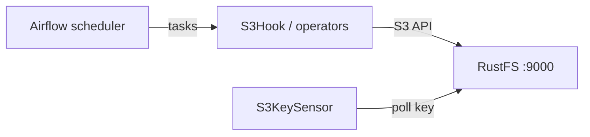
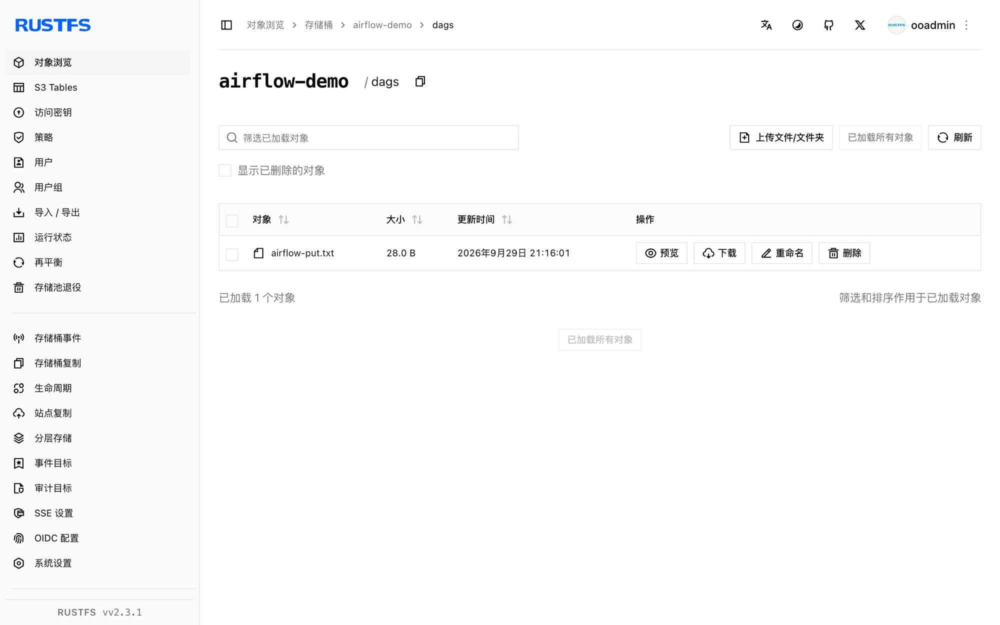

本指南将工作流编排平台 [Apache Airflow](https://github.com/apache/airflow) 通过 Amazon S3 provider 的 hook、operator 与 sensor 连接到 **RustFS**。你将注册一个自定义端点的连接，运行一个向 RustFS 桶写入对象的 DAG，用 `S3KeySensor` 等待键出现，再用 `S3Hook` 读回对象。整个流程使用 `apache/airflow:3.3.2`（standalone，SequentialExecutor）和 `apache-airflow-providers-amazon` provider 对 `rustfs/rustfs-x86-musl:v2.3.1` 验证通过。

你需要安装 Docker，或一个现有的 Airflow 实例。本部署用于本地集成测试，不适用于生产环境。

## 架构



DAG 内所有 S3 交互都经过 provider 的 S3 客户端，由连接的 `endpoint_url` 指向 RustFS。operator、sensor 与 hook 共享同一个连接对象。

## 1. 运行 Airflow

以关闭示例的方式启动 standalone 实例，并创建演示桶：

```bash
docker run -d --name airflow --network oo-rustfs_default -p 8080:8080 \
  -e AIRFLOW__CORE__LOAD_EXAMPLES=False \
  -v "$PWD/dags":/opt/airflow/dags \
  apache/airflow:3.3.2 standalone

rc mb rustfs/airflow-demo
```

镜像预装了全部 provider，包括 `apache-airflow-providers-amazon`。

## 2. 注册 RustFS 连接

S3 provider 从连接的 extra 字段读取端点。替换全部连接占位符：

```bash
docker exec airflow airflow connections add rustfs \
  --conn-type aws \
  --conn-extra '{"endpoint_url": "http://<your-rustfs-endpoint>:9000", "region_name": "us-east-1", "aws_access_key_id": "<your-access-key>", "aws_secret_access_key": "<your-secret-key>"}'
```

`--conn-extra` 中的 `aws_access_key_id` 与 `aws_secret_access_key` 提供凭证；`endpoint_url` 把 boto3 客户端从 AWS 重定向到 RustFS。

## 3. 编写 DAG

该 DAG 用 operator 写入对象、用 sensor 等待键、再用 hook 读回：

```python title="rustfs_demo.py"
import datetime

from airflow.providers.amazon.aws.hooks.s3 import S3Hook
from airflow.providers.amazon.aws.operators.s3 import S3CreateObjectOperator
from airflow.providers.amazon.aws.sensors.s3 import S3KeySensor
from airflow.sdk import dag, task

@dag(
    schedule=None,
    start_date=datetime.datetime(2026, 1, 1),
    catchup=False,
    tags=["rustfs"],
)
def rustfs_demo():
    create = S3CreateObjectOperator(
        task_id="write_object",
        s3_bucket="airflow-demo",
        s3_key="dags/airflow-put.txt",
        data="written by airflow to rustfs",
        aws_conn_id="rustfs",
        replace=True,
    )

    wait = S3KeySensor(
        task_id="wait_for_object",
        bucket_key="dags/airflow-put.txt",
        bucket_name="airflow-demo",
        aws_conn_id="rustfs",
        timeout=120,
        poke_interval=10,
        mode="reschedule",
    )

    @task
    def read_object():
        hook = S3Hook(aws_conn_id="rustfs")
        body = hook.read_key(key="dags/airflow-put.txt", bucket_name="airflow-demo")
        print("read back:", body)
        assert body == "written by airflow to rustfs"

    create >> [wait, read_object()]

rustfs_demo()
```

注意导入路径：`S3CreateObjectOperator` 位于 `operators` 模块，而 `S3KeySensor` 位于 `sensors` 模块——从同一个模块导入两者会失败。

## 4. 取消暂停并触发

新 DAG 默认处于暂停状态，暂停期间触发的 run 会永远停留在排队状态。先取消暂停，再触发：

```bash
docker exec airflow airflow dags unpause rustfs_demo
docker exec airflow airflow dags trigger rustfs_demo
```

观察 run 完成：

```bash
docker exec airflow airflow dags list-runs rustfs_demo | head -3
```

```text
dag_id       run_id                                    state
rustfs_demo  manual__2026-09-29T13:15:57.332688+00:00  success
```

三个任务全部成功：`write_object`、`wait_for_object` 和 `read_object`。

## 5. 验证 RustFS 中的对象

列举桶内前缀：

```bash
rc ls rustfs/airflow-demo/ -r
rc cat rustfs/airflow-demo/dags/airflow-put.txt
```

```text
[2026-09-29 13:16:01]       28 B dags/airflow-put.txt
written by airflow to rustfs
```



## 6. 停止或重置

保留桶内对象、仅拆除演示环境：

```bash
docker rm -f airflow
```

删除已存储的数据：

```bash
rc rm rustfs/airflow-demo/ --recursive --force
```

## 故障排查

### 触发后 dag run 一直停留在 `queued`

DAG 处于暂停状态。Airflow 3 中新 DAG 默认暂停，此状态下触发的 run 永远不会执行。执行 `airflow dags unpause rustfs_demo`，排队的 run 会自行启动。

### `cannot import name 'S3KeySensor' from 'airflow.providers.amazon.aws.operators.s3'`

sensor 在独立的模块里：`from airflow.providers.amazon.aws.sensors.s3 import S3KeySensor`。

### 任务报连接错误

`endpoint_url` 必须从 Airflow 容器内部可达——请使用 RustFS 的 Docker 网络主机名，而不是 `localhost`。需要检查组件状态时，Airflow 3 的健康检查端点在 `/api/v2/monitor/health`。

## 下一步

- 在启用更多 provider hook 前，先阅读 [S3 兼容性说明](/administration/protocols/s3)。
- 使用[访问密钥管理](/security-compliance/iam/access-token)创建专用的生产凭证。
- 按照 [Amazon provider 文档](https://airflow.apache.org/docs/apache-airflow-providers-amazon/stable/index.html)了解 `S3ToLocalFilesystemOperator`、`LocalFilesystemToS3Operator` 等传输 operator。
