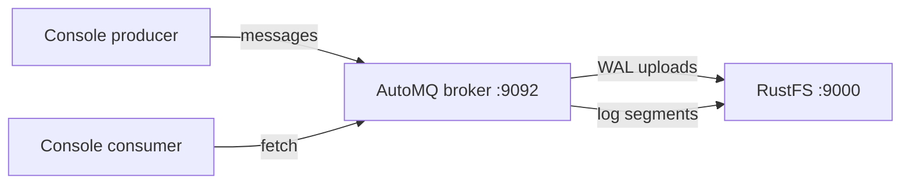
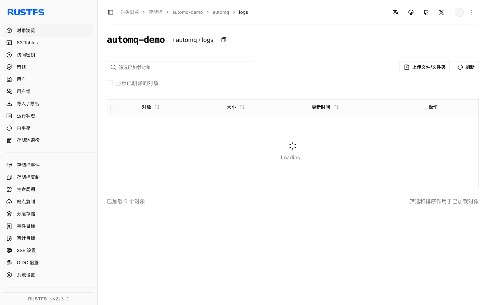

本指南将把日志存储放进对象存储的云原生 Kafka 发行版 [AutoMQ](https://github.com/AutoMQ/automq) 连接到 **RustFS**。你将在 KRaft 模式下启动单节点 AutoMQ broker，把 S3 日志桶指向 RustFS，然后生产并消费消息。整个流程使用 AutoMQ 1.3.0（Kafka 3.9.0 API）对 `rustfs/rustfs-x86-musl:v2.3.1` 验证通过。

你需要 Docker。本部署用于本地集成测试，不适用于生产环境。

## 架构



AutoMQ 把存储与 broker 解耦：预写日志先在本地缓冲，随后作为不可变流对象上传进桶。broker 除 WAL 外不保留本地数据目录。

## 1. 运行 broker

以 S3 桶指向 RustFS 的方式启动 AutoMQ。四个细节必须注意：脚本参数使用空格分隔（`--key=value` 形式会让启动脚本死循环）、`JAVA_TOOL_OPTIONS` 带 `-XX:-UseContainerSupport`（内置 JDK 17 在 cgroup v2 探测上会崩）、合并角色名为 `server`、凭证经 `KAFKA_S3_ACCESS_KEY`/`KAFKA_S3_SECRET_KEY` 环境变量传入（`--s3.access.key` 脚本参数会被忽略）：

```bash
docker run -d --name automq --hostname automq --network oo-rustfs_default -p 9092:9092 \
  -e JAVA_TOOL_OPTIONS="-XX:-UseContainerSupport" \
  -e KAFKA_HEAP_OPTS="-Xms512m -Xmx512m -XX:MetaspaceSize=96m -XX:MaxDirectMemorySize=512M" \
  -e KAFKA_S3_ACCESS_KEY=<your-access-key> \
  -e KAFKA_S3_SECRET_KEY=<your-secret-key> \
  -v /opt/automq-data:/data/kafka \
  automqinc/automq:1.3.0 /opt/automq/scripts/start.sh up \
  --process.roles server \
  --node.id 0 \
  --controller.quorum.voters 0@automq:9093 \
  --s3.region us-east-1 \
  --s3.bucket automq-demo \
  --s3.endpoint http://rustfs:9000
```

broker 的监听地址绑定容器 IP。控制台工具请用该 IP 访问（同一 Docker 网络内也可用主机名 `automq`）。

## 2. 建主题并生产

```bash
AIP=<automq-container-ip>
docker exec automq sh -c "cd /opt/automq/kafka && \
  ./bin/kafka-topics.sh --bootstrap-server $AIP:9092 --create --topic rustfs-automq --partitions 1 --replication-factor 1"

docker exec automq sh -c "cd /opt/automq/kafka && \
  printf 'mq-msg-one\nmq-msg-two\nmq-msg-three\n' | \
  ./bin/kafka-console-producer.sh --bootstrap-server $AIP:9092 --topic rustfs-automq"
```

## 3. 消费消息

```bash
docker exec automq sh -c "cd /opt/automq/kafka && \
  ./bin/kafka-console-consumer.sh --bootstrap-server $AIP:9092 \
  --topic rustfs-automq --from-beginning --max-messages 3 --timeout-ms 30000"
```

```text
mq-msg-one
mq-msg-two
mq-msg-three
Processed a total of 3 messages
```

## 4. 验证 RustFS 中的对象

列举桶——AutoMQ 把日志流与指标作为对象写入：

```bash
rc ls rustfs/automq-demo/ -r
```

```text
automq/logs/rZdE0DjZSrqy96PXrMUZVw/0/2026100700/fcd3fc76-... 
automq/logs/rZdE0DjZSrqy96PXrMUZVw/0/2026100701/52877dc7-...
automq/metrics/rZdE0DjZSrqy96PXrMUZVw/0/2026100701/4733e680-...
```

主题数据存放在日志流对象中——broker 本地只保留 WAL，因此扩缩 broker 不需要搬数据。



## 5. 停止或重置

```bash
docker rm -f automq
rc rm rustfs/automq-demo/ --recursive --force
```

## 故障排查

### 启动脚本不断打印 `setup_value:` 且 CPU 100%

参数解析器只接受空格分隔形式（`--s3.bucket x`，不是 `--s3.bucket=x`）。`=` 形式会让解析器死循环。

### `java.lang.NullPointerException ... CgroupInfo.getMountPoint()`

镜像内置的 JDK 17 在此环境下 cgroup v2 探测失败。设置 `JAVA_TOOL_OPTIONS="-XX:-UseContainerSupport"`。

### `unknown process role broker,controller`

AutoMQ 1.3.0 的脚本要求合并角色写作 `server`。

### broker 启动但客户端报 `Connection to node -1 could not be established`

监听绑定容器 IP（`hostname -I`）。请以该 IP 或主机名 `automq` 访问——`localhost` 只对 broker 容器内部的工具有效。

### `List objects failed, cost: 120000+ ms`

AutoMQ 默认虚拟主机寻址，对 IP 端点会陷入重试循环。用 `KAFKA_CFG_S3_DATA_BUCKETS`/`KAFKA_CFG_S3_OPS_BUCKETS` 把桶 URL 强制为 `0@s3://<bucket>?region=us-east-1&endpoint=http://rustfs:9000&pathStyle=true&authType=static` 传入（凭证经 `KAFKA_S3_ACCESS_KEY`/`KAFKA_S3_SECRET_KEY` 传入。

## 下一步

- 偏好在原生 Kafka 上以 connect 方式集成 S3 时，参考 [Kafka](/developer/integration/big-data/kafka) 指南。
- 使用[访问密钥管理](/security-compliance/iam/access-token)创建专用的生产凭证。
- 按照 [AutoMQ 文档](https://docs.automq.com/)在同一桶之上部署多节点集群与 WAL 参数调优。
