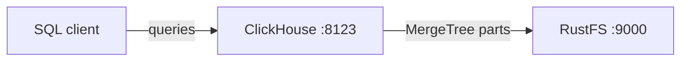
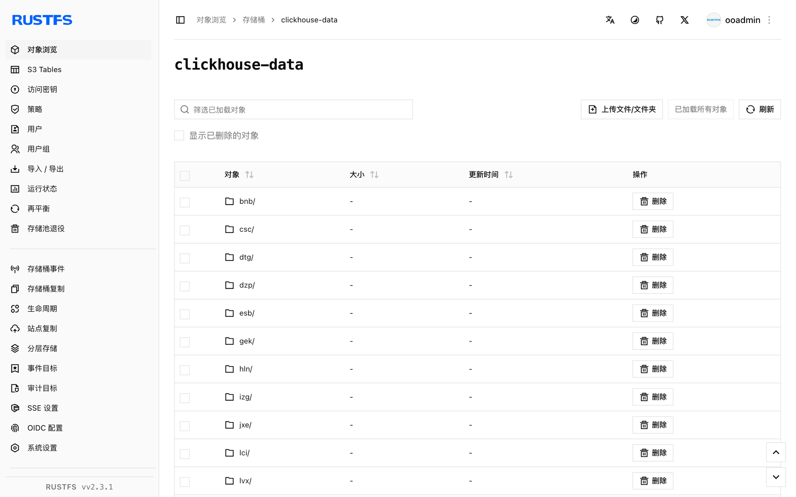

本指南通过 ClickHouse 的 S3 磁盘存储策略，将实时 OLAP 数据库 [ClickHouse](https://github.com/ClickHouse/ClickHouse) 连接到 **RustFS**。你将使用 Docker 启动 ClickHouse 服务器，创建一张数据部分存储在 RustFS 上的 MergeTree 表，插入数据行，并验证表数据已存入存储桶。整个流程使用 `clickhouse/clickhouse-server:25.8` 和 `rustfs/rustfs-x86-musl:v2.3.1` 验证通过。

你需要安装 Docker。本部署用于本地集成测试，不适用于生产环境。

## 架构



`rustfs` 磁盘是指向 `clickhouse-data` 存储桶的 ClickHouse S3 磁盘。使用对应存储策略创建的表会把数据部分——数据、索引和校验文件——写入存储桶而非本地文件系统。

## 1. 创建项目文件

先创建存储桶——ClickHouse 不会创建桶：

```bash
rc alias set rustfs http://<your-rustfs-endpoint>:9000 <your-access-key> <your-secret-key>
rc mb rustfs/clickhouse-data
```

创建存储配置，并替换两个凭证占位符：

```xml title="storage.xml"
<clickhouse>
  <storage_configuration>
    <disks>
      <rustfs>
        <type>s3</type>
        <endpoint>http://rustfs:9000/clickhouse-data/</endpoint>
        <access_key_id><your-access-key></access_key_id>
        <secret_access_key><your-secret-key></secret_access_key>
      </rustfs>
    </disks>
    <policies>
      <rustfs_policy>
        <volumes>
          <main>
            <disk>rustfs</disk>
          </main>
        </volumes>
      </rustfs_policy>
    </policies>
  </storage_configuration>
</clickhouse>
```

端点必须以 `/` 结尾，且桶名作为路径的第一段。Compose 网络内主机名为 `rustfs`；宿主机上使用 (`http://localhost:9000/clickhouse-data/`)。

挂载配置启动 ClickHouse：

```bash
docker run -d --name clickhouse --network oo-rustfs_default \
  -p 8123:8123 \
  -e CLICKHOUSE_PASSWORD=<your-clickhouse-password> \
  -v "$PWD/storage.xml":/etc/clickhouse-server/config.d/storage.xml:ro \
  clickhouse/clickhouse-server:25.8
```

## 2. 在 S3 磁盘上创建表

等待 HTTP 接口就绪，然后创建数据库和带存储策略的 MergeTree 表：

```bash
curl "http://localhost:8123/?password=<your-clickhouse-password>" \
  --data-binary "CREATE DATABASE rustfs_demo"

curl "http://localhost:8123/?password=<your-clickhouse-password>" \
  --data-binary "CREATE TABLE rustfs_demo.events
    (id UInt32, name String)
    ENGINE = MergeTree ORDER BY id
    SETTINGS storage_policy = 'rustfs_policy'"

curl "http://localhost:8123/?password=<your-clickhouse-password>" \
  --data-binary "INSERT INTO rustfs_demo.events
    VALUES (1, 'clickhouse-on-rustfs'), (2, 'second')"
```

读回数据行，并确认 ClickHouse 报告数据部分位于 `rustfs` 磁盘上：

```bash
curl "http://localhost:8123/?password=<your-clickhouse-password>" \
  --data-binary "SELECT count(), any(name) FROM rustfs_demo.events"

curl "http://localhost:8123/?password=<your-clickhouse-password>" \
  --data-binary "SELECT name, disk_name FROM system.parts
    WHERE database = 'rustfs_demo' AND active"
```

```text
2  clickhouse-on-rustfs
all_1_1_0  rustfs
```

## 3. 在 RustFS 中验证对象

列出存储桶：

```bash
rc ls rustfs/clickhouse-data/ -r
```

ClickHouse 把每个数据部分写成内容寻址的 blob。输出包含若干小对象，写入的部分越多对象越多：

```text
dtg/hpsyncexixvdnsgorvseobogcgowg
dzp/zfblobhsatzdveqdrsfqcupkdehja
izg/gvhchqobrizpkdftuvlmakkoutwps
```



数据部分存放在 RustFS 中，因此容器重启后数据依然可查：

```bash
docker restart clickhouse
curl "http://localhost:8123/?password=<your-clickhouse-password>" \
  --data-binary "SELECT count() FROM rustfs_demo.events"
```

## 4. 停止或重置部署

停止服务器并保留数据：

```bash
docker rm -f clickhouse
```

数据部分保留在 `clickhouse-data` 存储桶中，下次启动后即可继续查询。若要删除数据，请移除存储桶：

```bash
rc rb rustfs/clickhouse-data --force
```

## 故障排查

### 每次查询都返回 `REQUIRED_PASSWORD`

ClickHouse 25.8 镜像要求 `default` 用户使用密码。在容器上设置 `CLICKHOUSE_PASSWORD`，并在查询时传入相同的 `password` 参数，如上所示。

### 建表时报磁盘或端点错误

确认建表前存储桶已存在、端点以 `/` 结尾、凭证与 RustFS 部署一致。查看服务器日志中的底层 S3 错误：

```bash
docker logs clickhouse | grep -i s3 | tail
```

## 后续步骤

- 在采用更多 ClickHouse 操作之前，请查阅 [S3 兼容性说明](/administration/protocols/s3)。
- 通过[访问密钥管理](/security-compliance/iam/access-token)创建专用的生产凭证。
- 按照 [ClickHouse S3 磁盘文档](https://clickhouse.com/docs/engines/table-engines/mergetree-family/mergetree#table_engine-mergetree-s3)添加缓存磁盘或冷热分层策略。
