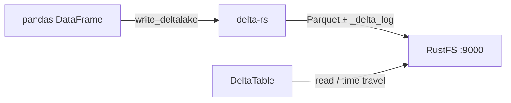
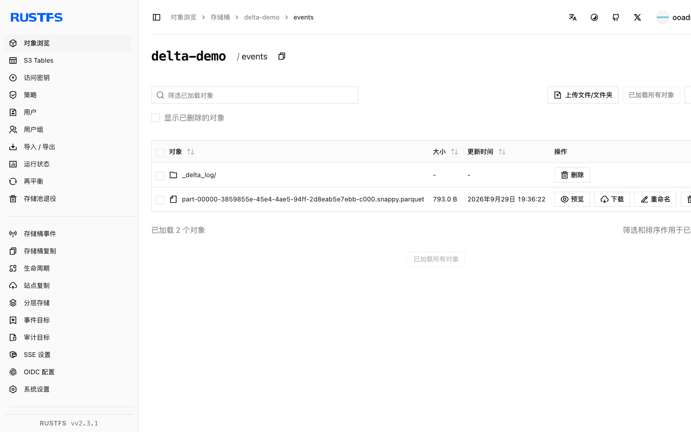

本指南将开源湖仓表格式 [Delta Lake](https://github.com/delta-io/delta) 通过 Rust 原生的 Delta 实现 delta-rs 连接到 **RustFS**。你将从 Python 向 RustFS 桶写入一张 Delta 表，带着 ACID 事务历史读回，并确认桶内的 `_delta_log` 与 Parquet 文件。整个流程使用 `deltalake` Python 包（delta-rs）和 pandas 对 `rustfs/rustfs-x86-musl:v2.3.1` 验证通过。

你需要 Python 3.9 或更高版本。本部署用于本地集成测试，不适用于生产环境。

## 架构



delta-rs 把每张表存为 Parquet 文件加事务日志（`_delta_log/`）。所有 I/O 都经过 `object_store` crate，与其他 S3 客户端一样使用 AWS 环境变量配置。

## 1. 安装客户端

```bash
pip install deltalake pandas pyarrow
```

`pyarrow` 负责把 pandas DataFrame 转换成 Delta 兼容的 record batch。

## 2. 写入 Delta 表

创建桶并写入一张表，替换全部连接占位符。由于 RustFS 不提供 copy-if-not-exists（delta-rs 处理提交冲突时依赖它），需要设置 `AWS_S3_ALLOW_UNSAFE_RENAME`：

```python title="delta_s3.py"
import pandas as pd
from deltalake import DeltaTable, write_deltalake

storage_options = {
    "AWS_ENDPOINT_URL": "http://<your-rustfs-endpoint>:9000",
    "AWS_ACCESS_KEY_ID": "<your-access-key>",
    "AWS_SECRET_ACCESS_KEY": "<your-secret-key>",
    "AWS_REGION": "us-east-1",
    "AWS_ALLOW_HTTP": "true",
    "AWS_S3_ALLOW_UNSAFE_RENAME": "true",
}

table = "s3://<your-bucket>/events"
df = pd.DataFrame({"id": [1, 2, 3], "name": ["alpha", "beta", "gamma"]})
write_deltalake(table, df, storage_options=storage_options)
print("written:", df.shape[0], "rows")
```

```text
written: 3 rows
```

`table` URI 使用标准的 `s3://bucket/prefix` 形式；端点与凭证来自 `storage_options`。

## 3. 读回表

```python title="delta_read.py"
from deltalake import DeltaTable

back = DeltaTable("s3://<your-bucket>/events", storage_options=storage_options).to_pandas()
print("read back:", back.shape[0], "rows")
print(back.sort_values("id").to_string(index=False))
print("version:", DeltaTable("s3://<your-bucket>/events", storage_options=storage_options).version())
```

```text
read back: 3 rows
 id   name
  1  alpha
  2   beta
  3  gamma
version: 0
```

版本记录在事务日志中，因此同一张表支持 `DeltaTable(..., version=N)` 做时间旅行，追加写入会递增版本号。

## 4. 验证 RustFS 中的对象

列举表前缀：

```bash
rc ls rustfs/<your-bucket>/ -r
```

首次提交会创建事务日志和一个 Parquet 文件：

```text
events/_delta_log/00000000000000000000.json
events/part-00000-3859855e-45e4-4ae5-94ff-2d8eab5e7ebb-c000.snappy.parquet
```

每次新写入都会新增一个 `NNNNNNNNNNNNNNNNNNNN.json` 日志条目和 Parquet 分件；读取方重放日志即可得到一致的快照。



## 5. 停止或重置

delta-rs 自身不持有状态。删除表：

```bash
rc rm rustfs/<your-bucket>/events/ --recursive --force
```

## 故障排查

### 写入 pandas DataFrame 时报 `Import pyarrow failed`

`write_deltalake` 经由 Arrow 转换 DataFrame。请与 `deltalake`、`pandas` 一并安装 `pyarrow`。

### 提交时报 `Generic DeltaTable error: commit conflict` 或 rename 错误

delta-rs 通过复制并重命名临时对象来提交，这要求后端支持原子重命名。对不支持 copy-if-not-exists 的 S3 兼容存储，需在 `storage_options` 中设置 `AWS_S3_ALLOW_UNSAFE_RENAME: "true"`——单写者可接受，并发写者不适用。

### `Unknown lengthy error: AWS connectivity or endpoint errors`

确认 `AWS_ENDPOINT_URL` 带协议前缀，且纯 HTTP 端点把 `AWS_ALLOW_HTTP` 设置为 `"true"`；否则 S3 客户端只讲 HTTPS。

## 下一步

- 在启用更多 Delta 客户端前，先阅读 [S3 兼容性说明](/administration/protocols/s3)。
- 使用[访问密钥管理](/security-compliance/iam/access-token)创建专用的生产凭证。
- 按照 [delta-rs 使用文档](https://delta-io.github.io/delta-rs/usage/writing/writing-to-s3/)了解基于 DynamoDB 提交协调的并发写者方案。
