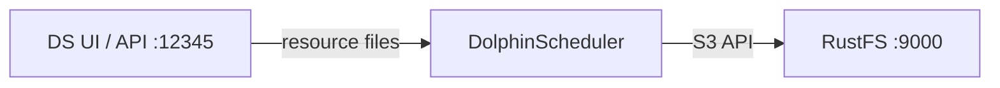
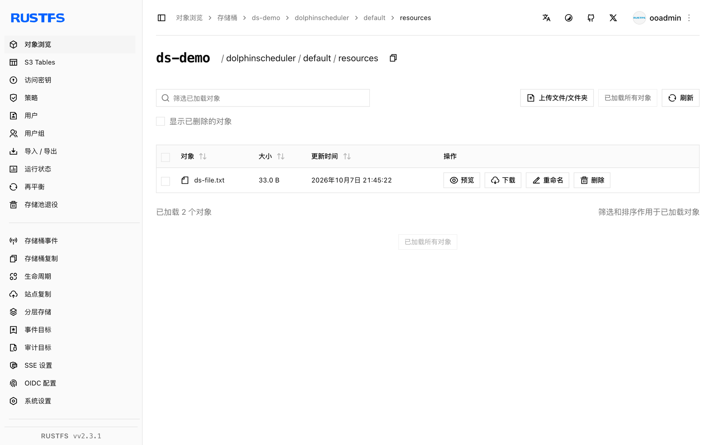

本指南将工作流调度器 [Apache DolphinScheduler](https://github.com/apache/dolphinscheduler) 连接到 **RustFS** 作为其资源中心存储。你将运行 standalone 服务器、把资源存储切到 S3、经 API 上传资源文件并验证桶内对象。整个流程使用 DolphinScheduler 3.2.1（standalone 服务器）对 `rustfs/rustfs-x86-musl:v2.3.1` 验证通过。

你需要 Docker。

## 架构



资源中心保存工作流脚本、依赖 JAR 等文件。切到 S3 存储后，每个上传的文件都会成为桶内 `dolphinscheduler/<tenant>/resources/` 之下的对象。

## 1. 运行 standalone 服务器

```bash
docker run -d --name dolphinscheduler --hostname dolphinscheduler \
  --network oo-rustfs_default -p 12345:12345 \
  apache/dolphinscheduler-standalone-server:3.2.1
```

单容器捆绑 master、worker、API、alert 与内置 ZooKeeper。UI 默认地址为 `http://localhost:12345/dolphinscheduler/ui` （默认登录 `admin` / `dolphinscheduler123`）。

## 2. 把资源中心切到 RustFS

存储后端位于 `/opt/dolphinscheduler/conf/common.properties`。把 S3 属性追加到现有文件——不要整文件替换，里面还有大量其他设置：

```bash
docker exec dolphinscheduler bash -c "cat >> /opt/dolphinscheduler/conf/common.properties << 'EOF'

resource.storage.type=S3
resource.storage.base.dir=/ds-resources
resource.aws.s3.bucket.name=ds-demo
resource.aws.s3.endpoint=http://<your-rustfs-endpoint>:9000
resource.aws.access.key.id=<your-access-key>
resource.aws.secret.access.key=<your-secret-key>
resource.aws.region=us-east-1
EOF"
docker restart dolphinscheduler
```

等 API 恢复（约一分钟），然后创建桶：

```bash
rc mb rustfs/ds-demo
```

## 3. 上传资源文件

经 API 登录拿 session id，再上传文件。该端点同时要求 `name` 与 `fullName` 两个参数：

```bash
printf "ds resource file stored in rustfs" > /tmp/ds-file.txt
TOKEN=$(curl -s -m 10 -X POST http://localhost:12345/dolphinscheduler/login \
  -d "userName=admin&userPassword=dolphinscheduler123" \
  | python3 -c "import json,sys; print(json.load(sys.stdin)['data']['sessionId'])")

curl -s -m 30 -X POST "http://localhost:12345/dolphinscheduler/resources" \
  -H "session-id: $TOKEN" -H "Cookie: sessionId=$TOKEN" \
  -F "file=@/tmp/ds-file.txt" -F "type=FILE" -F "currentDir=/" \
  -F "name=ds-file.txt" -F "fullName=/ds-file.txt" -F "description=demo"
```

```json
{"code":0,"msg":"success","data":null,"failed":false,"success":true}
```

## 4. 在 DolphinScheduler 与 RustFS 中验证

经 API 读回文件：

```bash
curl -s -m 30 "http://localhost:12345/dolphinscheduler/resources/view-ui?fullName=/ds-file.txt&skipLineNum=100&limit=100" \
  -H "session-id: $TOKEN" -H "Cookie: sessionId=$TOKEN" | grep "ds resource"
```

```text
ds resource file stored in rustfs
```

列举桶——文件位于租户的 resources 前缀之下：

```bash
rc ls rustfs/ds-demo/ -r
```

```text
dolphinscheduler/default/resources/ds-file.txt
dolphinscheduler/default/udfs/
```



## 5. 停止或重置

```bash
docker rm -f dolphinscheduler
rc rm rustfs/ds-demo/ --recursive --force
```

## 故障排查

### 服务器启动失败并报 Azure `clientId/tenantId/clientSecret` 错误

存储配置被写成了全新文件而非追加，`resource.storage.type=S3` 丢失后默认指向了 Azure。按第 2 步始终追加到现有 `common.properties`。

### `Required request parameter 'name'/'fullName' is not present`

资源创建端点在 `file`、`type`、`currentDir` 之外还要求 `name` 与 `fullName` 两个表单字段。

### API 对 token 调用返回 405

登录/token 端点接受 POST，但不同版本的 `/api/v2/token` 有差异——使用第 3 步的登录表单，并在每次调用时携带 `session-id` 头与 `Cookie: sessionId=...`。

## 下一步

- 需要无内置资源中心的编排方案时，参考 [Airflow](/developer/integration/big-data/airflow) 指南。
- 使用[访问密钥管理](/security-compliance/iam/access-token)创建专用的生产凭证。
- 按照 [DolphinScheduler 文档](https://dolphinscheduler.apache.org/en-us/docs/latest/user_doc/common/resource-management.html)把同一 S3 资源中心接入 worker 任务执行。
