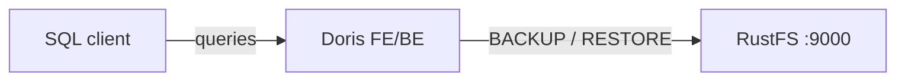
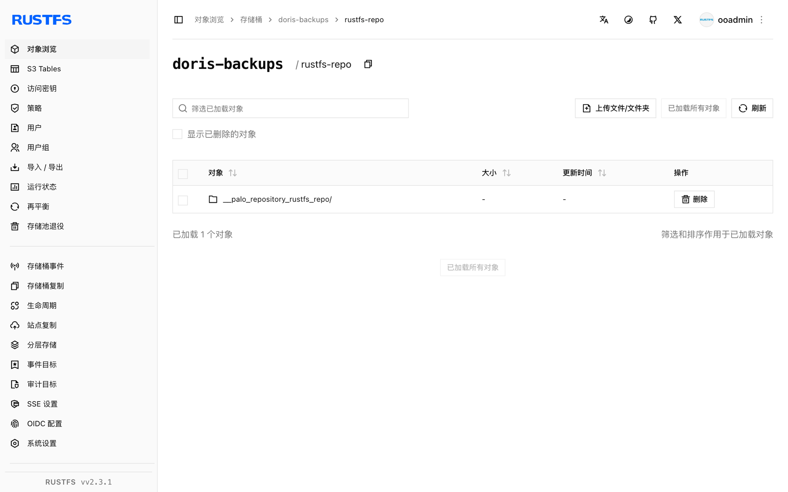

本指南通过 S3 备份仓库，将实时分析型数据仓库 [Apache Doris](https://github.com/apache/doris) 连接到 **RustFS**。你将启动一个 all-in-one Doris 容器，创建指向 RustFS 存储桶的 S3 仓库，备份一张表，删除后再从 RustFS 恢复。整个流程使用 `apache/doris:all-in-one-4.1.3` 和 `rustfs/rustfs-x86-musl:v2.3.1` 验证通过。

你需要安装 Docker。本部署用于本地集成测试，不适用于生产环境。

## 架构



仓库是 `doris-backups` 存储桶下的一个命名 S3 位置。`BACKUP SNAPSHOT` 上传表元数据和 tablet 数据文件；`RESTORE SNAPSHOT` 把它们下载为新表。

## 1. 启动 Doris 并创建仓库

先创建存储桶——Doris 不会创建桶：

```bash
rc alias set rustfs http://<your-rustfs-endpoint>:9000 <your-access-key> <your-secret-key>
rc mb rustfs/doris-backups
```

在与 RustFS 相同的 Docker 网络中启动 all-in-one 容器：

```bash
docker run -d --name doris --network oo-rustfs_default \
  -p 8030:8030 -p 9030:9030 apache/doris:all-in-one-4.1.3
```

等待前端健康后，用 MySQL 协议连接（端口 9030，用户 `root`，all-in-one 镜像无密码）。

创建带数据的测试表：

```sql
CREATE DATABASE rustfs_demo;
CREATE TABLE rustfs_demo.events
  (id INT, name VARCHAR(50))
  DISTRIBUTED BY HASH(id) BUCKETS 1
  PROPERTIES ("replication_num" = "1");
INSERT INTO rustfs_demo.events VALUES (1, 'doris-on-rustfs'), (2, 'backup-test');
```

创建 S3 仓库，把端点替换为 RustFS 容器的 IP 地址，并替换两个凭证占位符：

```sql
CREATE REPOSITORY `rustfs_repo`
  WITH S3
  ON LOCATION "s3://doris-backups/rustfs-repo"
  PROPERTIES (
    "AWS_ENDPOINT" = "http://<rustfs-container-ip>:9000",
    "AWS_ACCESS_KEY" = "<your-access-key>",
    "AWS_SECRET_KEY" = "<your-secret-key>",
    "AWS_REGION" = "us-east-1",
    "AWS_PATH_STYLE_ACCESS" = "true"
  );
```

Doris 4.1 即使启用了 `AWS_PATH_STYLE_ACCESS` 也会把桶解析进端点主机名，因此主机名端点会报 `UnknownHostException: doris-backups.rustfs`。改用容器 IP 地址即可强制 path-style 请求；`SHOW REPOSITORIES` 确认仓库注册成功且 `ErrMsg` 为空。

## 2. 把表备份到 RustFS

对表做快照：

```sql
BACKUP SNAPSHOT rustfs_demo.demo_snapshot
  TO rustfs_repo
  ON (events);
```

该语句立即返回；备份作业在后台运行。观察其状态：

```sql
SHOW BACKUP;
```

等待 `State` 到达 `FINISHED`——快照元数据和 tablet 数据文件此时已成为存储桶中的对象。

## 3. 在 RustFS 中验证备份

列出存储桶：

```bash
rc ls rustfs/doris-backups/ -r
```

仓库中保存了仓库描述文件、快照元数据和 tablet 文件：

```text
rustfs-repo/__palo_repository_rustfs_repo/__repo_info
rustfs-repo/__palo_repository_rustfs_repo/__ss_demo_snapshot/__meta.d50ecf9b...
rustfs-repo/__palo_repository_rustfs_repo/__ss_demo_snapshot/__ss_content/.../...dat...
```



## 4. 从 RustFS 恢复表

删除表并从快照恢复。时间戳来自 `SHOW SNAPSHOT ON REPOSITORY rustfs_repo;` 显示的快照名：

```sql
DROP TABLE rustfs_demo.events;

RESTORE SNAPSHOT rustfs_demo.demo_snapshot
  FROM rustfs_repo
  ON (events)
  PROPERTIES (
    "backup_timestamp" = "2026-09-21-16-35-12",
    "replication_num" = "1"
  );
```

等待恢复作业完成并确认数据：

```sql
SHOW RESTORE;
SELECT count(*) FROM rustfs_demo.events;
```

```text
2
```

## 5. 停止或重置部署

停止 Doris 并保留数据：

```bash
docker rm -f doris
```

备份保留在 `doris-backups` 存储桶中，任何注册了相同仓库的 Doris 集群都可以恢复它。若要删除备份，请移除存储桶：

```bash
rc rb rustfs/doris-backups --force
```

## 故障排查

### 创建仓库时报 `UnknownHostException: doris-backups.rustfs`

Doris 正在用桶和端点构造 virtual-hosted 主机名。按上文所示，在 `AWS_ENDPOINT` 中使用 RustFS 容器的 IP 地址并设置 `AWS_PATH_STYLE_ACCESS = "true"`。

### 备份长时间停留在 `SNAPSHOTING`

后端正在上传 tablet 文件。确认后端健康（`SHOW BACKENDS;`）且能访问端点；all-in-one 镜像启动后需要一两分钟两个进程才全部就绪。

### `Failed to create repository: ... file status`

存储桶不存在或凭证错误。用 `rc mb` 创建 `doris-backups`，并重新检查访问密钥对。

## 后续步骤

- 在采用更多 Doris 操作之前，请查阅 [S3 兼容性说明](/administration/protocols/s3)。
- 通过[访问密钥管理](/security-compliance/iam/access-token)创建专用的生产凭证。
- 按照 [Doris 备份恢复文档](https://doris.apache.org/docs/data-operate/backup-restore/)配置周期性快照。
