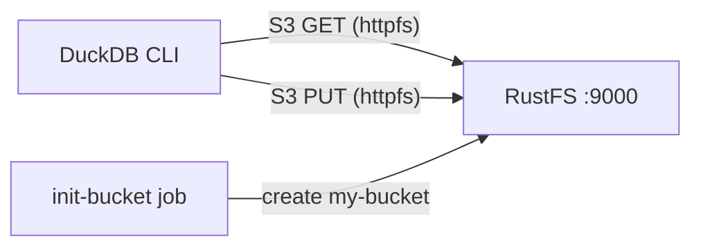
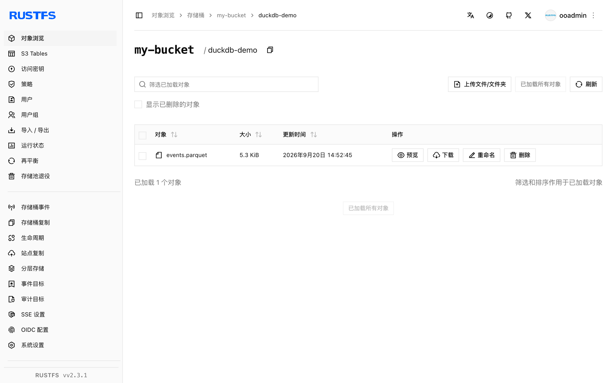

本指南将 **DuckDB** 与 **RustFS** 作为其 S3 兼容存储结合使用。你将使用 Docker Compose 启动两个服务，配置 DuckDB 的 `httpfs` 扩展以对接 RustFS 端点，将查询结果以 Parquet 格式写入桶中并读回，最后在 RustFS 中验证这些对象。整个流程使用 `duckdb/duckdb:latest` 镜像（v1.5.5）和 `rustfs/rustfs-x86-musl:v2.3.1` 验证通过。

你需要安装带有 Compose 插件的 Docker。本部署用于本地集成测试，不适用于生产环境。

## 架构



DuckDB 通过 [`httpfs` 扩展](https://duckdb.org/docs/stable/extensions/httpfs/overview)读写对象，该扩展实现了 S3 API。S3 secret 中配置 RustFS 端点、凭证、path-style 寻址和纯 HTTP 设置；此后即可像访问本地文件一样，通过 `s3://my-bucket/...` 路径加载和写入 Parquet 文件。

## 1. 创建项目文件

创建工作目录：

```bash
mkdir rustfs-duckdb
cd rustfs-duckdb
```

创建环境变量文件，并替换两个凭证占位符：

```ini title=".env"
RUSTFS_ACCESS_KEY=<your-access-key>
RUSTFS_SECRET_KEY=<your-secret-key>
```

请为桶使用专用的凭证，不要将 `.env` 提交到版本控制。

创建 Compose 文件：

```yaml title="compose.yaml"
services:
  rustfs:
    image: rustfs/rustfs-x86-musl:v2.3.1
    environment:
      RUSTFS_ACCESS_KEY: ${RUSTFS_ACCESS_KEY}
      RUSTFS_SECRET_KEY: ${RUSTFS_SECRET_KEY}
      RUSTFS_VOLUMES: /data
      RUSTFS_ADDRESS: ":9000"
      RUSTFS_CONSOLE_ADDRESS: ":9001"
      RUSTFS_CONSOLE_ENABLE: "true"
    volumes:
      - rustfs-data:/data
    ports:
      - "9000:9000"
      - "9001:9001"
    healthcheck:
      test: ["CMD", "curl", "-sf", "http://127.0.0.1:9000/health"]
      interval: 10s
      timeout: 5s
      retries: 6
      start_period: 10s
    networks:
      - warehouse

  create-bucket:
    image: rustfs/rc:latest
    depends_on:
      rustfs:
        condition: service_healthy
    environment:
      RUSTFS_ACCESS_KEY: ${RUSTFS_ACCESS_KEY}
      RUSTFS_SECRET_KEY: ${RUSTFS_SECRET_KEY}
    entrypoint:
      - /bin/sh
      - -c
      - |
        until /usr/bin/rc alias set rustfs http://rustfs:9000 "$${RUSTFS_ACCESS_KEY}" "$${RUSTFS_SECRET_KEY}"; do
          echo "Waiting for RustFS..."
          sleep 2
        done
        /usr/bin/rc ls rustfs/my-bucket >/dev/null 2>&1 || /usr/bin/rc mb rustfs/my-bucket
    networks:
      - warehouse

  duckdb:
    image: duckdb/duckdb:latest
    entrypoint: ["/duckdb"]
    depends_on:
      create-bucket:
        condition: service_completed_successfully
    networks:
      - warehouse

networks:
  warehouse:

volumes:
  rustfs-data:
```

[`rc` 镜像](https://github.com/rustfs/cli)提供 RustFS 官方命令行客户端。初始化任务在创建前会先检查 `my-bucket` 是否存在，因此重复启动不会删除已有数据。`duckdb/duckdb` 镜像内只包含 `/duckdb` 二进制文件、没有 shell，因此该服务设置了 `entrypoint: ["/duckdb"]`。

## 2. 启动部署

启动容器前先解析 Compose 文件：

```bash
docker compose config
```

启动服务并等待桶初始化任务完成：

```bash
docker compose up -d
docker compose ps -a
```

`create-bucket` 服务的退出码应为 `0`。随时可以打开 `http://localhost:9001/rustfs/console/` 的 RustFS 控制台查看桶内容。

## 3. 在 DuckDB 中配置 S3 secret

启动交互式 DuckDB 会话：

```bash
docker compose run --rm duckdb
```

安装扩展并注册 RustFS 端点：

```sql
INSTALL httpfs;
LOAD httpfs;

CREATE SECRET rustfs (
    TYPE S3,
    KEY_ID '<your-access-key>',
    SECRET '<your-secret-key>',
    ENDPOINT 'rustfs:9000',
    USE_SSL FALSE,
    URL_STYLE 'path'
);
```

端点使用不带协议的 `host:port` 形式。`USE_SSL FALSE` 表示在 Compose 网络内使用纯 HTTP；`URL_STYLE 'path'` 选择 path-style 寻址，这正是 RustFS 所期望的。secret 只在当前会话有效——每次启动新会话时都需要重新创建。

## 4. 将查询结果写入 RustFS

把一张小表以 Parquet 格式写入桶中：

```sql
COPY
    (SELECT i AS id, 'rustfs-duckdb-demo' AS source FROM range(1000) t(i))
    TO 's3://my-bucket/duckdb-demo/events.parquet'
    (FORMAT PARQUET);
```

```text
┌─────────┐
│ Success │
│ boolean │
├─────────┤
│   true  │
└─────────┘
```

## 5. 从 RustFS 读回 Parquet

像查询本地文件一样查询刚写入的对象：

```sql
SELECT count(*) AS rows, min(id) AS min_id, max(id) AS max_id
FROM read_parquet('s3://my-bucket/duckdb-demo/events.parquet');
```

```text
┌───────┬────────┬────────┐
│ rows  │ min_id │ max_id │
│ int64 │ int64  │ int64  │
├───────┼────────┼────────┤
│  1000 │      0 │    999 │
└───────┴────────┴────────┘
```

桶中任何 Parquet 对象都可以这样查询，包括 OpenObserve、Spark 或 Iceberg 等其他系统写入的文件。

## 6. 在 RustFS 中验证对象

通过桶初始化镜像列出该前缀下的对象：

```bash
docker compose run --rm --entrypoint /bin/sh create-bucket -c \
  '/usr/bin/rc alias set rustfs http://rustfs:9000 "$RUSTFS_ACCESS_KEY" "$RUSTFS_SECRET_KEY" >/dev/null && /usr/bin/rc ls rustfs/my-bucket/duckdb-demo --recursive'
```

```text
[2026-09-20 06:52:45]   5.32 KiB duckdb-demo/events.parquet
```

你也可以在 RustFS 控制台中查看 `duckdb-demo` 前缀：



## 7. 停止或重置环境

停止容器并保留 RustFS 数据卷：

```bash
docker compose down
```

如需删除本地对象并从空的 RustFS 数据卷开始，请显式加上 `--volumes`：

```bash
docker compose down --volumes
```

## 故障排除

### DuckDB 无法连接 RustFS

在 Compose 网络内端点是 `rustfs:9000`。如果 DuckDB 进程运行在宿主机上，请改用 `localhost:9000`，并按 Compose 文件中的配置发布 `9000` 端口。

### 纯 HTTP 端点出现 SSL 或连接错误

`ENDPOINT` 不带协议。如果 RustFS 未启用 TLS，secret 中必须设置 `USE_SSL FALSE`，否则 `httpfs` 会尝试 HTTPS 并报连接或证书错误。

### 返回 AccessDenied 响应

检查 secret 中的凭证是否与 RustFS 凭证一致，并确认桶初始化任务已成功完成：

```bash
docker compose logs create-bucket
```

### Virtual-host 风格的请求

容器网络端点需要 `URL_STYLE 'path'`。Virtual-host 风格的请求需要 RustFS 域名配置（`RUSTFS_SERVER_DOMAINS`）和对应的 DNS 记录，本方案不需要。

## 后续步骤

- 在采用其他 S3 操作前，请查看 [S3 兼容性说明](/administration/protocols/s3)。
- 通过[访问密钥管理](/security-compliance/iam/access-token)创建专用的生产凭证。
- 阅读 [DuckDB httpfs 文档](https://duckdb.org/docs/stable/extensions/httpfs/overview)了解区域覆盖、连接数限制等高级选项。
