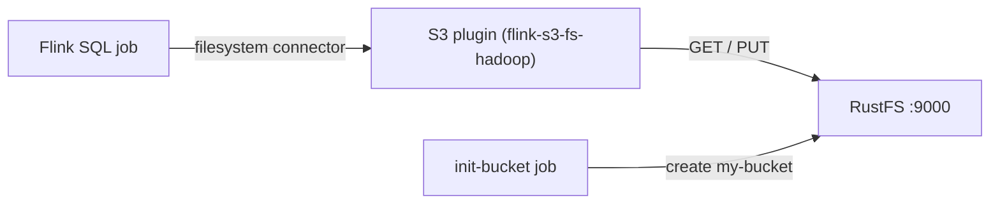
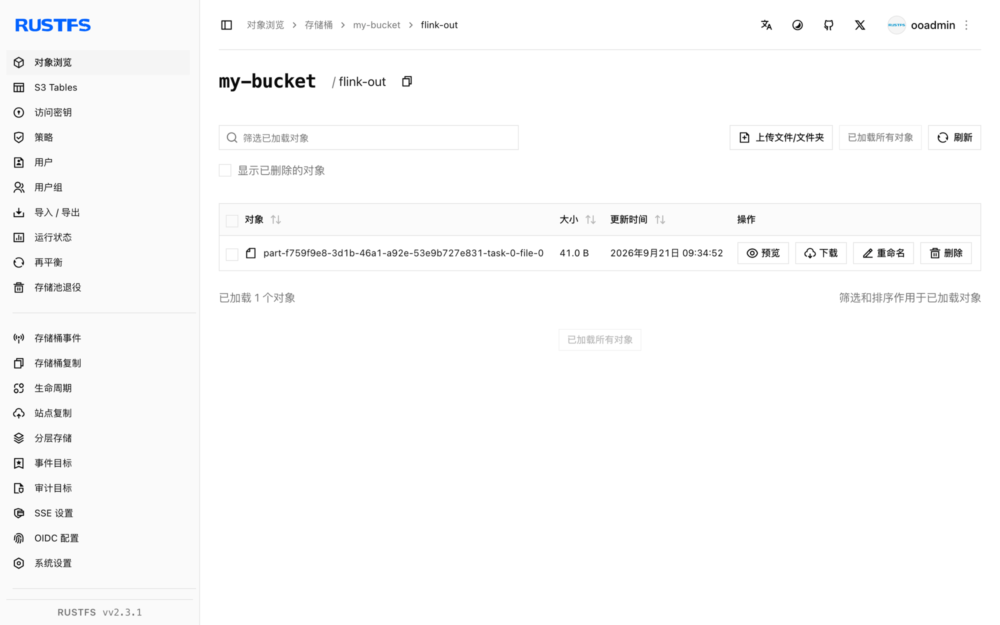

本指南将 [Apache Flink](https://github.com/apache/flink) 通过 Flink 的 S3 文件系统插件（`flink-s3-fs-hadoop`）连接到 **RustFS**。你将使用 Docker Compose 启动一个 session 集群，以批模式把一个有界结果集写入桶中，再通过 Flink SQL 读回。整个流程使用 `flink:1.20` 和 `rustfs/rustfs-x86-musl:v2.3.1` 验证通过。

你需要安装带有 Compose 插件的 Docker。本部署用于本地集成测试，不适用于生产环境。

## 架构



`flink-s3-fs-hadoop` 插件为 Flink 的 filesystem 连接器注册了 `s3://` 协议。端点、path-style 寻址、纯 HTTP 和凭证通过 `flink-conf.yaml` 中的 `s3.*` 属性配置（经 `FLINK_PROPERTIES` 传入）。

## 1. 创建项目文件

创建工作目录：

```bash
mkdir rustfs-flink
cd rustfs-flink
```

创建环境变量文件，并替换两个凭证占位符：

```ini title=".env"
RUSTFS_ACCESS_KEY=<your-access-key>
RUSTFS_SECRET_KEY=<your-secret-key>
```

请为桶使用专用的凭证，不要将 `.env` 提交到版本控制。

S3 插件随镜像内置在 `/opt/flink/opt/` 下，需要复制到 `/opt/flink/plugins/s3fs/` 才会加载。准备一个本地目录存放它：

```bash
mkdir -p s3fs
docker create --name flink-tmp flink:1.20
docker cp flink-tmp:/opt/flink/opt/flink-s3-fs-hadoop-1.20.5.jar s3fs/
docker rm flink-tmp
```

创建 Compose 文件：

```yaml title="compose.yaml"
services:
  rustfs:
    image: rustfs/rustfs-x86-musl:v2.3.1
    environment:
      RUSTFS_ACCESS_KEY: ${RUSTFS_ACCESS_KEY}
      RUSTFS_SECRET_KEY: ${RUSTFS_SECRET_KEY}
      RUSTFS_VOLUMES: /data
      RUSTFS_ADDRESS: ":9000"
      RUSTFS_CONSOLE_ADDRESS: ":9001"
      RUSTFS_CONSOLE_ENABLE: "true"
    volumes:
      - rustfs-data:/data
    ports:
      - "9000:9000"
      - "9001:9001"
    healthcheck:
      test: ["CMD", "curl", "-sf", "http://127.0.0.1:9000/health"]
      interval: 10s
      timeout: 5s
      retries: 6
      start_period: 10s
    networks:
      - flink

  create-bucket:
    image: rustfs/rc:latest
    depends_on:
      rustfs:
        condition: service_healthy
    environment:
      RUSTFS_ACCESS_KEY: ${RUSTFS_ACCESS_KEY}
      RUSTFS_SECRET_KEY: ${RUSTFS_SECRET_KEY}
    entrypoint:
      - /bin/sh
      - -c
      - |
        until /usr/bin/rc alias set rustfs http://rustfs:9000 "$${RUSTFS_ACCESS_KEY}" "$${RUSTFS_SECRET_KEY}"; do
          echo "Waiting for RustFS..."
          sleep 2
        done
        /usr/bin/rc ls rustfs/my-bucket >/dev/null 2>&1 || /usr/bin/rc mb rustfs/my-bucket
    networks:
      - flink

  jobmanager:
    image: flink:1.20
    command: jobmanager
    environment:
      FLINK_PROPERTIES: |
        jobmanager.rpc.address: jobmanager
        rest.address: jobmanager
        rest.bind-address: 0.0.0.0
        s3.access-key: ${RUSTFS_ACCESS_KEY}
        s3.secret-key: ${RUSTFS_SECRET_KEY}
        s3.endpoint: http://rustfs:9000
        s3.path-style-access: true
    volumes:
      - ./s3fs:/opt/flink/plugins/s3fs:ro
    ports:
      - "8081:8081"
    depends_on:
      create-bucket:
        condition: service_completed_successfully
    networks:
      - flink

  taskmanager:
    image: flink:1.20
    command: taskmanager
    environment:
      FLINK_PROPERTIES: |
        jobmanager.rpc.address: jobmanager
        taskmanager.host: taskmanager
        s3.access-key: ${RUSTFS_ACCESS_KEY}
        s3.secret-key: ${RUSTFS_SECRET_KEY}
        s3.endpoint: http://rustfs:9000
        s3.path-style-access: true
    volumes:
      - ./s3fs:/opt/flink/plugins/s3fs:ro
    depends_on:
      jobmanager:
        condition: service_started
    networks:
      - flink

networks:
  flink:

volumes:
  rustfs-data:
```

`s3.access-key`、`s3.secret-key`、`s3.endpoint` 和 `s3.path-style-access` 属性为 JobManager 和 TaskManager 上的 S3 插件提供配置。

## 2. 启动部署

启动容器前先解析 Compose 文件：

```bash
docker compose config
```

启动服务并等待桶初始化任务完成：

```bash
docker compose up -d
docker compose ps -a
```

## 3. 把结果集写入 RustFS

创建 SQL 作业——批模式加 filesystem sink：

```yaml title="batch.sql"
SET 'execution.runtime-mode' = 'batch';

CREATE TABLE sink (
  id INT,
  payload STRING
) WITH (
  'connector' = 'filesystem',
  'path' = 's3://my-bucket/flink-out/',
  'format' = 'csv'
);

INSERT INTO sink
  VALUES (1, 'alpha'), (2, 'bravo'), (3, 'charlie'), (4, 'delta'), (5, 'echo');
```

通过 JobManager 内的 SQL 客户端提交：

```bash
docker compose exec jobmanager bash -c "/opt/flink/bin/sql-client.sh embedded -f /dev/stdin" < batch.sql
```

所有行写完后作业即结束。

## 4. 读回数据

创建读取查询——filesystem 连接器会扫描该前缀：

```yaml title="read.sql"
CREATE TABLE readings (
  id INT,
  payload STRING
) WITH (
  'connector' = 'filesystem',
  'path' = 's3://my-bucket/flink-out/',
  'format' = 'csv'
);

SET 'sql-client.execution.result-mode' = 'TABLEAU';

SELECT * FROM readings;
```

```bash
docker compose exec jobmanager bash -c "/opt/flink/bin/sql-client.sh embedded -f /dev/stdin" < read.sql
```

```text
+----+-------------+--------------------------------+
| op |          id |                         payload |
+----+-------------+--------------------------------+
| +I |           1 |                           alpha |
| +I |           2 |                           bravo |
| +I |           3 |                         charlie |
| +I |           4 |                           delta |
| +I |           5 |                            echo |
+----+-------------+--------------------------------+
```

## 5. 在 RustFS 中验证对象

通过桶初始化镜像列出该前缀：

```bash
docker compose run --rm --entrypoint /bin/sh create-bucket -c \
  '/usr/bin/rc alias set rustfs http://rustfs:9000 "$RUSTFS_ACCESS_KEY" "$RUSTFS_SECRET_KEY" >/dev/null && /usr/bin/rc ls rustfs/my-bucket/flink-out --recursive'
```

```text
[2026-09-21 01:34:52]       41 B flink-out/part-f759f9e8-3d1b-46a1-a92e-53e9b727e831-task-0-file-0
```

你也可以在 RustFS 控制台中浏览该前缀：



## 6. 使用 RustFS S3 Tables

RustFS S3 Tables 提供内置的 Apache Iceberg REST 目录，Flink 可以把表桶当作托管的 Iceberg 仓库来使用，而数据仍保存在 RustFS 中。按 [S3 Tables](/administration/data/s3-tables) 的说明启用表桶，并把 Flink Iceberg 连接器的 REST 目录指向 RustFS：REST 目录 URI 为 `http://<rustfs-host>:9000/iceberg`，warehouse 即桶名，目录请求（AWS Signature Version 4，签名名 `s3`）与 S3 文件访问均使用 path-style 寻址。

根据 S3 Tables 支持矩阵，请在生产采用该路径前，用你实际部署的 Flink 和 Iceberg 版本完成验证。

## 7. 停止或重置环境

停止容器并保留 RustFS 数据卷：

```bash
docker compose down
```

如需删除已存储的文件并从空的 RustFS 数据卷开始，请显式加上 `--volumes`：

```bash
docker compose down --volumes
```

## 故障排除

### 写入时报 No AWS Credentials provided / AccessDenied

S3 插件从 `flink-conf.yaml` 的 `s3.*` 属性读取凭证。确认 JobManager 和 TaskManager **两者**的 `FLINK_PROPERTIES` 中都包含 `s3.access-key`、`s3.secret-key`、`s3.endpoint` 和 `s3.path-style-access`，并且各自的 `/opt/flink/plugins/s3fs/` 中都存在插件 jar。

### TaskManager 无法解析 `rustfs` 主机名

所有 Flink 容器必须与 RustFS 共用一个 Compose 网络。如果 RustFS 挂在别的网络上，请把 Flink 容器也接入该网络后再提交作业。

### 流式写入在失败重试后报 "Stream closed"

失败后恢复进行中的 S3 上传会让写入器进入无法恢复的状态。请删除桶中该作业的输出前缀后重新提交，或像本指南一样对一次性写入使用批模式。

## 后续步骤

- 在采用其他 S3 操作前，请查看 [S3 兼容性说明](/administration/protocols/s3)。
- 通过[访问密钥管理](/security-compliance/iam/access-token)创建专用的生产凭证。
- 阅读 [Apache Flink 文档](https://nightlies.apache.org/flink/flink-docs-stable/)了解 filesystem 连接器的分区与压实选项。
