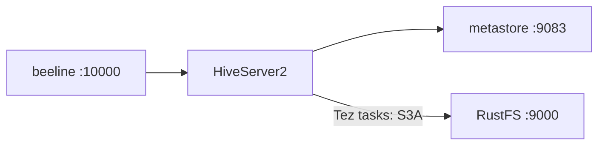
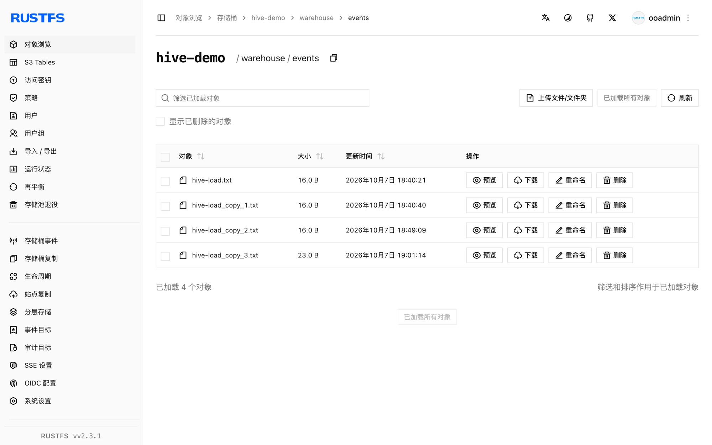

本指南将经典数据仓库 [Apache Hive](https://github.com/apache/hive) 经 S3A 文件系统连接到 **RustFS**。你将运行 Hive 4.0.1 Docker 镜像（metastore + HiveServer2），在三个配置层配置 S3A，在 RustFS 位置上创建外部表并加载数据查询。整个流程使用 Hive 4.0.1 对 `rustfs/rustfs-x86-musl:v2.3.1` 验证通过。

你需要 Docker（两个容器：metastore 与 hiveserver2）。

## 架构



Hive 把表元数据存在 metastore（本测试用 Derby），表数据存放在表的 S3A 位置。查询执行由 hiveserver2 容器内的 Tez 完成。

## 1. 运行 metastore 与 HiveServer2

```bash
docker run -d --name hive-metastore --hostname hive-meta --network oo-rustfs_default \
  -e SERVICE_NAME=metastore -e DB_DRIVER=derby apache/hive:4.0.1

docker run -d --name hive-server --hostname hive-server --network oo-rustfs_default \
  -e SERVICE_NAME=hiveserver2 -e DB_DRIVER=derby apache/hive:4.0.1
```

metastore 初始化 Derby schema 需 1-2 分钟；HiveServer2 监听 10000，metastore 监听 9083。

## 2. 在三处配置 S3A

Tez 任务读取 Hadoop 配置目录，HiveServer2 读取 Hive 配置，metastore 也需要端点。创建一份 properties 文件并拷贝到三个路径：

```xml title="s3a-core-site.xml"
<?xml version="1.0"?>
<configuration>
  <property><name>fs.s3a.endpoint</name><value>http://<your-rustfs-endpoint>:9000</value></property>
  <property><name>fs.s3a.access.key</name><value><your-access-key></value></property>
  <property><name>fs.s3a.secret.key</name><value><your-secret-key></value></property>
  <property><name>fs.s3a.path.style.access</name><value>true</value></property>
  <property><name>fs.s3a.connection.ssl.enabled</name><value>false</value></property>
  <property><name>fs.s3a.aws.credentials.provider</name><value>org.apache.hadoop.fs.s3a.SimpleAWSCredentialsProvider</value></property>
  <property><name>fs.s3a.impl</name><value>org.apache.hadoop.fs.s3a.S3AFileSystem</value></property>
</configuration>
```

```bash
rc mb rustfs/hive-demo
docker cp s3a-core-site.xml hive-server:/opt/hive/conf/hive-site.xml
docker cp s3a-core-site.xml hive-server:/opt/hive/conf/core-site.xml
docker cp s3a-core-site.xml hive-server:/opt/hadoop/etc/hadoop/core-site.xml
docker exec -u root hive-server bash -c \
  "chown hive:hive /opt/hive/conf/hive-site.xml /opt/hive/conf/core-site.xml /opt/hadoop/etc/hadoop/core-site.xml; \
   mkdir -p /home/hive/.beeline; chmod 777 /home/hive/.beeline"
docker exec hive-server bash -c \
  "echo 'export HADOOP_CONF_DIR=/opt/hadoop/etc/hadoop' >> /opt/hive/conf/hive-env.sh; \
   echo 'export HADOOP_CLASSPATH=/opt/hadoop/share/hadoop/tools/lib/*:/opt/tez/*:/opt/tez/lib/*' >> /opt/hive/conf/hive-env.sh"
docker restart hive-server
```

`hadoop-aws` jar 内置在 `/opt/hadoop/share/hadoop/tools/lib`——`HADOOP_CLASSPATH` 导出把它加进查询类路径。`mkdir /home/hive/.beeline` 可消除 beeline 的无害主目录报错。

## 3. 创建外部表

```bash
docker exec hive-server bash -c "cd /opt/hive && beeline -u 'jdbc:hive2://localhost:10000' \
  -n hive -e \"CREATE EXTERNAL TABLE default.events (id INT, label STRING) \
  ROW FORMAT DELIMITED FIELDS TERMINATED BY ',' STORED AS TEXTFILE \
  LOCATION 's3a://hive-demo/warehouse/events';\""
```

带 S3A `LOCATION` 的 `EXTERNAL` 表把数据完整保留在 RustFS 中。（Hive 4 的托管表规则不允许非默认库的托管表路径指向仓库根之外——S3A 位置请使用 `CREATE TABLE ... LOCATION` 语句（外部表）。）

## 4. 加载并查询数据

`LOAD DATA INPATH` 把本地文件移动进表的 S3A 位置（重命名由持有凭证的 HiveServer2 执行）：

```bash
docker exec hive-server bash -c "printf '1,alpha\n2,beta\n3,gamma\n' > /tmp/hive-load.txt"
docker exec hive-server bash -c "cd /opt/hive && beeline -u 'jdbc:hive2://localhost:10000' \
  -n hive -e \"LOAD DATA INPATH 'file:///tmp/hive-load.txt' INTO TABLE default.events;\""
```

```text
INFO  : Loading data to table default.events from file:/tmp/hive-load.txt
```

## 5. 查询并在 RustFS 中验证

```bash
docker exec hive-server bash -c "cd /opt/hive && beeline -u 'jdbc:hive2://localhost:10000' \
  -n hive --outputformat=tsv2 -e 'SELECT * FROM default.events ORDER BY id;'"
```

```text
1	alpha
2	beta
3	gamma
```

列举表目录——加载进来的文件就是普通对象：

```bash
rc ls rustfs/hive-demo/warehouse/events/
```

```text
warehouse/events/hive-load.txt
warehouse/events/hive-load_copy_1.txt
warehouse/events/hive-load_copy_2.txt
```



## 6. 停止或重置

```bash
docker rm -f hive-server hive-metastore
rc rm rustfs/hive-demo/ --recursive --force
```

## 故障排查

### INSERT 报 `NoClassDefFoundError: org.apache.tez.mapreduce.hadoop.InputSplitInfo`

查询类路径缺 Tez jar。把第 2 步的 `HADOOP_CLASSPATH` 导出（tools lib + tez + tez lib）加进 `/opt/hive/conf/hive-env.sh`。

### `NoAwsCredentialsException: SimpleAWSCredentialsProvider: No AWS credentials in the Hadoop configuration`

Tez 任务进程读取 `/opt/hadoop/etc/hadoop/core-site.xml`，而不只是 Hive 配置目录。把 S3A 属性拷贝到第 2 步的全部三个路径。

### 每条 beeline 命令后都打印 `Permission denied`

beeline 试图创建 `/home/hive/.beeline`。在容器内以 root 执行一次 `mkdir -p /home/hive/.beeline && chmod 777`。

### `Unable to create database managed path file:/user/hive/warehouse/...`

Hive 4 要求托管数据库位于托管仓库根之内。S3A 位置请使用 `CREATE EXTERNAL TABLE ... LOCATION 's3a://...'`。

## 下一步

- 想要无需 metastore 即可在相同对象上做交互式 SQL 时，参考 [Trino](/developer/integration/database/trino) 指南。
- 使用[访问密钥管理](/security-compliance/iam/access-token)创建专用的生产凭证。
- 按照 [Hive 文档](https://hive.apache.org/)接入 MySQL metastore，并让 Hive 与 Spark 共享同一桶上的仓库。
