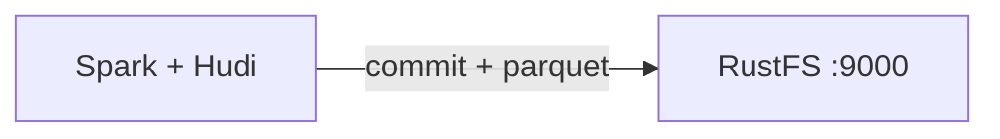
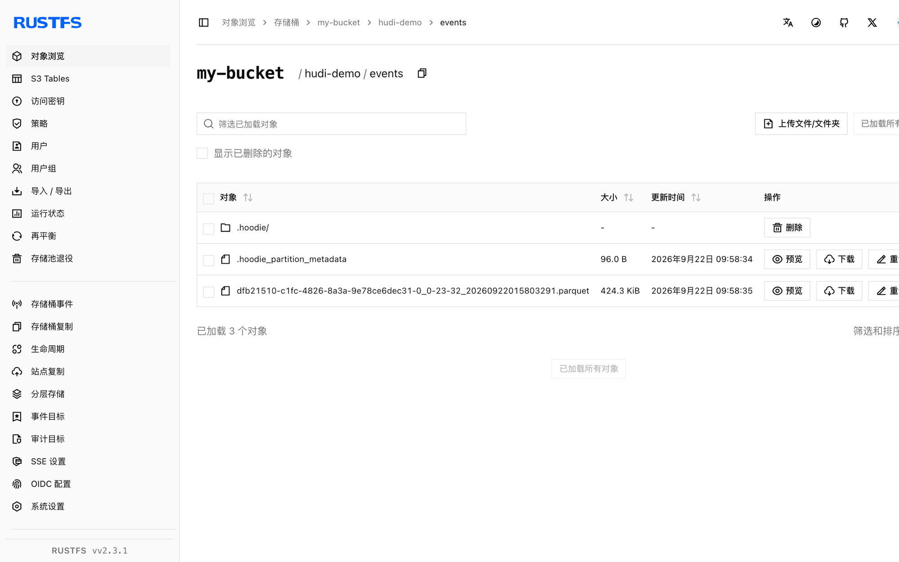

本指南将事务性数据湖平台 [Apache Hudi](https://github.com/apache/hudi) 连接到 **RustFS** 作为其写时复制表存储。你将运行带 Hudi bundle 的 Spark，向 RustFS 存储桶内的 `s3a://` 路径写入一张表，读回并验证表文件。整个流程使用 `apache/spark:3.5.6`、`hudi-spark3.5-bundle_2.12:0.15.0`、`hadoop-aws:3.3.4` 和 `rustfs/rustfs-x86-musl:v2.3.1` 验证通过。

你需要安装 Docker。本部署用于本地集成测试，不适用于生产环境。

## 架构



Hudi 把 `.hoodie/` 时间线、commit 文件和 Parquet 数据块存到桶内的表路径下。读取通过时间线解析表的最新快照，因此每次写入和查询都会经过 S3 API。

## 1. 运行 Spark 写入

Hudi 要求 Kryo 序列化器，s3a 凭证以 Hadoop 属性提供。下面的 `spark-shell` 会话在 `my-bucket` 中创建一张非分区表——请替换全部连接占位符：

```scala
import org.apache.spark.sql.SaveMode

val df = Seq((1, "a"), (2, "b"), (3, "c")).toDF("id", "name")
df.write.format("hudi")
  .option("hoodie.table.name", "events")
  .option("hoodie.datasource.write.recordkey.field", "id")
  .option("hoodie.datasource.write.precombine.field", "name")
  .option("hoodie.datasource.write.partitionpath.field", "")
  .mode(SaveMode.Overwrite)
  .save("s3a://my-bucket/hudi-demo/events")

val back = spark.read.format("hudi").load("s3a://my-bucket/hudi-demo/events")
back.select("id", "name").show()
```

```bash
docker run --rm --network oo-rustfs_default \
  -v "$PWD/hudi_test.scala":/tmp/hudi_test.scala \
  apache/spark:3.5.6 /opt/spark/bin/spark-shell \
  --packages org.apache.hudi:hudi-spark3.5-bundle_2.12:0.15.0,org.apache.hadoop:hadoop-aws:3.3.4 \
  --conf spark.serializer=org.apache.spark.serializer.KryoSerializer \
  --conf spark.hadoop.fs.s3a.endpoint=http://rustfs:9000 \
  --conf spark.hadoop.fs.s3a.path.style.access=true \
  --conf spark.hadoop.fs.s3a.access.key=<your-access-key> \
  --conf spark.hadoop.fs.s3a.secret.key=<your-secret-key> \
  --conf spark.hadoop.fs.s3a.region=us-east-1 \
  --conf spark.jars.ivy=/tmp/.ivy2 \
  --conf spark.sql.shuffle.partitions=2 \
  -i /tmp/hudi_test.scala
```

`--packages` 参数会在首次运行时下载 Hudi bundle 和 s3a 连接器。`spark.jars.ivy` 设置用于避免容器内的 Ivy 缓存权限错误。读回的 `show()` 输出三行数据：

```text
+---+----+
|  2|   b|
|  3|   c|
|  1|   a|
+---+----+
```

## 2. 在 RustFS 中验证对象

列出表前缀：

```bash
rc ls rustfs/my-bucket/hudi-demo/ -r
```

表路径下出现 Hudi 表布局——`.hoodie/` 时间线及 commit 文件，加上 Parquet 数据块：

```text
hudi-demo/events/.hoodie/20260922015803291.commit
hudi-demo/events/.hoodie/20260922015803291.commit.requested
hudi-demo/events/<partition>/<filegroup>/<parquet-block>
```



## 3. 停止或重置

Spark 是一次性客户端，不保存状态。删除演示表：

```bash
rc rm rustfs/my-bucket/hudi-demo/ --recursive --force
```

## 故障排查

### `hoodie only support org.apache.spark.serializer.KryoSerializer as spark.serializer`

Hudi 拒绝 Spark 默认序列化器。按上文传入 `--conf spark.serializer=org.apache.spark.serializer.KryoSerializer`。

### `Partition-path field has to be non-empty` 或 keygenerator 类错误

非分区表保持默认 key generator（不要设置 `hoodie.datasource.write.keygenerator.class`），并把 `hoodie.datasource.write.partitionpath.field` 设为空字符串。

### Hudi 写入时报 `NoSuchMethodError` 或 `ClassNotFoundException`

Spark 与 Hudi bundle 版本必须匹配：`hudi-spark3.5-bundle_2.12` 搭配 Spark 3.5.x，内置 Hadoop 客户端需兼容 `hadoop-aws:3.3.4`。

## 后续步骤

- 在采用更多 Hudi 操作之前，请查阅 [S3 兼容性说明](/administration/protocols/s3)。
- 通过[访问密钥管理](/security-compliance/iam/access-token)创建专用的生产凭证。
- 按照 [Hudi Spark 指南](https://hudi.apache.org/docs/quick-start-guide/)在同一张表上添加 upsert、compaction 与查询集成。
