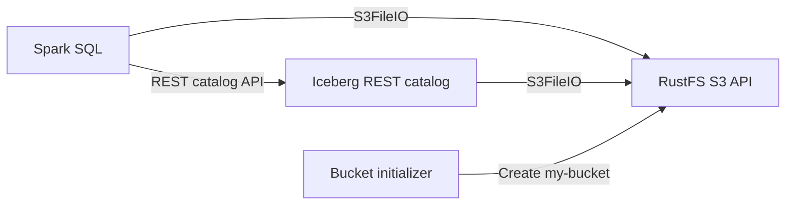

本指南将运行 **Apache Iceberg**、Spark、Iceberg REST catalog，并将 **RustFS** 用作兼容 S3 的仓库。你将创建一个 Iceberg 表、写入并查询数据行，然后验证表文件是否存储在 RustFS 中。

你需要安装带 Compose 插件的 Docker，并具备足够的本地资源来运行四个容器。此部署仅用于本地集成测试，不适用于生产环境。

:::note[上游状态]

Apache Iceberg [PR #14928](https://github.com/apache/iceberg/pull/14928) 展示了相同的 Spark、REST catalog、`S3FileIO` 和 RustFS 工作流，包括表创建与写入。该拉取请求已关闭且未合并，当前的 [Spark 快速入门](https://iceberg.apache.org/spark-quickstart/#docker-compose) 仍使用另一种兼容 S3 的存储。因此，以下配置记录的是 RustFS 集成方式，而不是 Apache Iceberg 的默认配置。

:::

## 架构



Spark 使用 REST 服务执行 catalog 操作。Spark 和 REST catalog 都会接收 RustFS 端点、区域、凭证和路径样式设置，以便访问 `s3://my-bucket/warehouse` 中的元数据和数据文件。

## 1. 创建项目文件

创建工作目录：

```bash
mkdir rustfs-iceberg
cd rustfs-iceberg
```

创建环境文件并替换两个凭证占位符：

```ini title=".env"
RUSTFS_ACCESS_KEY=<your-access-key>
RUSTFS_SECRET_KEY=<your-secret-key>
```

请为仓库存储桶使用专用凭证。不要将 `.env` 提交到源代码管理系统。

创建 Spark catalog 配置：

```ini title="spark-defaults.conf"
spark.sql.extensions org.apache.iceberg.spark.extensions.IcebergSparkSessionExtensions
spark.sql.catalog.demo org.apache.iceberg.spark.SparkCatalog
spark.sql.catalog.demo.type rest
spark.sql.catalog.demo.uri http://rest:8181
spark.sql.catalog.demo.io-impl org.apache.iceberg.aws.s3.S3FileIO
spark.sql.catalog.demo.warehouse s3://my-bucket/warehouse
spark.sql.catalog.demo.s3.endpoint http://rustfs:9000
spark.sql.catalog.demo.s3.path-style-access true
spark.sql.defaultCatalog demo
spark.sql.catalogImplementation in-memory
```

此容器网络端点必须使用路径样式访问。主机名 `rustfs` 只能在 Compose 网络内部解析；在主机上运行的客户端应改用 `http://localhost:9000`。

创建 Compose 文件：

```yaml title="compose.yaml"
services:
  rustfs:
    image: rustfs/rustfs:1.0.0-alpha.83
    environment:
      RUSTFS_ACCESS_KEY: ${RUSTFS_ACCESS_KEY}
      RUSTFS_SECRET_KEY: ${RUSTFS_SECRET_KEY}
      RUSTFS_VOLUMES: /data
      RUSTFS_ADDRESS: ":9000"
      RUSTFS_CONSOLE_ADDRESS: ":9001"
      RUSTFS_CONSOLE_ENABLE: "true"
      RUSTFS_OBS_LOGGER_LEVEL: error
      RUSTFS_OBS_LOG_DIRECTORY: /var/log/rustfs/
    volumes:
      - rustfs-data:/data
    ports:
      - "9000:9000"
      - "9001:9001"
    networks:
      - iceberg

  create-bucket:
    image: rustfs/rc:latest
    depends_on:
      - rustfs
    environment:
      RUSTFS_ACCESS_KEY: ${RUSTFS_ACCESS_KEY}
      RUSTFS_SECRET_KEY: ${RUSTFS_SECRET_KEY}
    entrypoint:
      - /bin/sh
      - -c
      - |
        until /usr/bin/rc alias set rustfs http://rustfs:9000 "$${RUSTFS_ACCESS_KEY}" "$${RUSTFS_SECRET_KEY}"; do
          echo "Waiting for RustFS..."
          sleep 2
        done
        /usr/bin/rc ls rustfs/my-bucket >/dev/null 2>&1 || /usr/bin/rc mb rustfs/my-bucket
    networks:
      - iceberg

  rest:
    image: apache/iceberg-rest-fixture
    depends_on:
      create-bucket:
        condition: service_completed_successfully
    environment:
      AWS_ACCESS_KEY_ID: ${RUSTFS_ACCESS_KEY}
      AWS_SECRET_ACCESS_KEY: ${RUSTFS_SECRET_KEY}
      AWS_REGION: us-east-1
      CATALOG_WAREHOUSE: s3://my-bucket/warehouse
      CATALOG_IO__IMPL: org.apache.iceberg.aws.s3.S3FileIO
      CATALOG_S3_ENDPOINT: http://rustfs:9000
      CATALOG_S3_PATH__STYLE__ACCESS: "true"
    ports:
      - "8181:8181"
    networks:
      - iceberg

  spark-iceberg:
    image: tabulario/spark-iceberg
    depends_on:
      create-bucket:
        condition: service_completed_successfully
      rest:
        condition: service_started
    environment:
      AWS_ACCESS_KEY_ID: ${RUSTFS_ACCESS_KEY}
      AWS_SECRET_ACCESS_KEY: ${RUSTFS_SECRET_KEY}
      AWS_REGION: us-east-1
    volumes:
      - ./spark-defaults.conf:/opt/spark/conf/spark-defaults.conf:ro
    ports:
      - "8888:8888"
      - "8080:8080"
    networks:
      - iceberg

networks:
  iceberg:

volumes:
  rustfs-data:
```

[`rc` 镜像](https://github.com/rustfs/cli)提供官方 RustFS 命令行客户端。初始化程序会在创建 `my-bucket` 前检查其是否存在，因此重复启动不会删除现有仓库数据。RustFS 卷会在容器重新创建后继续保留仓库对象。

:::warning[镜像版本]

Apache Iceberg 快速入门镜像在上游示例中发布时没有稳定版本标签。在将此模式用于本地测试之外的场景前，请将每个镜像固定到经过测试的标签或摘要，并同时验证 Spark、Iceberg runtime 和 REST catalog 的版本。

:::

## 2. 验证并启动部署

启动容器前解析 Compose 文件：

```bash
docker compose config
```

启动服务并等待存储桶初始化程序完成：

```bash
docker compose up -d
docker compose ps -a
```

`create-bucket` 服务应显示退出代码 `0`。如果该服务未完成，请检查其日志：

```bash
docker compose logs create-bucket
```

在 `http://localhost:9001` 打开 RustFS 控制台。REST catalog 位于 `http://localhost:8181`，Spark notebook 服务器位于 `http://localhost:8888`。

## 3. 创建并查询 Iceberg 表

启动 Spark SQL：

```bash
docker compose exec spark-iceberg spark-sql
```

创建命名空间和分区表：

```sql
CREATE NAMESPACE IF NOT EXISTS demo.nyc;

CREATE TABLE demo.nyc.taxis
(
	vendor_id bigint,
	trip_id bigint,
	trip_distance float,
	fare_amount double,
	store_and_fwd_flag string
)
PARTITIONED BY (vendor_id);
```

插入并查询示例数据行：

```sql
INSERT INTO demo.nyc.taxis
VALUES
	(1, 1000371, 1.8, 15.32, 'N'),
	(2, 1000372, 2.5, 22.15, 'N'),
	(2, 1000373, 0.9, 9.01, 'N'),
	(1, 1000374, 8.4, 42.13, 'Y');

SELECT * FROM demo.nyc.taxis ORDER BY trip_id;
```

查询应返回四行：

```text
1  1000371  1.8  15.32  N
2  1000372  2.5  22.15  N
2  1000373  0.9  9.01   N
1  1000374  8.4  42.13  Y
```

## 4. 验证 RustFS 中的对象

使用存储桶初始化程序镜像列出仓库内容：

```bash
docker compose run --rm --entrypoint /bin/sh create-bucket -c \
  '/usr/bin/rc alias set rustfs http://rustfs:9000 "$RUSTFS_ACCESS_KEY" "$RUSTFS_SECRET_KEY" >/dev/null && /usr/bin/rc find rustfs/my-bucket/warehouse'
```

输出应包含 `warehouse/nyc/taxis` 前缀下的 Iceberg 元数据和数据对象。你也可以在 RustFS 控制台中检查 `my-bucket` 存储桶。

## 5. 停止或重置服务栈

停止容器但保留 RustFS 数据卷：

```bash
docker compose down
```

要删除本地仓库并从空的 RustFS 卷重新开始，请显式添加 `--volumes`：

```bash
docker compose down --volumes
```

## 故障排除

### Spark 无法连接 RustFS

在 Compose 内部使用 `http://rustfs:9000`。在 `spark-defaults.conf` 中使用 `http://localhost:9000` 时，它指向的是 Spark 容器自身。

确认 `spark.sql.catalog.demo.s3.path-style-access` 为 `true`。虚拟主机样式请求需要额外的 RustFS 域名和 DNS 配置。

### Catalog 返回 S3 错误

检查 `.env` 中的凭证是否与 RustFS 凭证一致，以及 `create-bucket` 服务是否成功完成：

```bash
docker compose logs create-bucket rest
```

REST catalog 属性 `CATALOG_IO__IMPL` 和 `CATALOG_S3_PATH__STYLE__ACCESS` 使用双下划线；fixture 会将它们转换为带点号和连字符的 Iceberg 属性名。

## 后续步骤

- 在采用其他 Iceberg 操作前，请查看 [S3 兼容性说明](/administration/protocols/s3)。
- 通过[访问密钥管理](/security-compliance/iam/access-token)创建专用的生产凭证。
- 按照 [Apache Iceberg Spark 文档](https://iceberg.apache.org/docs/latest/spark-getting-started/)配置现有 Spark 环境。