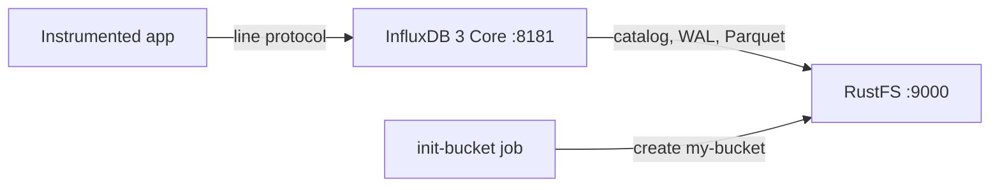
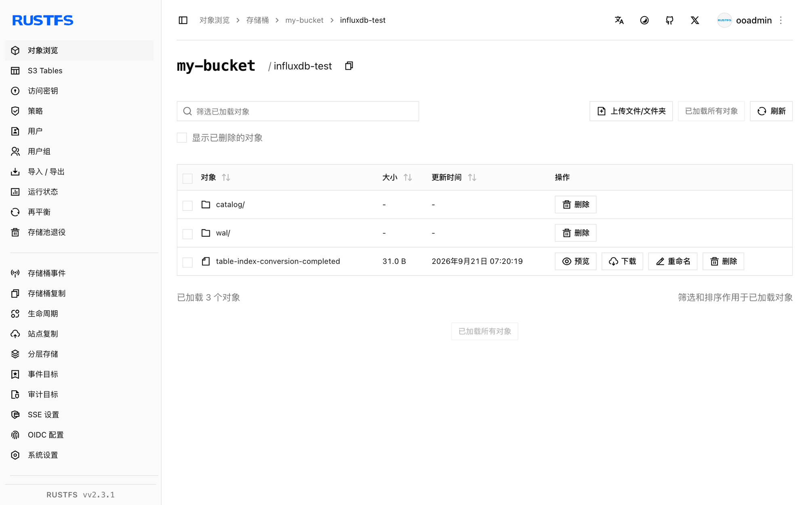

本指南运行 [InfluxDB](https://github.com/influxdata/influxdb)——具体是 **InfluxDB 3 Core**，基于 Rust、采用 Parquet 存储引擎的时序数据库——并以 **RustFS** 作为其对象存储。你将使用 Docker Compose 启动 InfluxDB，通过 HTTP API 写入 line protocol，用 SQL 查询回来，在 RustFS 中验证持久化的对象，并确认数据能在 InfluxDB 重启后保留。整个流程使用 `influxdb:3-core`（v3.11.5）和 `rustfs/rustfs-x86-musl:v2.3.1` 验证通过。

你需要安装带有 Compose 插件的 Docker。本部署用于本地集成测试，不适用于生产环境。

## 架构



InfluxDB 3 Core 将目录（catalog）、预写日志（WAL）和 Parquet 数据文件保存在配置的对象存储中。写入先落入 WAL 并持久化到 RustFS，因此在压缩生成 Parquet 文件之前，每次写入也能在重启后保留。服务端默认对所配置的端点使用 path-style 寻址。

## 1. 创建项目文件

创建工作目录：

```bash
mkdir rustfs-influxdb
cd rustfs-influxdb
```

创建环境变量文件，并替换两个凭证占位符：

```ini title=".env"
RUSTFS_ACCESS_KEY=<your-access-key>
RUSTFS_SECRET_KEY=<your-secret-key>
```

请为桶使用专用的凭证，不要将 `.env` 提交到版本控制。

创建 Compose 文件：

```yaml title="compose.yaml"
services:
  rustfs:
    image: rustfs/rustfs-x86-musl:v2.3.1
    environment:
      RUSTFS_ACCESS_KEY: ${RUSTFS_ACCESS_KEY}
      RUSTFS_SECRET_KEY: ${RUSTFS_SECRET_KEY}
      RUSTFS_VOLUMES: /data
      RUSTFS_ADDRESS: ":9000"
      RUSTFS_CONSOLE_ADDRESS: ":9001"
      RUSTFS_CONSOLE_ENABLE: "true"
    volumes:
      - rustfs-data:/data
    ports:
      - "9000:9000"
      - "9001:9001"
    healthcheck:
      test: ["CMD", "curl", "-sf", "http://127.0.0.1:9000/health"]
      interval: 10s
      timeout: 5s
      retries: 6
      start_period: 10s
    networks:
      - influxdb

  create-bucket:
    image: rustfs/rc:latest
    depends_on:
      rustfs:
        condition: service_healthy
    environment:
      RUSTFS_ACCESS_KEY: ${RUSTFS_ACCESS_KEY}
      RUSTFS_SECRET_KEY: ${RUSTFS_SECRET_KEY}
    entrypoint:
      - /bin/sh
      - -c
      - |
        until /usr/bin/rc alias set rustfs http://rustfs:9000 "$${RUSTFS_ACCESS_KEY}" "$${RUSTFS_SECRET_KEY}"; do
          echo "Waiting for RustFS..."
          sleep 2
        done
        /usr/bin/rc ls rustfs/my-bucket >/dev/null 2>&1 || /usr/bin/rc mb rustfs/my-bucket
    networks:
      - influxdb

  influxdb:
    image: influxdb:3-core
    command:
      - serve
      - --node-id
      - influxdb-demo
      - --object-store
      - s3
      - --bucket
      - my-bucket
      - --aws-endpoint
      - http://rustfs:9000
      - --aws-access-key-id
      - ${RUSTFS_ACCESS_KEY}
      - --aws-secret-access-key
      - ${RUSTFS_SECRET_KEY}
      - --aws-allow-http
    ports:
      - "8181:8181"
    depends_on:
      create-bucket:
        condition: service_completed_successfully
    networks:
      - influxdb

networks:
  influxdb:

volumes:
  rustfs-data:
```

`--object-store s3` 加上 `--aws-endpoint` 会把所有 catalog、WAL 和 Parquet 写入路由到 RustFS。InfluxDB 默认对该端点使用 path-style 寻址，`--aws-allow-http` 允许在 Compose 网络内使用纯 HTTP。

## 2. 启动部署

启动容器前先解析 Compose 文件：

```bash
docker compose config
```

启动服务并等待桶初始化任务完成：

```bash
docker compose up -d
docker compose ps -a
```

## 3. 创建管理员令牌

InfluxDB 3 Core 的每个 API 请求都需要持有者令牌（bearer token）。首次启动后创建一次管理员令牌，并保存打印出的值：

```bash
docker compose exec influxdb3 influxdb3 create token --admin
```

```text
Token: <your-admin-token>
```

:::note[令牌创建]

令牌值只会打印一次，之后无法找回。如果提示令牌名已存在（HTTP 409），说明该节点已有元数据——请换一个全新的桶前缀，或删除桶中的节点前缀后重试。

:::

## 4. 写入 line protocol

向 `rustfs_demo` 数据库发送一批 CPU 指标的 line protocol：

```bash
python3 - <<'PY'
import time, urllib.request

token = "<your-admin-token>"
now_ns = int(time.time() * 1e9)
lines = []
for i in range(30):
    ts = now_ns - i * 1_000_000_000
    lines.append(f"cpu_usage,host=az-server,region=us-east-1 usage={60 + i % 30}.{i % 10} {ts}")

req = urllib.request.Request(
    "http://localhost:8181/api/v3/write_lp?db=rustfs_demo",
    data="\n".join(lines).encode(),
    headers={"Content-Type": "text/plain", "Authorization": f"Bearer {token}"},
    method="POST",
)
with urllib.request.urlopen(req, timeout=30) as r:
    print("write:", r.status)
PY
```

```text
write: 204
```

## 5. 使用 SQL 查询

通过 SQL API 把刚才的测量数据查询回来：

```bash
curl -sG "http://localhost:8181/api/v3/query_sql" \
  --data-urlencode "db=rustfs_demo" \
  --data-urlencode "format=json" \
  --data-urlencode "q=SELECT count(*) AS cnt FROM cpu_usage" \
  -H "Authorization: Bearer <your-admin-token>"
```

```text
[{"cnt":30}]
```

## 6. 在 RustFS 中验证对象

通过桶初始化镜像列出节点前缀：

```bash
docker compose run --rm --entrypoint /bin/sh create-bucket -c \
  '/usr/bin/rc alias set rustfs http://rustfs:9000 "$RUSTFS_ACCESS_KEY" "$RUSTFS_SECRET_KEY" >/dev/null && /usr/bin/rc ls rustfs/my-bucket/influxdb-demo --recursive'
```

catalog、预写日志以及后续生成的 Parquet 数据文件都位于节点标识前缀之下：

```text
[2026-09-20 23:18:28]      105 B influxdb-demo/catalog/v3/snapshot
[2026-09-20 23:20:54]     1.45 KiB influxdb-demo/wal/00000000001.wal
[2026-09-20 23:20:19]       31 B influxdb-demo/table-index-conversion-completed
```

你也可以在 RustFS 控制台中浏览该前缀：



## 7. 确认重启后数据仍在

重启 InfluxDB 并重复 SQL 查询：

```bash
docker compose restart influxdb
curl -sG "http://localhost:8181/api/v3/query_sql" \
  --data-urlencode "db=rustfs_demo" \
  --data-urlencode "format=json" \
  --data-urlencode "q=SELECT count(*) AS cnt FROM cpu_usage" \
  -H "Authorization: Bearer <your-admin-token>"
```

```text
[{"cnt":30}]
```

计数保持不变，因为 catalog 和 WAL 是从 RustFS 重放的——对象存储就是持久层，与生产拓扑完全一致。

## 8. 停止或重置环境

停止容器并保留 RustFS 数据卷：

```bash
docker compose down
```

如需删除已存储的数据并从空的 RustFS 数据卷开始，请显式加上 `--volumes`：

```bash
docker compose down --volumes
```

## 故障排除

### 所有请求都提示 "the request was not authenticated"

InfluxDB 3 Core 的 API 请求需要管理员持有者令牌。先用 `influxdb3 create token --admin` 创建一次，并以 `Authorization: Bearer <token>` 的形式发送。

### 创建管理员令牌时提示 "token name already exists"

节点已有管理员令牌，且令牌值无法找回。在容器停止的情况下删除桶中的节点前缀（例如 `influxdb-demo/`），重新启动后再创建新令牌。

### 返回 AccessDenied 或 403 响应

确认 Compose 文件中的凭证与 RustFS 凭证一致，并确认 `create-bucket` 任务已成功完成：

```bash
docker compose logs create-bucket
```

### 连接或证书错误

`--aws-endpoint` 接收完整 URL；`--aws-allow-http` 允许容器网络端点使用纯 HTTP。Compose 网络内使用 `http://rustfs:9000` (宿主机上使用 `http://localhost:9000`)。

## 后续步骤

- 在采用其他 S3 操作前，请查看 [S3 兼容性说明](/administration/protocols/s3)。
- 通过[访问密钥管理](/security-compliance/iam/access-token)创建专用的生产凭证。
- 按照 [InfluxDB 3 Core 文档](https://docs.influxdata.com/influxdb3/core/)接入 telegraf 或通过写入 API 作为数据生产者。
