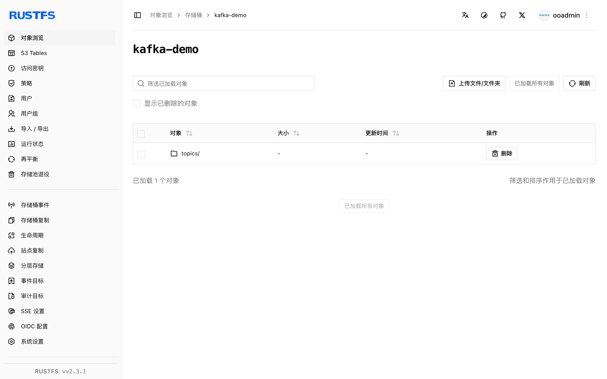

本指南将分布式事件流平台 [Apache Kafka](https://github.com/apache/kafka) 通过 Kafka Connect S3 sink 连接器连接到 **RustFS**。你将运行一个 KRaft broker 和一个 Connect worker，为一个主题部署 S3 sink，并生产一批落为桶内对象的记录。整个流程使用 `apache/kafka:4.0.0` 和 `confluentinc/kafka-connect-s3` v10.5.25 对 `rustfs/rustfs-x86-musl:v2.3.1` 验证通过。

Kafka 的 KIP-405 分层存储需要 `RemoteLogStorageManager` 插件，而生态中的 S3 实现均为厂商专有。Connect S3 sink 是把主题数据迁移到 S3 兼容存储的开放、可自托管方案，也是本指南采用的方式。

你需要安装 Docker。本部署用于本地集成测试，不适用于生产环境。

## 架构


sink 任务以独立的消费者组消费主题，并按每个分区每 `flush.size` 条记录一个对象的方式写入桶内。

## 1. 运行 broker

启动一个发布地址对其他容器可达的 KRaft broker：

```bash
docker run -d --name kafka --hostname kafka --network oo-rustfs_default \
  -e CLUSTER_ID=5L6g3nShT-eMCtK--X86sw \
  -e KAFKA_NODE_ID=1 \
  -e KAFKA_PROCESS_ROLES=broker,controller \
  -e KAFKA_LISTENERS=PLAINTEXT://:9092,CONTROLLER://:9093 \
  -e KAFKA_ADVERTISED_LISTENERS=PLAINTEXT://kafka:9092 \
  -e KAFKA_CONTROLLER_LISTENER_NAMES=CONTROLLER \
  -e KAFKA_LISTENER_SECURITY_PROTOCOL_MAP=CONTROLLER:PLAINTEXT,PLAINTEXT:PLAINTEXT \
  -e KAFKA_CONTROLLER_QUORUM_VOTERS=1@kafka:9093 \
  -e KAFKA_OFFSETS_TOPIC_REPLICATION_FACTOR=1 \
  -e KAFKA_TRANSACTION_STATE_LOG_REPLICATION_FACTOR=1 \
  -e KAFKA_TRANSACTION_STATE_LOG_MIN_ISR=1 \
  apache/kafka:4.0.0

docker exec kafka /opt/kafka/bin/kafka-topics.sh \
  --bootstrap-server localhost:9092 \
  --create --topic rustfs-topic --partitions 1 --replication-factor 1

rc mb rustfs/kafka-demo
```

镜像默认发布 `localhost:9092`，仅在 broker 容器内部可用。`KAFKA_ADVERTISED_LISTENERS` 覆盖是让 Connect（以及任何远程客户端）能够连上 broker 的关键。

## 2. 安装连接器

下载打包了连接器及其依赖的 Confluent Hub 压缩包，解压到 worker 可见的目录：

```bash
curl -Lo kafka-connect-s3.zip "https://hub-downloads.confluent.io/api/plugins/confluentinc/kafka-connect-s3/versions/10.5.25/confluentinc-kafka-connect-s3-10.5.25.zip"
unzip kafka-connect-s3.zip -d /opt/kafka-conn/plugins
```

## 3. 配置 worker 与 sink

创建 worker 配置。value converter 必须是 `ByteArrayConverter`，记录才会按原始字节写出：

```ini title="worker.properties"
bootstrap.servers=kafka:9092
key.converter=org.apache.kafka.connect.storage.StringConverter
value.converter=org.apache.kafka.connect.converters.ByteArrayConverter
offset.storage.file.filename=/tmp/connect.offsets
offset.flush.interval.ms=5000
plugin.path=/opt/kafka-conn-plugins
```

创建 sink 连接器配置，并替换全部连接占位符：

```ini title="rustfs-sink.properties"
name=rustfs-sink
connector.class=io.confluent.connect.s3.S3SinkConnector
tasks.max=1
topics=rustfs-topic
s3.bucket.name=kafka-demo
s3.region=us-east-1
store.url=http://<your-rustfs-endpoint>:9000
s3.path.style.access.enabled=true
flush.size=3
storage.class=io.confluent.connect.s3.storage.S3Storage
format.class=io.confluent.connect.s3.format.bytearray.ByteArrayFormat
consumer.override.auto.offset.reset=earliest
```

Kafka 4.0 把该类移动到了 `org.apache.kafka.connect.converters.ByteArrayConverter`——旧的 `storage` 包路径已无法解析。

## 4. 运行 worker

以前台方式运行 `connect-standalone`，让日志进入 `docker logs`，桶凭证走环境变量：

```bash
docker run -d --name kafka-connect --hostname kafka-connect \
  --network oo-rustfs_default \
  -v /opt/kafka-conn/plugins:/opt/kafka-conn-plugins:ro \
  -v "$PWD/worker.properties":/etc/kafka/worker.properties:ro \
  -v "$PWD/rustfs-sink.properties":/etc/kafka/sink.properties:ro \
  -e AWS_ACCESS_KEY_ID=<your-access-key> \
  -e AWS_SECRET_ACCESS_KEY=<your-secret-key> \
  apache/kafka:4.0.0 \
  /opt/kafka/bin/connect-standalone.sh /etc/kafka/worker.properties /etc/kafka/sink.properties
```

当 sink 任务认领分区后，worker 即就绪：

```text
INFO [rustfs-sink|task-0] Assigned topic partitions: [rustfs-topic-0]
```

## 5. 生产记录

至少发送 `flush.size` 条记录，让连接器完成一个批次：

```bash
docker exec kafka sh -c "printf 'msg-one\nmsg-two\nmsg-three\n' | \
  /opt/kafka/bin/kafka-console-producer.sh --bootstrap-server localhost:9092 --topic rustfs-topic"
```

几秒后，这一批记录变成桶里的对象：

```bash
rc ls rustfs/kafka-demo/ -r
rc cat rustfs/kafka-demo/topics/rustfs-topic/partition=0/rustfs-topic+0+0000000000.bin
```

```text
topics/rustfs-topic/partition=0/rustfs-topic+0+0000000000.bin
topics/rustfs-topic/partition=0/rustfs-topic+0+0000000003.bin
msg-one
msg-two
msg-three
```

对象名编码了主题、分区和起始偏移量。后续每三行记录落入下一个对象（`+0000000003.bin`，以此类推）。



## 6. 停止或重置

保留桶内对象、仅拆除演示环境：

```bash
docker rm -f kafka-connect kafka
```

删除已存储的数据：

```bash
rc rm rustfs/kafka-demo/ --recursive --force
```

## 故障排查

### `AdminClient ... Rebootstrapping with Cluster (id: null)` 无限循环

broker 发布的是 `localhost:9092`，远程客户端收到的元数据指向它自己。按第 1 步设置 `KAFKA_ADVERTISED_LISTENERS=PLAINTEXT://kafka:9092`（以及配套的监听变量）。

### `Invalid schema type for ByteArrayConverter: STRING`

`ByteArrayFormat` 写入器只接受原始字节。要么把 worker 的 `value.converter` 换成 ByteArray converter，要么选择与当前 converter 匹配的 format class。

### `Class org.apache.kafka.connect.storage.ByteArrayConverter could not be found`

Kafka 4.0 把该类移动到了 `org.apache.kafka.connect.converters.ByteArrayConverter`。请在 `worker.properties` 中使用新的包路径。

### 连接器已下载但插件未找到

Maven 上的裸连接器 JAR 不含依赖。请使用第 2 步的 Confluent Hub 压缩包（内含完整的 `lib/` 目录），并确保 `plugin.path` 指向包含连接器目录的上级目录。

## 下一步

- 在启用更多连接器前，先阅读 [S3 兼容性说明](/administration/protocols/s3)。
- 使用[访问密钥管理](/security-compliance/iam/access-token)创建专用的生产凭证。
- 按照 [Kafka Connect S3 sink 文档](https://docs.confluent.io/kafka-connect-s3/current/index.html)了解 Parquet 与 Avro 格式、按时间分区以及基于 IAM 的凭证链。
