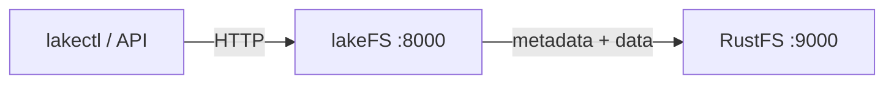
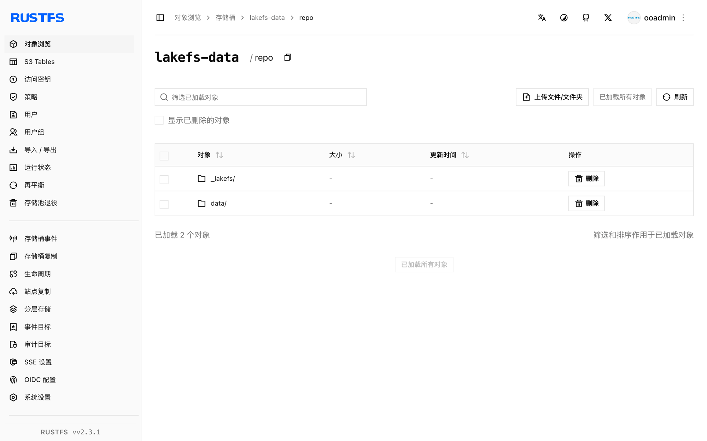

本指南将 Git 式数据湖版本管理层 [lakeFS](https://github.com/treeverse/lakeFS) 连接到 **RustFS** 作为其 S3 blockstore。你将启动 lakeFS，创建存储命名空间指向 RustFS 存储桶的仓库，提交一个对象，并验证 lakeFS 的元数据和数据文件存放在 RustFS 中。整个流程使用 `treeverse/lakefs:1.58.0` 和 `rustfs/rustfs-x86-musl:v2.3.1` 验证通过。

你需要安装 Docker。本部署用于本地集成测试，不适用于生产环境。

## 架构



lakeFS 把仓库元数据和已提交的数据文件按存储命名空间存入 blockstore。桶内是一个 `repo/` 前缀，包含 `_lakefs/` 元数据和 `data/` 对象，全部通过 S3 API 读写。

## 1. 创建项目文件

先创建存储桶，再创建 lakeFS 配置：

```bash
rc alias set rustfs http://<your-rustfs-endpoint>:9000 <your-access-key> <your-secret-key>
rc mb rustfs/lakefs-data
```

```yaml title="config.yaml"
database:
  type: local
  local:
    path: /lakefs/data

blockstore:
  type: s3
  s3:
    endpoint: http://rustfs:9000
    region: us-east-1
    force_path_style: true

auth:
  encrypt:
    secret_key: change-me-to-a-random-string

gateways:
  s3:
    domain_name: rustfs-gateway.local

logging:
  format: text
  level: info
```

`force_path_style: true` 是必需的——缺少它 lakeFS 会把 `lakefs-data.<主机名>` 当作主机名，所有请求都会因 DNS 错误失败。凭证通过标准的 `AWS_ACCESS_KEY_ID` 和 `AWS_SECRET_ACCESS_KEY` 环境变量提供。

创建服务凭证与初始管理员用户的环境文件，并替换占位符：

```ini title=".env"
AWS_ACCESS_KEY_ID=<your-access-key>
AWS_SECRET_ACCESS_KEY=<your-secret-key>
LAKEFS_INSTALLATION_USER_NAME=admin
LAKEFS_INSTALLATION_ACCESS_KEY_ID=<your-lakefs-access-key>
LAKEFS_INSTALLATION_SECRET_ACCESS_KEY=<your-lakefs-secret-key>
LAKEFS_STATS_ENABLED=false
```

## 2. 启动 lakeFS

```bash
docker run -d --name lakefs --network oo-rustfs_default \
  -p 8000:8000 \
  -v "$PWD/config.yaml":/etc/lakefs/config.yaml:ro \
  --env-file .env \
  treeverse/lakefs:1.58.0 run
```

等待 `http://localhost:8000/api/healthcheck` 返回 `200`，然后创建存储命名空间位于桶内的仓库：

```bash
curl -s -u <your-lakefs-access-key>:<your-lakefs-secret-key> \
  -X POST http://localhost:8000/api/v1/repositories \
  -H "Content-Type: application/json" \
  -d '{"name": "rustfs-demo", "storage_namespace": "s3://lakefs-data/repo"}'
```

## 3. 提交一个对象

向 `main` 分支上传文件并提交：

```bash
echo "hello from lakefs on rustfs" > hello.txt

curl -s -u <your-lakefs-access-key>:<your-lakefs-secret-key> \
  -X POST "http://localhost:8000/api/v1/repositories/rustfs-demo/branches/main/objects?path=hello.txt" \
  --data-binary @hello.txt

curl -s -u <your-lakefs-access-key>:<your-lakefs-secret-key> \
  -X POST "http://localhost:8000/api/v1/repositories/rustfs-demo/branches/main/commits" \
  -H "Content-Type: application/json" \
  -d '{"message": "add hello"}'
```

通过分支 ref 读回对象——响应体就是已提交的内容：

```bash
curl -s -u <your-lakefs-access-key>:<your-lakefs-secret-key> \
  "http://localhost:8000/api/v1/repositories/rustfs-demo/refs/main/objects?path=hello.txt"
```

## 4. 在 RustFS 中验证对象

列出存储桶：

```bash
rc ls rustfs/lakefs-data/ -r
```

输出显示仓库前缀下的 lakeFS 元数据对象和已提交数据文件：

```text
repo/_lakefs/19b2b26e37cb20fc6763c527f88eb5151891b04a2c8c9ddd32870c5c3f353281
repo/data/fueia10jdra000e1c480/daots7ojdra000e1c490
```



## 5. 停止或重置部署

停止 lakeFS 并保留数据：

```bash
docker rm -f lakefs
```

仓库元数据和数据保留在 `lakefs-data` 存储桶中，以相同配置重启 lakeFS 即可恢复仓库。若要删除全部内容，请移除存储桶：

```bash
rc rb rustfs/lakefs-data --force
```

## 故障排查

### `failed to create repository: failed to access storage` 并伴随 DNS 错误

lakeFS 正在使用 virtual-hosted 寻址。在 `blockstore.s3` 下设置 `force_path_style: true`——1.x 配置 schema 会拒绝旧的 `path_style` 键。

### `missing required keys: [auth.encrypt.secret_key]`

lakeFS 1.x 要求本地数据库的加密密钥。按上文配置添加 `auth.encrypt.secret_key` 段。

### `mkdir /lakefs: permission denied`

容器以非 root 用户运行，无法创建数据库目录。本地测试可加 `-u 0` 运行，或在配置路径上挂载可写目录。

## 后续步骤

- 在采用更多 lakeFS 操作之前，请查阅 [S3 兼容性说明](/administration/protocols/s3)。
- 通过[访问密钥管理](/security-compliance/iam/access-token)创建专用的生产凭证。
- 按照 [lakeFS S3 blockstore 文档](https://docs.lakefs.io/howto/using-s3.html)配置 S3 网关，让讲 S3 协议的工具直接接入。
