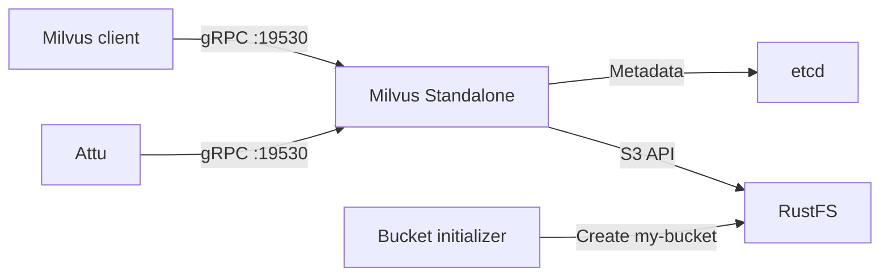

本指南将运行 **Milvus Standalone**，并将 **RustFS** 用作兼容 S3 的对象存储后端。你将启动 Milvus、etcd、RustFS 和 Attu，插入示例向量，并验证 Milvus 是否将对象持久化到 RustFS。

你需要安装带 Compose 插件的 Docker 和 Python 3.9 或更高版本。此部署仅用于本地集成测试，不适用于生产环境。

:::note[Milvus 配置名称]

Milvus 将兼容 S3 的存储设置归入 `minio` 配置键。该名称并不要求使用 MinIO 服务器。在本指南中，`minio.address` 指向 RustFS 服务，Milvus 使用 RustFS 提供的 S3 API。

:::

## 架构



Milvus 将服务元数据存储在 etcd 中，并将向量数据、索引和相关对象持久化到 RustFS 的 `s3://my-bucket/milvus` 下。运行时数据和缓存仍需要本地 Milvus 卷。

## 1. 创建项目文件

创建工作目录：

```bash
mkdir rustfs-milvus
cd rustfs-milvus
```

创建环境文件并替换两个凭证占位符：

```ini title=".env"
RUSTFS_ACCESS_KEY=<your-access-key>
RUSTFS_SECRET_KEY=<your-secret-key>
```

请为 Milvus 存储桶使用专用凭证。不要将 `.env` 提交到源代码管理系统。

创建 Milvus 存储覆盖配置：

```yaml title="user.yaml"
common:
  storageType: remote

minio:
  address: rustfs:9000
  port: 9000
  bucketName: my-bucket
  rootPath: milvus
  useSSL: false
  useIAM: false
  cloudProvider: aws
  region: us-east-1
  useVirtualHost: false
```

`useVirtualHost: false` 会选择路径样式 S3 请求。主机名 `rustfs` 可在 Compose 网络内部解析；主机上的客户端使用 `http://localhost:9000`。

创建 Compose 文件：

```yaml title="compose.yaml"
services:
  etcd:
    image: quay.io/coreos/etcd:v3.5.18
    environment:
      ETCD_AUTO_COMPACTION_MODE: revision
      ETCD_AUTO_COMPACTION_RETENTION: "1000"
      ETCD_QUOTA_BACKEND_BYTES: "4294967296"
      ETCD_SNAPSHOT_COUNT: "50000"
    command:
      - etcd
      - --advertise-client-urls=http://etcd:2379
      - --listen-client-urls=http://0.0.0.0:2379
      - --data-dir=/etcd
    volumes:
      - etcd-data:/etcd
    healthcheck:
      test: ["CMD", "etcdctl", "endpoint", "health"]
      interval: 30s
      timeout: 20s
      retries: 3
    networks:
      - milvus

  rustfs:
    image: rustfs/rustfs:1.0.0-alpha.83
    environment:
      RUSTFS_ACCESS_KEY: ${RUSTFS_ACCESS_KEY}
      RUSTFS_SECRET_KEY: ${RUSTFS_SECRET_KEY}
      RUSTFS_VOLUMES: /data
      RUSTFS_ADDRESS: ":9000"
      RUSTFS_CONSOLE_ADDRESS: ":9001"
      RUSTFS_CONSOLE_ENABLE: "true"
      RUSTFS_OBS_LOGGER_LEVEL: error
      RUSTFS_OBS_LOG_DIRECTORY: /var/log/rustfs/
    volumes:
      - rustfs-data:/data
    ports:
      - "9000:9000"
      - "9001:9001"
    healthcheck:
      test: ["CMD-SHELL", "curl -fsS http://localhost:9000/health/ready"]
      interval: 10s
      timeout: 5s
      retries: 12
      start_period: 20s
    networks:
      - milvus

  create-bucket:
    image: rustfs/rc:latest
    depends_on:
      rustfs:
        condition: service_healthy
    environment:
      RUSTFS_ACCESS_KEY: ${RUSTFS_ACCESS_KEY}
      RUSTFS_SECRET_KEY: ${RUSTFS_SECRET_KEY}
    entrypoint:
      - /bin/sh
      - -c
      - |
        /usr/bin/rc alias set rustfs http://rustfs:9000 "$${RUSTFS_ACCESS_KEY}" "$${RUSTFS_SECRET_KEY}" \
          --region us-east-1 --bucket-lookup path
        /usr/bin/rc bucket create rustfs/my-bucket --ignore-existing
    networks:
      - milvus

  standalone:
    image: milvusdb/milvus:v2.6.0
    command: ["milvus", "run", "standalone"]
    security_opt:
      - seccomp:unconfined
    depends_on:
      etcd:
        condition: service_healthy
      create-bucket:
        condition: service_completed_successfully
    environment:
      ETCD_ENDPOINTS: etcd:2379
      MINIO_ADDRESS: rustfs:9000
      MINIO_ACCESS_KEY_ID: ${RUSTFS_ACCESS_KEY}
      MINIO_SECRET_ACCESS_KEY: ${RUSTFS_SECRET_KEY}
      MINIO_REGION: us-east-1
      MQ_TYPE: woodpecker
    volumes:
      - milvus-data:/var/lib/milvus
      - ./user.yaml:/milvus/configs/user.yaml:ro
    ports:
      - "19530:19530"
      - "9091:9091"
    healthcheck:
      test: ["CMD", "curl", "-f", "http://localhost:9091/healthz"]
      interval: 30s
      timeout: 20s
      retries: 3
      start_period: 90s
    networks:
      - milvus

  attu:
    image: zilliz/attu:v2.6.5
    depends_on:
      standalone:
        condition: service_healthy
    environment:
      MILVUS_URL: standalone:19530
    ports:
      - "8000:3000"
    networks:
      - milvus

networks:
  milvus:

volumes:
  etcd-data:
  rustfs-data:
  milvus-data:
```

`create-bucket` 服务使用官方 [`rc`](https://github.com/rustfs/cli) 镜像，并在确保 `my-bucket` 存在后退出。命名卷会在容器重新创建时保留 etcd 元数据、RustFS 对象和 Milvus 本地数据。

:::warning[保护本地服务端口]

为了进行本地测试，Compose 文件会在主机上发布 RustFS API 和控制台、Milvus gRPC 和健康检查端口以及 Attu。不要将这些端口暴露给不受信任的网络。生产部署需要限定权限的凭证、TLS、身份验证、资源规划、备份，以及独立运行的依赖项。

:::

## 2. 验证并启动部署

启动容器前解析 Compose 文件：

```bash
docker compose config
```

启动服务：

```bash
docker compose up -d
docker compose ps -a
```

`create-bucket` 服务应以代码 `0` 退出，`etcd`、`rustfs` 和 `standalone` 应进入健康状态。如果服务未达到预期状态，请检查日志：

```bash
docker compose logs create-bucket rustfs standalone
```

打开以下本地界面：

- RustFS 控制台：`http://localhost:9001`
- Attu：`http://localhost:8000`
- Milvus 健康端点：`http://localhost:9091/healthz`

Attu 通过 Compose 网络连接到 `standalone:19530`。如果 Attu 要求输入连接地址，请使用该服务名称，而不是 `localhost:19530`。

## 3. 插入并查询示例向量

创建 Python 虚拟环境，并安装与服务器版本匹配的 Milvus 客户端：

```bash
python3 -m venv .venv
source .venv/bin/activate
python -m pip install "pymilvus==2.6.0"
```

创建测试脚本：

```python title="verify_milvus.py"
from pymilvus import MilvusClient

client = MilvusClient(uri="http://localhost:19530")
collection_name = "rustfs_demo"

if client.has_collection(collection_name=collection_name):
    client.drop_collection(collection_name=collection_name)

client.create_collection(
    collection_name=collection_name,
    dimension=4,
)

client.insert(
    collection_name=collection_name,
    data=[
        {"id": 1, "vector": [0.1, 0.2, 0.3, 0.4]},
        {"id": 2, "vector": [0.2, 0.3, 0.4, 0.5]},
        {"id": 3, "vector": [0.9, 0.8, 0.7, 0.6]},
    ],
)

client.flush(collection_name=collection_name)
results = client.search(
    collection_name=collection_name,
    data=[[0.1, 0.2, 0.3, 0.4]],
    limit=2,
    output_fields=["id"],
)

print(results)
client.close()
```

运行脚本：

```bash
python verify_milvus.py
```

结果应将 ID 为 `1` 的数据行排在第一位。打开 Attu 并确认 `rustfs_demo` collection 包含三个实体。

## 4. 验证 RustFS 中的 Milvus 对象

使用存储桶初始化程序镜像列出配置的 `milvus` 根路径下的对象：

```bash
docker compose run --rm --entrypoint /bin/sh create-bucket -c \
  '/usr/bin/rc alias set rustfs http://rustfs:9000 "$RUSTFS_ACCESS_KEY" "$RUSTFS_SECRET_KEY" --region us-east-1 --bucket-lookup path >/dev/null && /usr/bin/rc find rustfs/my-bucket/milvus'
```

输出应包含 Milvus 在 `milvus/` 前缀下创建的对象。你也可以在 RustFS 控制台中打开 `my-bucket`。

Milvus 可能会在每个预期对象出现前缓冲或压缩数据。插入、刷新和查询成功，再加上 RustFS 对象列表，共同验证了集成路径。

## 5. 停止或重置服务栈

停止容器但保留所有命名卷：

```bash
docker compose down
```

要删除本地测试数据（包括 Milvus 存储桶内容和 etcd 元数据），请显式移除卷：

```bash
docker compose down --volumes
```

:::warning[重置会删除测试数据]

`--volumes` 选项会永久删除此 Compose 项目使用的命名卷。请勿针对需要保留的数据运行此命令。

:::

## 故障排除

### Milvus 无法连接 RustFS

在 Compose 内部使用 `rustfs:9000` 作为 S3 端点。Milvus 容器内的 `localhost:9000` 指向该容器自身，而不是 RustFS。

确认 `useVirtualHost` 仍为 `false`，并且传递给 Milvus 的凭证值与 RustFS 凭证一致：

```bash
docker compose logs standalone rustfs
```

### 存储桶初始化程序失败

检查 RustFS 就绪状态和初始化程序日志：

```bash
curl -fsS http://localhost:9000/health/ready
docker compose logs create-bucket
```

确认 `.env` 包含非空凭证，并且 `docker compose config` 能够解析这两个变量。

### Milvus 启动后没有现有数据

对于现有部署，请勿更改 `minio.bucketName`、`minio.rootPath` 或 etcd 根路径。确认 `rustfs-data`、`etcd-data` 和 `milvus-data` 卷仍然存在，并且使用的是同一个 Compose 项目名称。

### Attu 无法连接

Attu 容器必须使用 `standalone:19530`。浏览器或主机端客户端应使用 `localhost:19530`。检查 Milvus 健康状态和 Attu 日志：

```bash
curl -fsS http://localhost:9091/healthz
docker compose logs attu standalone
```

## 后续步骤

- 在启用其他 Milvus 存储功能前，请查看 [S3 兼容性说明](/administration/protocols/s3)。
- 通过[访问密钥管理](/security-compliance/iam/access-token)创建专用的生产凭证。
- 将此本地模式调整为托管或分布式部署时，请遵循 [Milvus 文档](https://milvus.io/docs)。