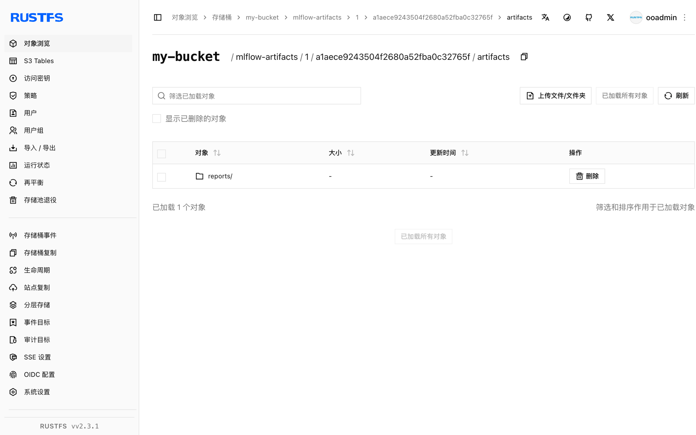

本指南将实验跟踪与模型注册平台 [MLflow](https://github.com/mlflow/mlflow) 连接到 **RustFS**，作为其 S3 制品存储。你将使用 Docker Compose 启动 MLflow 跟踪服务器，记录一次训练运行的参数、指标和制品，然后验证制品已存储在 RustFS 中。整个流程使用 `ghcr.io/mlflow/mlflow:v2.22.1` 和 `rustfs/rustfs-x86-musl:v2.3.1` 验证通过。

你需要安装带有 Compose 插件的 Docker。本部署用于本地集成测试，不适用于生产环境。

## 架构

```mermaid
flowchart LR
	Client["Training script"] -->|"runs + metrics"| Server["MLflow server :5000"]
	Client -->|"artifacts"| RustFS["RustFS :9000"]
	Server -->|"metadata"| DB["SQLite"]
```

跟踪服务器将实验和运行元数据保存在 SQLite 中，而制品——模型文件、图表、报告——通过 `s3://` 制品根路径直接存入 RustFS。客户端也需要同样的 RustFS 凭证，因为制品由客户端自己上传，借助 boto3 和 `MLFLOW_S3_ENDPOINT_URL` 设置完成。

## 1. 创建项目文件

创建工作目录：

```bash
mkdir rustfs-mlflow
cd rustfs-mlflow
```

创建环境文件，并替换两个凭证占位符：

```ini title=".env"
RUSTFS_ACCESS_KEY=<your-access-key>
RUSTFS_SECRET_KEY=<your-secret-key>
MLFLOW_BUCKET=my-bucket
```

请为制品存储桶使用专用凭证。不要将 `.env` 提交到版本控制。

创建 Compose 文件：

```yaml title="compose.yaml"
services:
  rustfs:
    image: rustfs/rustfs-x86-musl:v2.3.1
    environment:
      RUSTFS_ACCESS_KEY: ${RUSTFS_ACCESS_KEY}
      RUSTFS_SECRET_KEY: ${RUSTFS_SECRET_KEY}
      RUSTFS_VOLUMES: /data
      RUSTFS_ADDRESS: ":9000"
      RUSTFS_CONSOLE_ADDRESS: ":9001"
      RUSTFS_CONSOLE_ENABLE: "true"
    volumes:
      - rustfs-data:/data
    ports:
      - "9000:9000"
      - "9001:9001"
    healthcheck:
      test: ["CMD", "curl", "-sf", "http://127.0.0.1:9000/health"]
      interval: 10s
      timeout: 5s
      retries: 6
      start_period: 10s
    networks:
      - mlflow

  create-bucket:
    image: rustfs/rc:latest
    depends_on:
      rustfs:
        condition: service_healthy
    environment:
      RUSTFS_ACCESS_KEY: ${RUSTFS_ACCESS_KEY}
      RUSTFS_SECRET_KEY: ${RUSTFS_SECRET_KEY}
      MLFLOW_BUCKET: ${MLFLOW_BUCKET}
    entrypoint:
      - /bin/sh
      - -c
      - |
        /usr/bin/rc alias set rustfs http://rustfs:9000 "$${RUSTFS_ACCESS_KEY}" "$${RUSTFS_SECRET_KEY}"
        /usr/bin/rc mb --ignore-existing rustfs/$${MLFLOW_BUCKET}
    networks:
      - mlflow

  mlflow:
    image: ghcr.io/mlflow/mlflow:v2.22.1
    command:
      - server
      - --backend-store-uri
      - sqlite:////mlflow/mlflow.db
      - --default-artifact-root
      - s3://${MLFLOW_BUCKET}/mlflow-artifacts
      - --host
      - 0.0.0.0
      - --port
      - "5000"
    environment:
      AWS_ACCESS_KEY_ID: ${RUSTFS_ACCESS_KEY}
      AWS_SECRET_ACCESS_KEY: ${RUSTFS_SECRET_KEY}
      MLFLOW_S3_ENDPOINT_URL: http://rustfs:9000
      AWS_DEFAULT_REGION: us-east-1
    depends_on:
      create-bucket:
        condition: service_completed_successfully
    ports:
      - "5000:5000"
    volumes:
      - mlflow-db:/mlflow
    networks:
      - mlflow

networks:
  mlflow:

volumes:
  rustfs-data:
  mlflow-db:
```

`create-bucket` 服务必须先于服务器运行，因为 MLflow 不会创建存储桶。`MLFLOW_S3_ENDPOINT_URL` 将服务器的 boto3 客户端指向 RustFS，并以 path-style 方式寻址。SQLite 数据库保存在卷中，实验元数据因此可以在重启后保留；生产部署应改用受管数据库后端。

## 2. 校验并启动部署

启动容器前先解析 Compose 文件：

```bash
docker compose config
```

启动服务并等待跟踪服务器就绪：

```bash
docker compose up -d
docker compose ps
```

`create-bucket` 服务应以退出码 `0` 结束，MLflow UI 应在 `http://localhost:5000` 上响应：

```bash
curl -sf http://localhost:5000/ >/dev/null && echo ready
```

打开 `http://localhost:9001` 的 RustFS 控制台，在下一步中观察制品落入 `my-bucket`。

## 3. 记录一次训练运行

创建客户端脚本——它在 MLflow 镜像内运行，镜像自带全部依赖：

```bash title="train_demo.py" {12}
import mlflow

mlflow.set_tracking_uri("http://localhost:5000")
mlflow.set_experiment("rustfs-demo")

with mlflow.start_run(run_name="rustfs-verify") as run:
    mlflow.log_params({"model": "demo-regressor", "alpha": 0.5})
    for step in range(3):
        mlflow.log_metric("rmse", 0.9 - step * 0.2, step=step)
    with open("model-summary.txt", "w") as f:
        f.write("demo model trained against RustFS artifact store\n")
    mlflow.log_artifact("model-summary.txt", artifact_path="reports")
    print("run_id:", run.info.run_id)
    print("artifact_uri:", run.info.artifact_uri)
```

把脚本复制到运行中的容器里，并使用服务环境执行：

```bash
docker compose cp train_demo.py mlflow:/tmp/train_demo.py
docker compose exec -w /tmp mlflow python train_demo.py
```

`artifact_uri` 会输出为 `s3://my-bucket/mlflow-artifacts/<experiment-id>/<run-id>/artifacts`——制品由客户端直接上传到 RustFS。

## 4. 在 RustFS 中验证制品

通过跟踪服务器读回制品，然后列出 RustFS 中的同一对象。将以下内容保存为 `verify.py`，把 `<your-run-id>` 替换为第 3 步输出的标识符，并以相同方式运行：

```bash title="verify.py" {5}
import mlflow

mlflow.set_tracking_uri("http://localhost:5000")
client = mlflow.MlflowClient()
print([a.path for a in client.list_artifacts("<your-run-id>", "reports")])
path = client.download_artifacts("<your-run-id>", "reports/model-summary.txt")
print(open(path).read())
```

下载操作会通过跟踪服务器从 RustFS 读取对象。然后确认存储桶中的对象：

```bash
docker compose exec rustfs /usr/bin/rc ls local/my-bucket/mlflow-artifacts/ -r
```

输出应包含该制品对象：

```text
mlflow-artifacts/1/a1aece9243504f2680a52fba0c32765f/artifacts/reports/model-summary.txt
```



运行、参数和指标在服务器重启后依然保留，因为它们存储在 SQLite 中，而制品保存在 RustFS 里：

```bash
docker compose restart mlflow
docker compose exec -w /tmp mlflow python verify.py
```

重启后的服务器上 `list_artifacts` 调用依然成功，读取的是 RustFS 中相同的对象。

## 5. 停止或重置部署

停止容器并保留所有数据：

```bash
docker compose down
```

RustFS 卷会保留制品对象，MLflow 卷会保留元数据数据库。若要删除包括 RustFS 中制品在内的所有数据，请追加 `--volumes`。

## 故障排查

### 记录制品时出现 `ModuleNotFoundError: No module named 'boto3'`

执行 `log_artifact` 的客户端需要 boto3，因为制品是直接上传到 S3 的。在运行训练脚本的环境中安装它，或按第 3 步所示在 MLflow 镜像内运行脚本。

### 制品上传时出现 `AccessDenied` 或连接错误

确认客户端环境中设置了 `MLFLOW_S3_ENDPOINT_URL`——缺少它时，boto3 会把请求发到真实的 AWS S3。端点必须从运行训练脚本的机器可达；在 Compose 网络外使用 `http://localhost:9000`，网络内使用 `http://rustfs:9000`。

### 服务器启动失败并报存储桶错误

制品存储桶必须在服务器启动前存在。检查 `create-bucket` 服务的日志：

```bash
docker compose logs create-bucket
```

## 后续步骤

- 在采用更多 MLflow 操作之前，请查阅 [S3 兼容性说明](/administration/protocols/s3)。
- 通过[访问密钥管理](/security-compliance/iam/access-token)创建专用的生产凭证。
- 按照 [MLflow 文档](https://mlflow.org/docs/latest/)添加模型注册表，或将元数据存储迁移到受管数据库。
