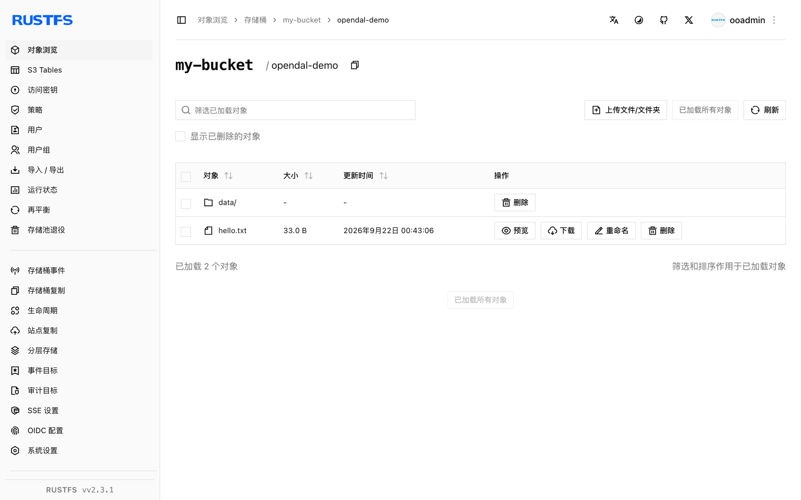

本指南通过 `s3` 服务，将统一数据访问层 [Apache OpenDAL](https://github.com/apache/opendal) 连接到 **RustFS**。你将针对 RustFS 运行 OpenDAL 的 Python 绑定，写入并读回一个对象，列出前缀，再删除它。整个流程使用 `opendal` Python 包 0.46（运行于 `python:3.12-slim`）和 `rustfs/rustfs-x86-musl:v2.3.1` 验证通过。

你需要安装 Docker 和 Python 3.9 或更高版本。OpenDAL 的 Rust、Java、Node.js 和 Go 绑定提供等效设置的相同 `s3` 服务。

## 架构


绑定到 `s3` 服务的 OpenDAL `Operator` 在存储桶之上提供统一 API——`write`、`read`、`stat`、`list`、`delete`——换一套连接设置即可在 S3、RustFS 或任何受支持的服务之间切换。

## 1. 准备项目

安装 Python 绑定：

```bash
pip install opendal
```

创建脚本，并替换全部连接占位符：

```python title="opendal_demo.py"
import opendal

op = opendal.Operator(
    "s3",
    endpoint="http://<your-rustfs-endpoint>:9000",
    bucket="my-bucket",
    access_key_id="<your-access-key>",
    secret_access_key="<your-secret-key>",
    region="us-east-1",
)
op.write("opendal-demo/hello.txt", b"hello from opendal against rustfs")
print("read-back:", op.read("opendal-demo/hello.txt"))
print("content_length:", op.stat("opendal-demo/hello.txt").content_length)
for entry in op.list("opendal-demo/"):
    print("listed:", entry.path)
op.delete("opendal-demo/hello.txt")
print("deleted:", not op.exists("opendal-demo/hello.txt"))
```

凭证参数名是 `access_key_id` 和 `secret_access_key`——较短的 `access_key` 写法不存在，会导致签名错误。对非 AWS 端点默认使用 path-style 寻址。

## 2. 运行演示

在能访问 RustFS 的机器上运行脚本：

```bash
python opendal_demo.py
```

```text
read-back: b"hello from opendal against rustfs"
content_length: 33
listed: opendal-demo/hello.txt
deleted: True
```

这次往返覆盖了完整的对象生命周期：`write` 上传字节，`read` 读回，`stat` 返回对象大小，`list` 枚举前缀，`delete` 删除对象。

## 3. 在 RustFS 中验证对象

注释掉最后的 `op.delete` 行，再次运行脚本，然后列出 RustFS 中的前缀：

```bash
rc ls rustfs/my-bucket/opendal-demo/ -r
```

```text
hello.txt
data/rows.csv
```



RustFS 控制台中可见的对象正是 OpenDAL API 写入的路径。

## 4. 停止或重置

OpenDAL 是一个类库，自身不保存状态。清理演示对象：

```bash
rc rm rustfs/my-bucket/opendal-demo/ --recursive --force
```

## 故障排查

### `failed to load signing credential`

Operator 没有获得可用凭证。使用确切的参数名 `access_key_id` 和 `secret_access_key`；其他拼写会被静默忽略，导致签名失败。

### 写入时出现连接或 DNS 错误

确认端点包含协议和端口，且应用可以访问它。Compose 网络内主机名为 `rustfs`；宿主机上使用 `http://localhost:9000`。

## 后续步骤

- 在采用更多 OpenDAL 操作之前，请查阅 [S3 兼容性说明](/administration/protocols/s3)。
- 通过[访问密钥管理](/security-compliance/iam/access-token)创建专用的生产凭证。
- 按照 [OpenDAL 文档](https://opendal.apache.org/docs/)在 Rust、Java 或 Node.js 中使用相同的 Operator。
