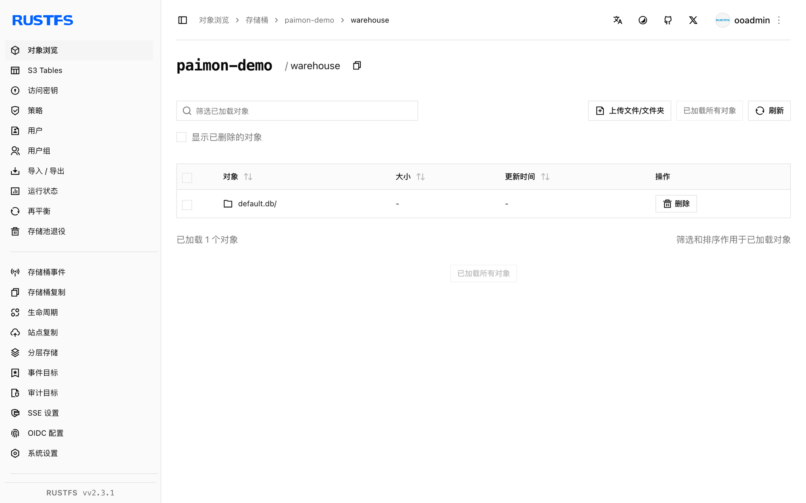

本指南将流式湖仓表格式 [Apache Paimon](https://github.com/apache/paimon) 连接到 **RustFS** 作为其 catalog 仓库存储。你将以 Spark 在 RustFS 桶上创建 Paimon catalog、写入主键表并读回。整个流程使用 Paimon 1.2.0 + Spark 3.5.6 对 `rustfs/rustfs-x86-musl:v2.3.1` 验证通过。

你需要 Docker 和 `rc` 客户端。

## 架构


Paimon 把每张表存放在 catalog warehouse 的 `*.db` 目录下，内含 `schema/`、`snapshot/` 与数据文件。所有 I/O 走 Paimon 自己的 S3 FileIO（`paimon-s3`），不经过 Hadoop S3A。

## 1. 运行 Spark

```bash
docker run -d --name spark-paimon --hostname spark --network oo-rustfs_default \
  spark:3.5.6-scala2.12-java17-python3-ubuntu sleep infinity
docker cp paimon_test.sql spark-paimon:/tmp/paimon_test.sql
```

创建 SQL 文件（catalog 选项在下方 CLI 传入，不写在文件里）：

```sql title="paimon_test.sql"
CREATE TABLE paimon.default.events (id INT, label STRING) TBLPROPERTIES ("primary-key"="id");
INSERT INTO paimon.default.events VALUES (1,'alpha'),(2,'beta'),(3,'gamma');
SELECT * FROM paimon.default.events ORDER BY id;
```

## 2. 执行 SQL 脚本

三样东西缺一不可：Spark extensions、Paimon 自己的 S3 FileIO（`paimon-s3`——Paimon 的读取不使用 Hadoop S3A jar）、以及 catalog 级 `s3.*` 选项：

```bash
docker exec -u root spark-paimon bash -c "cd /opt/spark && \
  ./bin/spark-sql \
  --packages org.apache.paimon:paimon-spark-3.5:1.2.0,org.apache.paimon:paimon-s3:1.2.0,org.apache.hadoop:hadoop-aws:3.3.4 \
  --conf spark.sql.extensions=org.apache.paimon.spark.extensions.PaimonSparkSessionExtensions \
  --conf spark.sql.catalog.paimon=org.apache.paimon.spark.SparkCatalog \
  --conf spark.sql.catalog.paimon.warehouse=s3://paimon-demo/warehouse \
  --conf spark.sql.catalog.paimon.s3.endpoint=http://rustfs:9000 \
  --conf spark.sql.catalog.paimon.s3.access-key=<your-access-key> \
  --conf spark.sql.catalog.paimon.s3.secret-key=<your-secret-key> \
  --conf spark.sql.catalog.paimon.s3.path-style-access=true \
  -f /tmp/paimon_test.sql"
```

```text
Time taken: 9.447 seconds
1	alpha
2	beta
3	gamma
Time taken: 1.257 seconds, Fetched 3 row(s)
```

缺 extensions 行时 Paimon 会以 `requiredSparkConfsCheck` 快速失败；缺 `paimon-s3` 时 catalog 报 `UnsupportedSchemeException: Could not find a file io implementation for scheme 's3'`。

## 3. 验证 RustFS 中的对象

```bash
rc ls rustfs/paimon-demo/warehouse/ -r | head -6
```

```text
warehouse/default.db/events/schema/schema-0
warehouse/default.db/events/snapshot/snapshot-1
warehouse/default.db/events/bucket-0/data-...
warehouse/default.db/events/manifest/...
```

桶内承载完整的湖仓布局：schema、快照、manifest 与按桶分组的数据文件。



## 4. 停止或重置

```bash
docker rm -f spark-paimon
rc rm rustfs/paimon-demo/ --recursive --force
```

## 故障排查

### `UnsupportedSchemeException: Could not find a file io implementation for scheme 's3'`

Paimon 自己的 FileIO 需要其 S3 插件在类路径上。把 `org.apache.paimon:paimon-s3:1.2.0` 与 Spark 连接器一起加进 `--packages`。

### `When using Paimon, it is necessary to configure spark.sql.extensions...`

加 `--conf spark.sql.extensions=org.apache.paimon.spark.extensions.PaimonSparkSessionExtensions`——Paimon 缺它会快速失败。

### `SCHEMA_NOT_FOUND: The schema paimon cannot be found`

catalog 未注册。注册为 `spark.sql.catalog.paimon`，并用 `paimon.` 前缀限定表名。

### 执行侧写入报 S3 错误

Paimon 的 FileIO 读取的是 catalog 级 `s3.*` 选项（`s3.endpoint`、`s3.access-key`、`s3.secret-key`、`s3.path-style-access`）——执行侧文件操作不使用 Hadoop `fs.s3a.*` 设置。

## 下一步

- 在同一桶上使用其他湖仓格式时，参考 [Iceberg](/developer/integration/big-data/iceberg)、[Hudi](/developer/integration/big-data/hudi) 与 [Delta Lake](/developer/integration/big-data/delta-lake) 指南。
- 使用[访问密钥管理](/security-compliance/iam/access-token)创建专用的生产凭证。
- 按照 [Paimon 文档](https://paimon.apache.org/docs/master/)在同一桶上使用压实、changelog 生产者与 Flink 流式写入。
