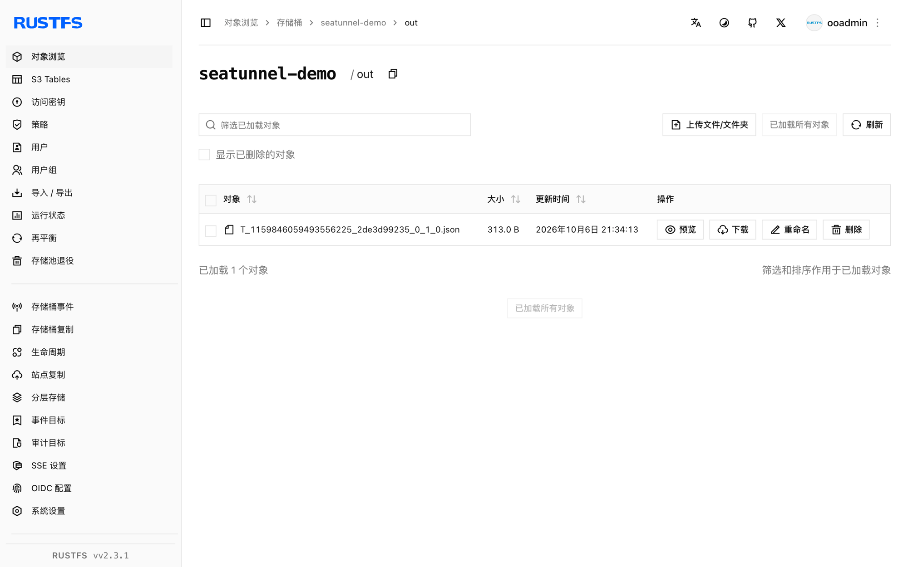

本指南将数据集成引擎 [Apache SeaTunnel](https://github.com/apache/seatunnel) 通过 S3File 连接器连接到 **RustFS**。你将运行一个批处理作业，用 FakeSource 生成数据行并以 JSON 文件写入 RustFS 桶。整个流程使用 SeaTunnel 2.3.12 对 `rustfs/rustfs-x86-musl:v2.3.1` 验证通过。

你需要 Docker 和 `rc` 客户端。

## 架构


S3File sink 经 Hadoop S3A 文件系统写入，因此连接器同时接受它自己的凭证选项和标准的 `fs.s3a.*` Hadoop 键。

## 1. 运行引擎

连接器与 Hadoop AWS jar 都内置在镜像里：

```bash
docker run --rm apache/seatunnel:2.3.12 \
  sh -c "ls /opt/seatunnel/connectors/ | grep s3; ls /opt/seatunnel/lib/ | grep hadoop-aws"
```

```text
connector-file-s3-2.3.12.jar
seatunnel-hadoop-aws.jar
```

## 2. 编写作业配置

注意两处：sink 在编译期校验 `access_key`/`secret_key`，而实际的 S3A 客户端读取 `fs.s3a.*` 键——两组都要提供；另外 endpoint 不带 scheme，镜像内的 Hadoop 版本会拒绝 `http://` 形式的端点：

```text title="seatunnel-rustfs.conf"
env {
  parallelism = 1
  job.mode = "BATCH"
}

source {
  FakeSource {
    plugin_output = "fake"
    row.num = 5
    schema = {
      fields {
        id = "int"
        name = "string"
        value = "double"
      }
    }
  }
}

sink {
  S3File {
    bucket = "s3a://seatunnel-demo"
    access_key = "<your-access-key>"
    secret_key = "<your-secret-key>"
    fs.s3a.endpoint = "<your-rustfs-endpoint>:9000"
    fs.s3a.access.key = "<your-access-key>"
    fs.s3a.secret.key = "<your-secret-key>"
    fs.s3a.aws.credentials.provider = "org.apache.hadoop.fs.s3a.SimpleAWSCredentialsProvider"
    fs.s3a.connection.ssl.enabled = "false"
    file_format_type = "json"
    path = "/out"
  }
}
```

## 3. 运行作业

```bash
docker run --rm --network oo-rustfs_default \
  -v "$PWD/seatunnel-rustfs.conf":/task.conf:ro \
  apache/seatunnel:2.3.12 \
  sh -c "cd /opt/seatunnel && ./bin/seatunnel.sh --config /task.conf -e local"
```

```text
2026-10-07 ... INFO  ... Submit job finished, job id: 1159846059493556225
```

## 4. 验证 RustFS 中的对象

```bash
rc ls rustfs/seatunnel-demo/out/
rc cat rustfs/seatunnel-demo/out/T_1159846059493556225_2de3d99235_0_1_0.json | head -1
```

```text
out/T_1159846059493556225_2de3d99235_0_1_0.json
{"id":168282592,"name":"ELyqD","value":1.594479327987022E308}
```

FakeSource 生成的 5 行数据作为单个 JSON 文件落入桶内。



## 5. 停止或重置

`-e local` 模式下 SeaTunnel 无状态。删除输出：

```bash
rc rm rustfs/seatunnel-demo/ --recursive --force
```

## 故障排查

### `Plugin PluginIdentifier{... pluginName='S3'} not found`

sink 类注册名为 `S3File`，不是 `S3`。

### `There are unconfigured options, the options('access_key', 'secret_key') are required`

即使提供了 `fs.s3a.*` 键，S3File sink 也要求自己的 `access_key`/`secret_key` 选项。按第 2 步同时提供两组。

### `No AWS Credentials provided by InstanceProfileCredentialsProvider`

协调端的 S3A 客户端回退到了实例配置文件提供器，因为缺少 `fs.s3a.aws.credentials.provider` 和 `fs.s3a.access.key`/`fs.s3a.secret.key`。按第 2 步把三项都补上。

### 作业卡在 `doesBucketExist`

镜像内置的 Hadoop 版本拒绝带 `http://` scheme 的端点。`fs.s3a.endpoint` 使用裸 `host:port` 形式，并加 `fs.s3a.connection.ssl.enabled = "false"`。

## 下一步

- 在启用更多 SeaTunnel 连接器前，先阅读 [S3 兼容性说明](/administration/protocols/s3)。
- 使用[访问密钥管理](/security-compliance/iam/access-token)创建专用的生产凭证。
- 按照 [SeaTunnel S3File 文档](https://seatunnel.apache.org/docs/connector-v2/sink/S3File)了解 parquet/orc 格式、分区写入与配套的 S3File source。
