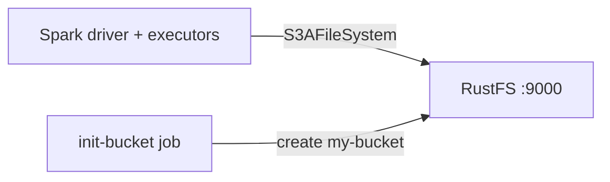
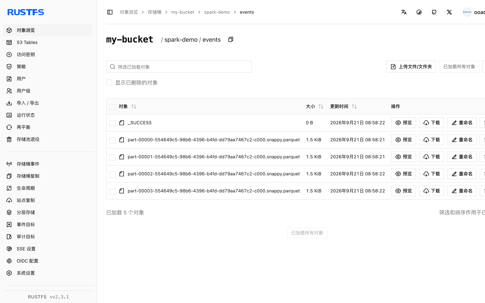

本指南将 [Apache Spark](https://github.com/apache/spark) 通过 `s3a` 连接器连接到 **RustFS**。你将使用 Docker Compose 启动 RustFS，运行一个把 Parquet 数据集写入桶中再读回的 Spark 作业，并在 RustFS 中验证这些对象。整个流程使用 `apache/spark:3.5.6`（配套 `hadoop-aws` 3.3.4）和 `rustfs/rustfs-x86-musl:v2.3.1` 验证通过。

你需要安装带有 Compose 插件的 Docker。本部署用于本地集成测试，不适用于生产环境。

## 架构



Spark 通过 `hadoop-aws` 的 S3A 文件系统访问 RustFS。端点、path-style 寻址、纯 HTTP 和凭证等连接器设置以 `spark.hadoop.fs.s3a.*` 属性的形式传入。

## 1. 创建项目文件

创建工作目录：

```bash
mkdir rustfs-spark
cd rustfs-spark
```

创建环境变量文件，并替换两个凭证占位符：

```ini title=".env"
RUSTFS_ACCESS_KEY=<your-access-key>
RUSTFS_SECRET_KEY=<your-secret-key>
```

请为桶使用专用的凭证，不要将 `.env` 提交到版本控制。

创建 Spark 作业：

```python title="job.py"
from pyspark.sql import SparkSession

spark = SparkSession.builder.appName("rustfs-spark-demo").getOrCreate()
spark.sparkContext.setLogLevel("WARN")

spark.range(1000).withColumnRenamed("id", "num") \
    .write.mode("overwrite").parquet("s3a://my-bucket/spark-demo/events")

back = spark.read.parquet("s3a://my-bucket/spark-demo/events")
print("ROWS_READ_BACK:", back.count())
spark.stop()
```

创建 Compose 文件：

```yaml title="compose.yaml"
services:
  rustfs:
    image: rustfs/rustfs-x86-musl:v2.3.1
    environment:
      RUSTFS_ACCESS_KEY: ${RUSTFS_ACCESS_KEY}
      RUSTFS_SECRET_KEY: ${RUSTFS_SECRET_KEY}
      RUSTFS_VOLUMES: /data
      RUSTFS_ADDRESS: ":9000"
      RUSTFS_CONSOLE_ADDRESS: ":9001"
      RUSTFS_CONSOLE_ENABLE: "true"
    volumes:
      - rustfs-data:/data
    ports:
      - "9000:9000"
      - "9001:9001"
    healthcheck:
      test: ["CMD", "curl", "-sf", "http://127.0.0.1:9000/health"]
      interval: 10s
      timeout: 5s
      retries: 6
      start_period: 10s
    networks:
      - warehouse

  create-bucket:
    image: rustfs/rc:latest
    depends_on:
      rustfs:
        condition: service_healthy
    environment:
      RUSTFS_ACCESS_KEY: ${RUSTFS_ACCESS_KEY}
      RUSTFS_SECRET_KEY: ${RUSTFS_SECRET_KEY}
    entrypoint:
      - /bin/sh
      - -c
      - |
        until /usr/bin/rc alias set rustfs http://rustfs:9000 "$${RUSTFS_ACCESS_KEY}" "$${RUSTFS_SECRET_KEY}"; do
          echo "Waiting for RustFS..."
          sleep 2
        done
        /usr/bin/rc ls rustfs/my-bucket >/dev/null 2>&1 || /usr/bin/rc mb rustfs/my-bucket
    networks:
      - warehouse

  spark:
    image: apache/spark:3.5.6
    entrypoint: ["/opt/spark/bin/spark-submit"]
    volumes:
      - ./job.py:/job.py:ro
    command:
      - --conf
      - spark.jars.ivy=/tmp/.ivy2
      - --packages
      - org.apache.hadoop:hadoop-aws:3.3.4
      - --conf
      - spark.hadoop.fs.s3a.endpoint=http://rustfs:9000
      - --conf
      - spark.hadoop.fs.s3a.access.key=${RUSTFS_ACCESS_KEY}
      - --conf
      - spark.hadoop.fs.s3a.secret.key=${RUSTFS_SECRET_KEY}
      - --conf
      - spark.hadoop.fs.s3a.path.style.access=true
      - --conf
      - spark.hadoop.fs.s3a.connection.ssl.enabled=false
      - --conf
      - spark.hadoop.fs.s3a.impl=org.apache.hadoop.fs.s3a.S3AFileSystem
      - /job.py
    depends_on:
      create-bucket:
        condition: service_completed_successfully
    networks:
      - warehouse

networks:
  warehouse:

volumes:
  rustfs-data:
```

`--packages org.apache.hadoop:hadoop-aws:3.3.4` 会在启动时下载 S3 连接器，其版本必须与 Spark 镜像内置的 Hadoop 版本匹配。`spark.jars.ivy=/tmp/.ivy2` 把下载缓存移到可写目录。

## 2. 启动存储并运行作业

启动存储服务：

```bash
docker compose up -d
docker compose ps -a
```

运行 Spark 作业：

```bash
docker compose run --rm spark
```

```text
ROWS_READ_BACK: 1000
```

## 3. 在 RustFS 中验证对象

通过桶初始化镜像列出数据集：

```bash
docker compose run --rm --entrypoint /bin/sh create-bucket -c \
  '/usr/bin/rc alias set rustfs http://rustfs:9000 "$RUSTFS_ACCESS_KEY" "$RUSTFS_SECRET_KEY" >/dev/null && /usr/bin/rc ls rustfs/my-bucket/spark-demo --recursive'
```

```text
[2026-09-21 00:58:22]        0 B spark-demo/events/_SUCCESS
[2026-09-21 00:58:21]   1.46 KiB spark-demo/events/part-00000-...-c000.snappy.parquet
[2026-09-21 00:58:21]   1.46 KiB spark-demo/events/part-00001-...-c000.snappy.parquet
[2026-09-21 00:58:21]   1.46 KiB spark-demo/events/part-00002-...-c000.snappy.parquet
```

你也可以在 RustFS 控制台中浏览该前缀：



## 4. 使用 RustFS S3 Tables

RustFS S3 Tables 提供内置的 Apache Iceberg REST 目录，Spark 可以把表桶当作托管的 Iceberg 仓库来使用，而数据仍保存在 RustFS 中。按 [S3 Tables](/administration/data/s3-tables) 的说明启用表桶并连接 Spark 的 Iceberg REST 目录：REST 目录 URI 为 `http://<rustfs-host>:9000/iceberg`，warehouse 即桶名，目录请求（AWS Signature Version 4，签名名 `s3`）与 S3 文件访问均使用 path-style 寻址。

根据 S3 Tables 支持矩阵，请在生产采用该路径前，用你实际部署的 Spark 和 Iceberg 版本完成验证。

## 5. 停止或重置环境

停止容器并保留 RustFS 数据卷：

```bash
docker compose down
```

如需删除数据集并从空的 RustFS 数据卷开始，请显式加上 `--volumes`：

```bash
docker compose down --volumes
```

## 故障排除

### NumberFormatException: For input string: "60s"

`hadoop-aws` 版本与 Spark 镜像内置的 Hadoop 版本不匹配。Spark 4.x 镜像需要 `hadoop-aws` 3.4.x；本指南锁定 `apache/spark:3.5.6` 搭配 `hadoop-aws:3.3.4`。

### 连接 `rustfs:9000` 失败

`fs.s3a.endpoint` 是在 Compose 网络内解析的。如果 Spark 进程运行在宿主机上，请改用 (`http://localhost:9000`)。

### 返回 AccessDenied 或 403 响应

确认连接器设置与 RustFS 凭证一致，并确认 `create-bucket` 任务已成功完成：

```bash
docker compose logs create-bucket
```

## 后续步骤

- 在采用其他 S3 操作前，请查看 [S3 兼容性说明](/administration/protocols/s3)。
- 通过[访问密钥管理](/security-compliance/iam/access-token)创建专用的生产凭证。
- 阅读 [Spark 文档](https://spark.apache.org/docs/latest/)了解结构化流与数据源选项。
