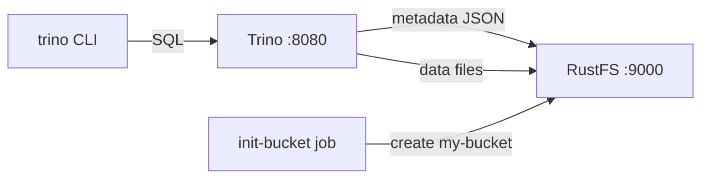
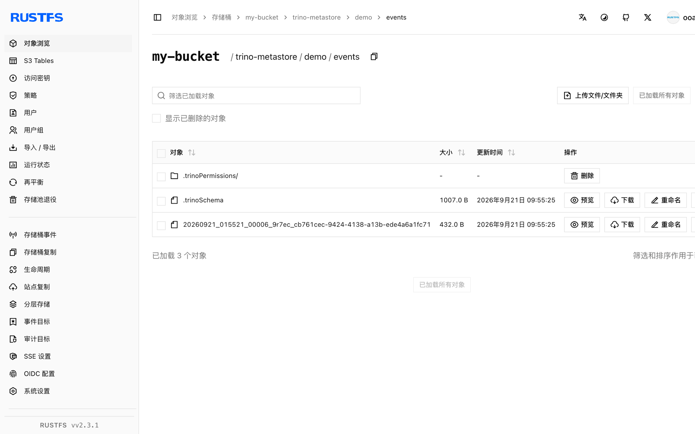

本指南将 [Trino](https://github.com/trinodb/trino)——分布式 SQL 查询引擎——通过 hive 连接器的文件元存储和原生 S3 文件系统连接到 **RustFS**。你将创建 schema 和表、插入数据、查询回来，并在 RustFS 中验证这些对象。表的元数据和数据文件都保存在 RustFS 中。整个流程使用 `trinodb/trino:435` 和 `rustfs/rustfs-x86-musl:v2.3.1` 验证通过。

你需要安装带有 Compose 插件的 Docker。本部署用于本地集成测试，不适用于生产环境。

## 架构



hive 连接器配合 `hive.metastore=file` 把 schema 和表元数据以 JSON 对象的形式保存在目录目录之下，原生 S3 文件系统（`fs.s3.enabled`）以纯 HTTP 上的 path-style 寻址把元数据和数据文件都存进 RustFS。

## 1. 创建项目文件

创建工作目录：

```bash
mkdir rustfs-trino
cd rustfs-trino
```

创建环境变量文件，并替换两个凭证占位符：

```ini title=".env"
RUSTFS_ACCESS_KEY=<your-access-key>
RUSTFS_SECRET_KEY=<your-secret-key>
```

请为桶使用专用的凭证，不要将 `.env` 提交到版本控制。

创建 Trino 的 catalog 配置：

```ini title="hive.properties"
connector.name=hive
hive.metastore=file
hive.metastore.catalog.dir=s3://my-bucket/trino-metastore
fs.s3.enabled=true
s3.endpoint=http://rustfs:9000
s3.region=us-east-1
s3.path-style-access=true
s3.aws-access-key=<your-access-key>
s3.aws-secret-key=<your-secret-key>
```

`hive.metastore.catalog.dir` 把文件元存储指进桶内，元数据和数据都保存在 RustFS 中。`fs.s3.enabled` 启用原生 S3 文件系统；容器网络端点需要 `s3.path-style-access`。

创建 Compose 文件：

```yaml title="compose.yaml"
services:
  rustfs:
    image: rustfs/rustfs-x86-musl:v2.3.1
    environment:
      RUSTFS_ACCESS_KEY: ${RUSTFS_ACCESS_KEY}
      RUSTFS_SECRET_KEY: ${RUSTFS_SECRET_KEY}
      RUSTFS_VOLUMES: /data
      RUSTFS_ADDRESS: ":9000"
      RUSTFS_CONSOLE_ADDRESS: ":9001"
      RUSTFS_CONSOLE_ENABLE: "true"
    volumes:
      - rustfs-data:/data
    ports:
      - "9000:9000"
      - "9001:9001"
    healthcheck:
      test: ["CMD", "curl", "-sf", "http://127.0.0.1:9000/health"]
      interval: 10s
      timeout: 5s
      retries: 6
      start_period: 10s
    networks:
      - warehouse

  create-bucket:
    image: rustfs/rc:latest
    depends_on:
      rustfs:
        condition: service_healthy
    environment:
      RUSTFS_ACCESS_KEY: ${RUSTFS_ACCESS_KEY}
      RUSTFS_SECRET_KEY: ${RUSTFS_SECRET_KEY}
    entrypoint:
      - /bin/sh
      - -c
      - |
        until /usr/bin/rc alias set rustfs http://rustfs:9000 "$${RUSTFS_ACCESS_KEY}" "$${RUSTFS_SECRET_KEY}"; do
          echo "Waiting for RustFS..."
          sleep 2
        done
        /usr/bin/rc ls rustfs/my-bucket >/dev/null 2>&1 || /usr/bin/rc mb rustfs/my-bucket
    networks:
      - warehouse

  trino:
    image: trinodb/trino:435
    volumes:
      - ./hive.properties:/etc/trino/catalog/hive.properties:ro
      - metastore-data:/data/metastore
    depends_on:
      create-bucket:
        condition: service_completed_successfully
    networks:
      - warehouse

networks:
  warehouse:

volumes:
  rustfs-data:
  metastore-data:
```

## 2. 启动部署

启动容器前先解析 Compose 文件：

```bash
docker compose config
```

启动服务并等待桶初始化任务完成：

```bash
docker compose up -d
docker compose ps -a
```

Trino 服务日志输出 `SERVER STARTED` 即表示已启动。容器以 `trino` 用户（uid 1000）运行，请确保元存储卷可写：

```bash
docker compose exec trino id
docker compose exec trino ls -la /data/metastore
```

## 3. 创建 schema 与表

创建 schema 时不要指定 location——Trino 会把它放到 RustFS 中的目录目录之下：

```bash
docker compose exec trino trino --execute \
  "CREATE SCHEMA hive.demo"
```

建表并插入五行数据：

```bash
docker compose exec trino trino --execute \
  "CREATE TABLE hive.demo.events (id bigint, label varchar) WITH (format = 'parquet')"

docker compose exec trino trino --execute \
  "INSERT INTO hive.demo.events VALUES (1,'alpha'),(2,'bravo'),(3,'charlie'),(4,'delta'),(5,'echo')"
```

```text
INSERT: 5 rows
```

## 4. 查询数据

把数据读回来：

```bash
docker compose exec trino trino --execute \
  "SELECT * FROM hive.demo.events ORDER BY id"
```

```text
"1","alpha"
"2","bravo"
"3","charlie"
"4","delta"
"5","echo"
```

## 5. 在 RustFS 中验证对象

通过桶初始化镜像列出元存储前缀：

```bash
docker compose run --rm --entrypoint /bin/sh create-bucket -c \
  '/usr/bin/rc alias set rustfs http://rustfs:9000 "$RUSTFS_ACCESS_KEY" "$RUSTFS_SECRET_KEY" >/dev/null && /usr/bin/rc ls rustfs/my-bucket/trino-metastore --recursive'
```

```text
[2026-09-21 01:55:16]      155 B trino-metastore/.demo.trinoSchema
[2026-09-21 01:55:19]      474 B trino-metastore/demo/events/.trinoPermissions/user_trino
[2026-09-21 01:55:25]     1007 B trino-metastore/demo/events/.trinoSchema
[2026-09-21 01:55:25]      432 B trino-metastore/demo/events/20260921_..._cb761cec-...parquet
```

你也可以在 RustFS 控制台中浏览该前缀：



## 6. 使用 RustFS S3 Tables

RustFS S3 Tables 提供内置的 Apache Iceberg REST 目录，Trino 可以把表桶当作托管的 Iceberg 仓库来使用，而数据仍保存在 RustFS 中。按 [S3 Tables](/administration/data/s3-tables) 的说明启用表桶，并把 Trino 的 Iceberg 连接器接到 REST 目录：REST 目录 URI 为 `http://<rustfs-host>:9000/iceberg`，warehouse 即桶名，目录请求（AWS Signature Version 4，签名名 `s3`）与 S3 文件访问均使用 path-style 寻址。

根据 S3 Tables 支持矩阵，Trino 目前只对目录做过只读探测；在生产采用该路径前，请自行验证写入兼容性与实际部署的 Trino 版本。

## 7. 停止或重置环境

停止容器并保留 RustFS 数据卷：

```bash
docker compose down
```

如需删除已存储的元数据和数据并从空的 RustFS 数据卷开始，请显式加上 `--volumes`：

```bash
docker compose down --volumes
```

## 故障排除

### `fs.native-s3.enabled` 或 `fs.s3.enabled` 的配置错误

原生 S3 文件系统的属性名在不同 Trino 版本间有变化：Trino 435 使用 `fs.native-s3.enabled`，更新的版本使用 `fs.s3.enabled`。本指南锁定 `trinodb/trino:435`，请使用 `fs.native-s3.enabled`。

### 建表时报 "Table directory must be ..."

文件元存储要求表位置位于 `hive.metastore.catalog.dir` 之下。创建 schema 时请不要指定 location，或把 schema location 指向同一桶前缀内的目录。

### Hive CSV 存储格式仅支持 VARCHAR

CSV 格式不支持非字符串列。如本指南所示，有类型的表请使用 `format = 'parquet'`。

### 返回 AccessDenied 或 403 响应

确认 `hive.properties` 中的凭证与 RustFS 凭证一致，并确认 `create-bucket` 任务已成功完成：

```bash
docker compose logs create-bucket
```

## 后续步骤

- 在采用其他 S3 操作前，请查看 [S3 兼容性说明](/administration/protocols/s3)。
- 通过[访问密钥管理](/security-compliance/iam/access-token)创建专用的生产凭证。
- 阅读 [Trino 文档](https://trino.io/docs/current/)连接 BI 工具并添加对象存储 catalog。
