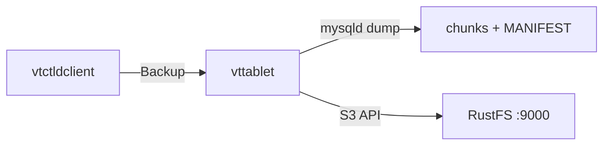
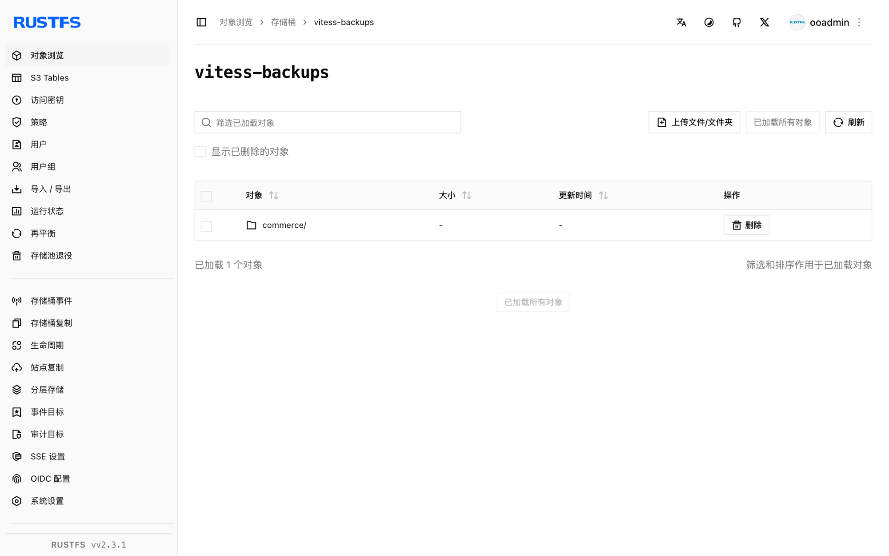

本指南将 MySQL 水平扩展数据库集群系统 [Vitess](https://github.com/vitessio/vitess) 通过其 S3 备份存储实现连接到 **RustFS**。你将在单机上架起一个最小 Vitess 拓扑，对 tablet 执行 `Backup`，确认桶内的备份分块与 `MANIFEST`，并从 RustFS 读回备份列表。整个流程使用 `vitess/lite`（Vitess v25.0.0-SNAPSHOT，2026-09-22 构建）、MySQL 8.4 对 `rustfs/rustfs-x86-musl:v2.3.1` 验证通过；Vitess 20+ 稳定版本使用相同的 flag。

你需要安装 Docker。本部署用于本地集成测试，不适用于生产环境。

## 架构



`vtctld` 负责触发备份，但实际执行由持有该 tablet 的 `vttablet` 完成：它对 MySQL 做快照，把数据压缩成编号分块，并通过 S3 兼容端点连同 `MANIFEST` 一起上传。

## 1. 运行 etcd 与 Vitess 镜像

Vitess 将拓扑存储在 etcd 中，`vitess/lite` 镜像自带全部 Vitess 二进制和 MySQL：

```bash
docker run -d --name etcd --hostname etcd --network oo-rustfs_default \
  quay.io/coreos/etcd:v3.5.17 etcd \
  --advertise-client-urls http://etcd:2379 \
  --listen-client-urls http://0.0.0.0:2379

docker run -d --name vtess --hostname vtess --network oo-rustfs_default \
  -e AWS_ACCESS_KEY_ID=<your-access-key> \
  -e AWS_SECRET_ACCESS_KEY=<your-secret-key> \
  vitess/lite:latest sleep infinity
```

AWS 环境变量为 `vtctld` 和 `vttablet` 中的 S3 备份存储提供凭证。

## 2. 初始化 MySQL

在 Vitess 标准的 tablet 目录中初始化 MySQL 实例，便于后续让 `vttablet` 加载其 `my.cnf`：

```bash
docker exec vtess sh -c \
  "/vt/bin/mysqlctl --log_dir /tmp/vtlogs init --tablet-dir vt_0000000100"
```

socket 文件出现即表示实例就绪：

```text
/vt/vtdataroot/vt_0000000100/mysql.sock
```

## 3. 启动 vtctld 与 vttablet

带 S3 备份 flag 启动 `vtctld`，注册 cell，再启动 tablet。替换全部连接占位符：

```bash
docker exec vtess sh -c "nohup /vt/bin/vtctld \
  --topo-implementation etcd2 \
  --topo-global-server-address etcd:2379 \
  --topo-global-root /vitess/global \
  --service-map grpc-vtctl,grpc-vtctld \
  --backup-storage-implementation s3 \
  --s3-backup-aws-endpoint http://<your-rustfs-endpoint>:9000 \
  --s3-backup-aws-region us-east-1 \
  --s3-backup-force-path-style \
  --s3-backup-storage-bucket vitess-backups \
  --s3-backup-storage-root commerce \
  --port 15999 --grpc-port 15998 \
  --log_dir /tmp/vtlogs > /tmp/vtlogs/vtctld.out 2>&1 &"

docker exec vtess sh -c \
  "/vt/bin/vtctldclient --server localhost:15998 \
  AddCellInfo --root /vitess/zone1 --server-address etcd:2379 zone1"

docker exec vtess sh -c "nohup /vt/bin/vttablet \
  --topo-implementation etcd2 \
  --topo-global-server-address etcd:2379 \
  --topo-global-root /vitess/global \
  --tablet-path zone1-0000000100 \
  --init-keyspace commerce --init-shard 0 --init-tablet-type replica \
  --port 15100 --grpc-port 15101 \
  --service-map grpc-queryservice,grpc-tabletmanager,grpc-throttler \
  --mycnf-file /vt/vtdataroot/vt_0000000100/my.cnf \
  --db-dba-user root --db-allprivs-user root --db-app-user root --db-repl-user root \
  --db-dba-use-ssl=false --db-allprivs-use-ssl=false \
  --db-app-use-ssl=false --db-repl-use-ssl=false \
  --backup-storage-implementation s3 \
  --s3-backup-aws-endpoint http://<your-rustfs-endpoint>:9000 \
  --s3-backup-aws-region us-east-1 \
  --s3-backup-force-path-style \
  --s3-backup-storage-bucket vitess-backups \
  --s3-backup-storage-root commerce \
  --log_dir /tmp/vtlogs > /tmp/vtlogs/vttablet.out 2>&1 &"
```

两个进程都要携带 S3 flag：`vttablet` 执行备份，`vtctld` 负责列举和删除备份。对非 AWS 端点必须加 `--s3-backup-force-path-style`。确认 tablet 已注册：

```bash
docker exec vtess /vt/bin/vtctldclient --server localhost:15998 GetTablets
```

```text
zone1-0000000100 commerce 0 replica vtess:15100 vtess:3306 [] <null>
```

## 4. 执行备份

创建存储桶并触发备份：

```bash
rc mb rustfs/vitess-backups

docker exec vtess /vt/bin/vtctldclient --server localhost:15998 \
  Backup zone1-0000000100
```

输出末尾会显示引擎写入清单：

```text
commerce/0 (zone1-0000000100): ... value:"Completed backing up MANIFEST (attempt 1/2)"
```

## 5. 验证 RustFS 中的对象

列出备份前缀：

```bash
rc ls rustfs/vitess-backups/ -r | head -4
```

tablet 上传了压缩数据分块与元数据文件：

```text
commerce/commerce/0/2026-09-23.011225.zone1-0000000100/0
commerce/commerce/0/2026-09-23.011225.zone1-0000000100/1
commerce/commerce/0/2026-09-23.011225.zone1-0000000100/MANIFEST
```



通过 `vtctld` 从 RustFS 读回备份列表：

```bash
docker exec vtess /vt/bin/vtctldclient --server localhost:15998 GetBackups commerce/0
```

```text
2026-09-23.011225.zone1-0000000100
```

## 6. 停止或重置

保留桶内对象、仅拆除演示环境：

```bash
docker rm -f vtess etcd
```

删除已存储的备份：

```bash
rc rm rustfs/vitess-backups/ --recursive --force
```

## 故障排查

### `cannot perform backup without my.cnf`

传入 `--db-socket` 或 `--db-host` 等连接参数会让 `vttablet` 跳过加载 `my.cnf`，备份随之拒绝执行。应使用 `--mycnf-file` 指向实例配置并让它从那里发现 socket——这正是第 2 步把 MySQL 实例放在 `vt_0000000100` 目录的原因。

### `unknown service vtctlservice.Vtctld`

只有当 service map 包含该服务时，`vtctld` 才会暴露 `vtctldclient` 使用的 API：`--service-map grpc-vtctl,grpc-vtctld`。同时确保 `vtctldclient --server` 指向 gRPC 端口（此处为 `15998`），而不是 Web UI 端口。

### `node doesn't exist: /vitess/global/cells/zone1/CellInfo`

cell 必须先存在，tablet 才能注册。按第 3 步在启动 `vttablet` 之前执行 `vtctldclient AddCellInfo`。

### `unknown shorthand flag` 之类的 flag 解析错误

Vitess 20+ 会把下划线规范化为连字符，flag 请写成连字符风格（`--tablet-path`）。单连字符的长 flag（如 `-tablet_dir`）会被当作短选项解析并报错。

## 下一步

- 在启用更多 Vitess 存储选项前，先阅读 [S3 兼容性说明](/administration/protocols/s3)。
- 使用[访问密钥管理](/security-compliance/iam/access-token)创建专用的生产凭证。
- 按照 [Vitess 备份与恢复文档](https://vitess.io/docs/user-guides/configuration-basic/#backups)安排备份计划，并从存储桶恢复 tablet。
