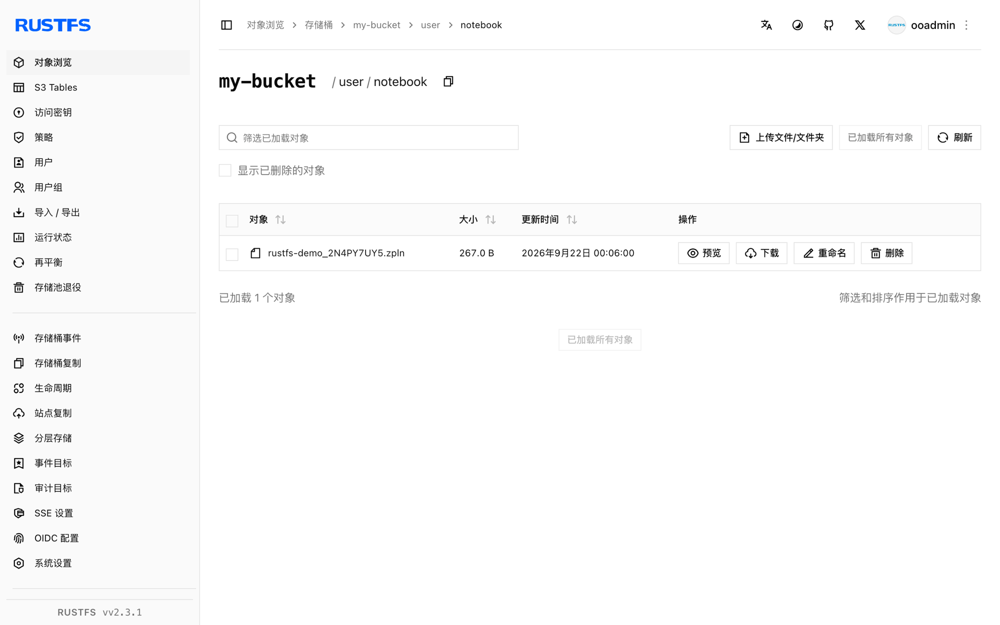

本指南通过 Zeppelin 的 S3 笔记本存储，将数据分析笔记本 [Apache Zeppelin](https://github.com/apache/zeppelin) 连接到 **RustFS**。你将启动指向 RustFS 存储桶的 Zeppelin，创建一个笔记本，并验证笔记本文件已存储在 RustFS 中且在重启后依然保留。整个流程使用 `apache/zeppelin:0.12.0` 和 `rustfs/rustfs-x86-musl:v2.3.1` 验证通过。

你需要安装 Docker。本部署用于本地集成测试，不适用于生产环境。

## 架构


使用 `S3NotebookRepo` 存储类后，每个笔记本都会以 `.zpln` JSON 文件的形式持久化到存储桶的 `user/notebook/` 前缀下。Zeppelin 直接读写存储桶，因此笔记本可在容器重启后保留，还能在多个实例间共享。

## 1. 启动 Zeppelin

创建环境文件，并替换两个凭证占位符：

```ini title=".env"
AWS_ACCESS_KEY_ID=<your-access-key>
AWS_SECRET_ACCESS_KEY=<your-secret-key>
```

在与 RustFS 相同的 Docker 网络中启动 Zeppelin，并带上 S3 存储设置：

```bash
docker run -d --name zeppelin --network oo-rustfs_default \
  -p 8080:8080 \
  -e AWS_ACCESS_KEY_ID \
  -e AWS_SECRET_ACCESS_KEY \
  -e ZEPPELIN_NOTEBOOK_STORAGE=org.apache.zeppelin.notebook.repo.S3NotebookRepo \
  -e ZEPPELIN_NOTEBOOK_S3_BUCKET=my-bucket \
  -e ZEPPELIN_NOTEBOOK_S3_ENDPOINT=http://rustfs:9000 \
  -e ZEPPELIN_NOTEBOOK_S3_PATH_STYLE_ACCESS=true \
  apache/zeppelin:0.12.0
```

Zeppelin 把 `ZEPPELIN_*` 环境变量作为配置属性读取，因此无需修改 `zeppelin-site.xml`。本指南使用现有的 `my-bucket`；笔记本会落到它的 `user/notebook/` 前缀下，该前缀由 S3 存储按需创建。

## 2. 创建笔记本

等待 `http://localhost:8080` 的 UI 就绪，在笔记本列表中创建名为 `rustfs-demo` 的笔记本并添加段落，或者使用 REST API：

```bash
NOTE=$(curl -s -X POST "http://localhost:8080/api/notebook" \
  -H "Content-Type: application/json" \
  -d '{"name": "rustfs-demo"}' | python3 -c "import json,sys; print(json.load(sys.stdin)['body'])")
echo "note id: $NOTE"
```

## 3. 在 RustFS 中验证笔记本

列出笔记本前缀：

```bash
rc ls rustfs/my-bucket/user/notebook/ -r
```

笔记本以"笔记本名 + ID"命名的 JSON 文件存储：

```text
user/notebook/rustfs-demo_2N4PY7UY5.zpln
```



由于 Zeppelin 从存储桶加载笔记本，重启后依然存在：

```bash
docker restart zeppelin
curl -s "http://localhost:8080/api/notebook" | head -c 200
```

重启后笔记本列表中再次出现 `2N4PY7UY5`。

## 4. 停止或重置部署

停止 Zeppelin 并保留笔记本：

```bash
docker rm -f zeppelin
```

笔记本保留在 `my-bucket` 的 `user/notebook/` 前缀下。若要删除它们，请移除该前缀：

```bash
rc rm rustfs/my-bucket/user/notebook/ --recursive --force
```

## 故障排查

### Zeppelin 启动了但桶里始终没有笔记本

确认三个 `ZEPPELIN_NOTEBOOK_S3_*` 变量都已设置，且凭证环境变量能进入容器——S3 仓库在启动时初始化，任何修改后都需要重建容器。

### `UnknownHostException: my-bucket.rustfs`

path-style 开关没有生效。保持 `ZEPPELIN_NOTEBOOK_S3_PATH_STYLE_ACCESS=true` 原样；禁用 path-style 后 Zeppelin 会把桶当作主机名。

## 后续步骤

- 在采用更多 Zeppelin 操作之前，请查阅 [S3 兼容性说明](/administration/protocols/s3)。
- 通过[访问密钥管理](/security-compliance/iam/access-token)创建专用的生产凭证。
- 按照 [Zeppelin 存储文档](https://zeppelin.apache.org/docs/latest/setup/storage/storage.html#notebook-storage-in-s3)按用户组织笔记本前缀。
