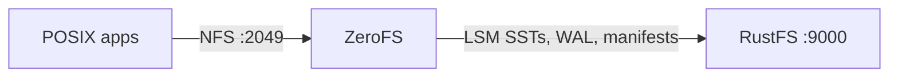
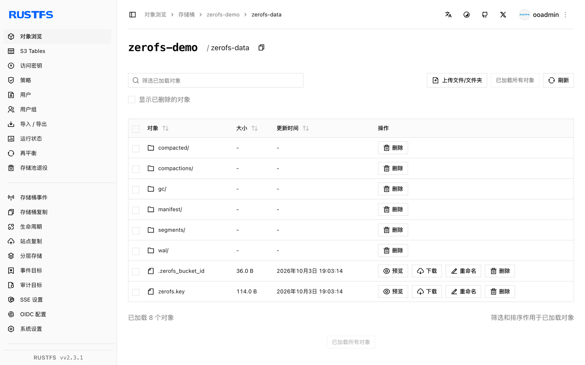

本指南将"以 S3 为底的日志结构文件系统"[ZeroFS](https://github.com/Barre/ZeroFS) 连接到 **RustFS** 作为其对象存储后端。你将运行一个 LSM 树根植于 RustFS 桶的 ZeroFS 实例，在 Linux 主机上通过 NFS 挂载该文件系统，经挂载点写入文件，并验证它们在 ZeroFS 重启后作为桶内对象持久存在。整个流程使用 ZeroFS v2.3.5（ghcr.io/barre/zerofs）对 `rustfs/rustfs-x86-musl:v2.3.1` 验证通过。

你需要 Docker 以及装有 NFS 客户端（`nfs-common`）的 Linux 主机。本部署用于本地集成测试，不适用于生产环境。

## 架构



ZeroFS 把文件系统操作翻译为存放在桶内的 LSM 键值树：写入先进 WAL，再刷成 SST 段，压实（compaction）在后台进行。客户端通过 NFS（或 9P/NBD）看到的就是一棵普通目录树。

## 1. 生成配置

创建桶和配置文件，替换全部连接占位符：

```bash
rc mb rustfs/zerofs-demo

docker run --rm -u root:root -v /opt/zerofs:/cfg -w /cfg \
  --entrypoint /bin/sh ghcr.io/barre/zerofs:latest -c "zerofs init"
```

然后编辑 `zerofs.toml`，把 storage 与 aws 段指向 RustFS：

```toml title="zerofs.toml"
[cache]
dir = "/cache"
disk_size_gb = 5.0

[storage]
url = "s3://zerofs-demo/zerofs-data"
encryption_password = "${ZEROFS_PASSWORD}"

[servers.nfs]
addresses = ["0.0.0.0:2049"]

[servers.rpc]
addresses = ["0.0.0.0:7000"]

[aws]
access_key_id = "${AWS_ACCESS_KEY_ID}"
secret_access_key = "${AWS_SECRET_ACCESS_KEY}"
endpoint = "http://<your-rustfs-endpoint>:9000"
default_region = "us-east-1"
allow_http = "true"
```

`endpoint` 加 `allow_http` 两个键负责把 ZeroFS 从 AWS 重定向到 RustFS。自定义端点使用路径风格寻址，无需额外选项。

## 2. 运行 ZeroFS

带配置文件、凭证和可写缓存目录启动（镜像以 UID 1001 运行）：

```bash
mkdir -p /opt/zerofs/cache && chown -R 1001:1001 /opt/zerofs/cache

docker run -d --name zerofs --network oo-rustfs_default -p 2049:2049 \
  -e ZEROFS_PASSWORD=<encryption-password> \
  -e AWS_ACCESS_KEY_ID=<your-access-key> \
  -e AWS_SECRET_ACCESS_KEY=<your-secret-key> \
  -v /opt/zerofs/zerofs.toml:/zerofs.toml:ro \
  -v /opt/zerofs/cache:/cache \
  ghcr.io/barre/zerofs:latest run -c /zerofs.toml
```

```text
INFO zerofs::nfs: NFS server listening on 0.0.0.0:2049
```

## 3. 通过 NFS 挂载

在主机上用 ZeroFS 推荐的参数挂载导出：

```bash
apt-get install -y nfs-common
mkdir -p /mnt/zerofs

mount -t nfs -o async,nolock,rsize=1048576,wsize=1048576,tcp,port=2049,mountport=2049,hard \
  127.0.0.1:/ /mnt/zerofs
```

挂载点就是一个普通的 POSIX 文件系统：

```bash
echo "written via zerofs nfs mount on rustfs" > /mnt/zerofs/hello.txt
dd if=/dev/urandom of=/mnt/zerofs/data/inner/blob.bin bs=1M count=8
```

## 4. 验证持久化与 RustFS 中的对象

强制把未落盘写入刷进桶，然后重启 ZeroFS 并重新挂载：

```bash
docker exec zerofs zerofs flush -c /zerofs.toml
umount /mnt/zerofs
docker restart zerofs
mount -t nfs -o async,nolock,rsize=1048576,wsize=1048576,tcp,port=2049,mountport=2049,hard \
  127.0.0.1:/ /mnt/zerofs
```

重启前写入的内容完好无损：

```bash
cat /mnt/zerofs/hello.txt
sha1sum /mnt/zerofs/data/inner/blob.bin
```

```text
written via zerofs nfs mount on rustfs
645faaefe499f9ebda8edceeeb1a6261999aece7  /mnt/zerofs/data/inner/blob.bin
```

列举桶，看文件实际存放的位置：

```bash
rc ls rustfs/zerofs-demo/ -r | head -4
```

```text
zerofs-data/compacted/01M40Q1RA0X3AVG76VC0SBYE58.sst
zerofs-data/manifest/0000000000000000.json
zerofs-data/wal/00000000000000000001.sst
```

文件并非一对一存放——它们是 LSM 树里的键值，这正是 ZeroFS 能把桶当文件系统服务的原因。



## 5. 停止或重置

保留桶内对象、仅拆除演示环境：

```bash
umount /mnt/zerofs
docker rm -f zerofs
```

删除已存储的数据（等同于销毁文件系统本身）：

```bash
rc rm rustfs/zerofs-demo/ --recursive --force
```

## 故障排查

### 启动报 `Failed to parse config file: missing field uid`（位于 `[servers.webui]`）

ZeroFS v2.3.5 中 `[servers.webui]` 段一旦存在就必须包含 `uid` 与 `gid`。补上 `uid = 1000`、`gid = 1000`，不需要 Web UI 时也可以整段删除。

### 创建缓存目录报 `Permission denied`

容器以 UID 1001 运行。挂载缓存卷后先执行 `chown -R 1001:1001 <cache-dir>` 再启动容器。

### 挂载失败或卡住

确认已安装 NFS 客户端（`nfs-common`），且 ZeroFS 在客户端可达的网络里监听 `0.0.0.0:2049`。`port=2049,mountport=2049` 两个参数很关键——ZeroFS 把 mountd 流量也放在同一端口上。

### 容器崩溃后写入丢失

ZeroFS 会缓冲写入并周期性刷盘。演示环境可执行 `docker exec zerofs zerofs flush -c /zerofs.toml`；生产环境中需要严格持久性的客户端应调用 fsync（或使用 9P 挂载，其 fsync 会等到数据进入稳定存储才返回）。

## 下一步

- 在启用更多 ZeroFS 后端前，先阅读 [S3 兼容性说明](/administration/protocols/s3)。
- 使用[访问密钥管理](/security-compliance/iam/access-token)创建专用的生产凭证。
- 按照 [ZeroFS 配置指南](https://www.zerofs.net/configuration)了解缓存容量、9P/NBD 服务以及基于同一桶的高可用复制。
