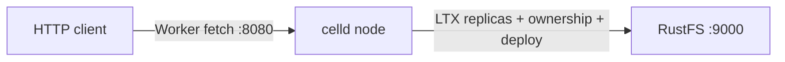
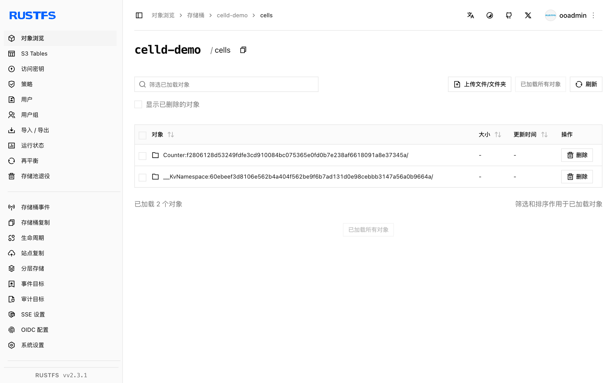

本指南将 Denoland 出品的自托管分布式 Durable Objects 运行时 [celld](https://github.com/denoland/celld) 连接到 **RustFS** 作为其舰队桶（fleet bucket）。你将先对 RustFS 桶跑 `celld diagnose`（含条件写探测），部署一个 Counter Worker，经 HTTP 修改 Durable Object 状态，重启 celld 后确认状态仍在。整个流程使用 celld v0.6.2 对 `rustfs/rustfs-x86-musl:v2.3.1` 验证通过。

你需要 `celld` 二进制、`esbuild`（打包用）以及驱动已部署 Worker 的 Node.js。

## 架构



celld 本地只留 WAL。每笔已提交的 SQLite 写入都会捕获为 LTX 格式并上传到舰队桶；桶上的条件写（put-if-not-exists）负责节点 ownership 分配。桶即事实来源——节点崩溃或重启都不会丢 Durable Object 状态。

## 1. 安装 celld

```bash
curl -sLo /tmp/celld.gz \
  https://github.com/denoland/celld/releases/download/v0.6.2/celld-x86_64-unknown-linux-gnu.gz
gunzip /tmp/celld.gz && chmod +x /tmp/celld
mv /tmp/celld /usr/local/bin/celld
celld --version
```

```text
celld 0.6.2
```

同时安装 esbuild——`celld deploy` 用它打包 Worker：

```bash
npm install -g esbuild
```

## 2. 诊断桶

`celld diagnose` 会对桶做探测，包括 celld 分配 ownership 所需的条件写：

```bash
export S3_ENDPOINT=http://<your-rustfs-endpoint>:9000
export AWS_REGION=us-east-1
export AWS_ACCESS_KEY_ID=<your-access-key>
export AWS_SECRET_ACCESS_KEY=<your-secret-key>

rc mb rustfs/celld-demo
celld diagnose --bucket s3://celld-demo
```

```text
ok listen 127.0.0.1:18080: bind check; diagnose does not serve
ok bucket s3://celld-demo
ok bucket conditional write: create, reject-create, update, reject-stale
ok fleet: 0 node lease(s) enumerated
```

`ok bucket conditional write` 是关键一行——RustFS 原生支持 put-if-not-exists，无需任何兜底存储。

## 3. 启动节点

非环回 `--listen` 必须显式指定 `--internal-listen`：

```bash
nohup celld --bucket s3://celld-demo \
  --listen 0.0.0.0:18080 \
  --internal-listen 0.0.0.0:9099 \
  --advertise 127.0.0.1:9099 > /opt/celld/celld.out 2>&1 &
```

```text
INFO celld: host runtime initialized event="host_runtime" worker_count=4
INFO celld::fleet: no deployment yet; run `celld deploy` ...
```

## 4. 部署 Counter Worker

使用 celld 仓库里的 counter 示例——一个 Durable Object，每次请求都从 SQLite 存储读 `n`、加一并写回：

```bash
curl -sLo /tmp/celld.zip https://codeload.github.com/denoland/celld/zip/refs/tags/v0.6.2
unzip /tmp/celld.zip -d /opt/celld
cd /opt/celld/celld-0.6.2/examples/counter
celld deploy . --bucket s3://celld-demo
```

```text
Uploaded counter (0.02 sec)
  s3://celld-demo/deploy/counter/bf5806589892a6cc
Current Version ID: bf5806589892a6cc
```

## 5. 修改 Durable Object 状态

每个请求都会路由到 `Counter` Durable Object：从存储读 `n`、自增、写回：

```bash
curl -s "http://127.0.0.1:18080/?name=rustfs"
curl -s "http://127.0.0.1:18080/?name=rustfs"
curl -s "http://127.0.0.1:18080/?name=rustfs"
```

```json
{"n":1,"url":"http://127.0.0.1:18080/?name=rustfs"}
{"n":2,"url":"http://127.0.0.1:18080/?name=rustfs"}
{"n":3,"url":"http://127.0.0.1:18080/?name=rustfs"}
```

## 6. 重启 celld 验证持久化

杀掉节点、重新启动、再打同一 URL——计数器从上次停的地方继续，因为状态一直都在 RustFS 里：

```bash
pkill -f "celld --bucket"
nohup celld --bucket s3://celld-demo \
  --listen 0.0.0.0:18080 --internal-listen 0.0.0.0:9099 \
  --advertise 127.0.0.1:9099 > /opt/celld/celld2.out 2>&1 &
sleep 8
curl -s "http://127.0.0.1:18080/?name=rustfs"
```

```json
{"n":4,"url":"http://127.0.0.1:18080/?name=rustfs"}
```

列举桶——舰队状态全在里面：

```bash
rc ls rustfs/celld-demo/ -r | head -5
```

```text
cells/Counter:f2806128.../ltx/e1/0000/0000000000000001-0000000000000001.ltx
cells/Counter:f2806128.../own.json
deploy/counter/bf5806589892a6cc/index.js
deploy/counter/current.json
```



## 7. 停止或重置

```bash
pkill -f "celld --bucket"
rc rm rustfs/celld-demo/ --recursive --force
```

## 故障排查

### `bind --listen 127.0.0.0.1:8080 ... Address already in use`

8080 端口很常见被占（本地 GitLab registry 或 dev server）。把 Worker 监听挪走：`--listen 0.0.0.0:18080`。

### `a non-loopback --listen requires an explicit --internal-listen`

绑定公网接口时需要单独的对等监听：加 `--internal-listen 0.0.0.0:9099 --advertise 127.0.0.1:9099`。

### `esbuild not found`

`celld deploy` 用 esbuild 打包 Worker。全局安装（`npm install -g esbuild`）或把 `CELLD_ESBUILD` 指向二进制路径。

### `celld deploy` 部署的示例运行时打印 `unknown command init for argo`

这说明执行器容器/ Pod 里跑的是 `argo` CLI 而非 argoexec——通常是集群环境中把错误镜像打成了执行器镜像，与 celld 本身无关。纯主机（无集群）部署不会出现。

## 下一步

- 与 [Cloudflare Durable Objects 文档](https://developers.cloudflare.com/durable-objects/)对照——celld 在你自己的桶上运行同样的编程模型。
- 使用[访问密钥管理](/security-compliance/iam/access-token)创建专用的生产凭证。
- 按照 [celld README](https://github.com/denoland/celld) 搭建多节点舰队：让第二个节点指向同一桶，由条件写选出 owner。
