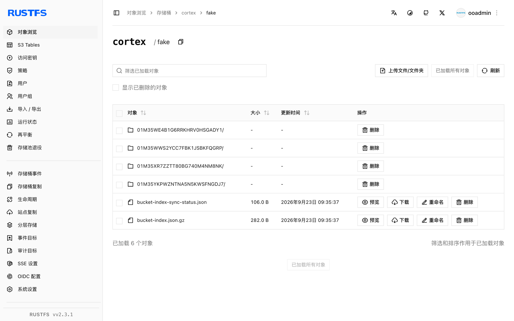

本指南将 [Cortex](https://github.com/cortexproject/cortex)——可水平扩展的 Prometheus 兼容指标后端——通过其原生 S3 存储连接到 **RustFS**。你将以单二进制模式运行 Cortex，把 blocks、ruler 与 alertmanager 存储全部指向一个 RustFS 存储桶，通过 remote write 推送指标，保存一个规则组，并验证桶内对象。整个流程使用 `cortexproject/cortex:v1.21.1` 和 `rustfs/rustfs-x86-musl:v2.3.1` 验证通过。

你需要安装 Docker。本部署用于本地集成测试，不适用于生产环境。

## 架构


Cortex 将所有 TSDB 块、ruler 规则组和 alertmanager 配置存放在对象存储中。把 `s3` 后端指向 RustFS 后，该存储桶就是所有租户数据的唯一事实来源。

## 1. 创建 Cortex 配置

创建配置文件，并替换全部连接占位符：

```yaml title="cortex.yaml"
target: all
auth_enabled: false

server:
  http_listen_port: 9009

distributor:
  shard_by_all_labels: true
  pool:
    health_check_ingesters: true

ingester:
  lifecycler:
    min_ready_duration: 0s
    final_sleep: 0s
    num_tokens: 512
    ring:
      kvstore:
        store: inmemory
      replication_factor: 1

blocks_storage:
  backend: s3
  s3: &s3
    endpoint: <your-rustfs-endpoint>:9000
    region: us-east-1
    bucket_name: cortex
    access_key_id: <your-access-key>
    secret_access_key: <your-secret-key>
    insecure: true
    bucket_lookup_type: path
  tsdb:
    dir: /data/tsdb
    block_ranges_period: [15m]
    ship_interval: 30s
  bucket_store:
    sync_dir: /data/tsdb-sync
    bucket_index:
      enabled: true

compactor:
  data_dir: /data/compactor
  sharding_ring:
    kvstore:
      store: inmemory

ruler:
  enable_api: true
  rule_path: /data/ruler

ruler_storage:
  backend: s3
  s3:
    <<: *s3

alertmanager:
  external_url: /alertmanager
  enable_api: true
  data_dir: /data/alertmanager

alertmanager_storage:
  backend: s3
  s3:
    <<: *s3
```

Cortex 的桶字段名为 `bucket_name`，路径风格寻址通过 `bucket_lookup_type: path` 控制。`insecure: true` 允许使用纯 HTTP 端点。`block_ranges_period` 与 `ship_interval` 的取值缩短了切块周期，便于测试快速产出对象；生产环境请保持默认值。

## 2. 运行 Cortex

创建存储桶，并在与 RustFS 同一 Docker 网络中启动 Cortex：

```bash
rc mb rustfs/cortex

docker run -d --name cortex --network oo-rustfs_default -p 9009:9009 \
  -v "$PWD/cortex.yaml":/etc/cortex/cortex.yaml:ro \
  -v /opt/cortex/data:/data \
  cortexproject/cortex:v1.21.1 -config.file=/etc/cortex/cortex.yaml
```

```text
ts=... caller=cortex.go:469 level=info msg="Cortex started"
```

## 3. 推送指标与规则

启动一个抓取自身并向 Cortex remote write 的 Prometheus：

```yaml title="prometheus.yml"
global:
  scrape_interval: 5s
scrape_configs:
  - job_name: self
    static_configs:
      - targets: ["localhost:9090"]
remote_write:
  - url: http://cortex:9009/api/v1/push
```

```bash
docker run -d --name prom-writer --network oo-rustfs_default \
  -v "$PWD/prometheus.yml":/etc/prometheus/prometheus.yml:ro \
  prom/prometheus:latest --config.file=/etc/prometheus/prometheus.yml
```

通过 ruler API 保存一个规则组：

```bash
cat > rules.yaml << "EOF"
name: rustfs-demo
rules:
  - alert: RustFSAlwaysFiring
    expr: vector(1)
    labels:
      severity: demo
    annotations:
      summary: "demo alert stored in RustFS"
EOF

curl -s -o /dev/null -w "%{http_code}\n" \
  -X POST http://localhost:9009/api/v1/rules/rustfs-demo \
  --data-binary @rules.yaml -H "Content-Type: application/yaml"
```

```text
202
```

查询已写入的序列：

```bash
curl -s "http://localhost:9009/prometheus/api/v1/query?query=up"
```

```text
{"status":"success","data":{"resultType":"vector","result":[{"metric":{"__name__":"up",...},"value":[...,"1"]}]}}
```

## 4. 验证 RustFS 中的对象

列出桶内前缀：

```bash
rc ls rustfs/cortex/ -r
```

ruler 配置立即落盘，ingester 上传了两个 TSDB 块（每个包含 `chunks`、`index` 与 `meta.json`）：

```text
fake/01M35WE4B1G6RRKHRV0HSGADY1/chunks/000001
fake/01M35WE4B1G6RRKHRV0HSGADY1/index
fake/01M35WE4B1G6RRKHRV0HSGADY1/meta.json
fake/01M35WWS2YCC7FBK1JSBKFQGRP/chunks/000001
fake/01M35WWS2YCC7FBK1JSBKFQGRP/index
fake/01M35WWS2YCC7FBK1JSBKFQGRP/meta.json
rules/fake/cnVzdGZzLWRlbW8=/cnVzdGZzLWRlbW8=
```



## 5. 停止或重置

保留桶内对象、仅拆除演示环境：

```bash
docker rm -f cortex prom-writer
```

删除已存储的数据：

```bash
rc rm rustfs/cortex/ --recursive --force
```

## 故障排查

### `field bucket not found in type s3.Config`

Cortex 使用 `bucket_name` 而不是 `bucket`。路径风格寻址通过 `bucket_lookup_type: path` 设置——Thanos 使用的 `force_path_style` 键在 Cortex 中不存在。

### 块一直没有出现在桶里

ingester 只会在 head 达到 `block_ranges_period` 边界（默认 2h）完成压缩后才上传块。测试时可设置较小周期（如 `[15m]`），并配合 `ship_interval: 30s`，等待一个周期即可。

### `Unauthorized` 或桶列表为空

确认每一个使用该桶的 `s3` 配置块都带有 `access_key_id` 与 `secret_access_key`，且 `insecure: true` 与纯 HTTP 端点相匹配。

## 下一步

- 在启用更多 Cortex 存储选项前，先阅读 [S3 兼容性说明](/administration/protocols/s3)。
- 使用[访问密钥管理](/security-compliance/iam/access-token)创建专用的生产凭证。
- 如果还需要为 Prometheus 长期数据提供块存储，可以结合 [Thanos](/developer/integration/observability/thanos) 一起使用。
